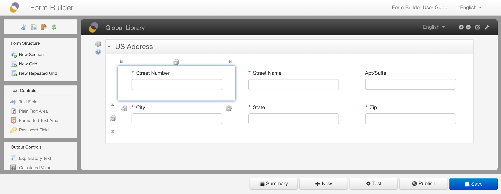
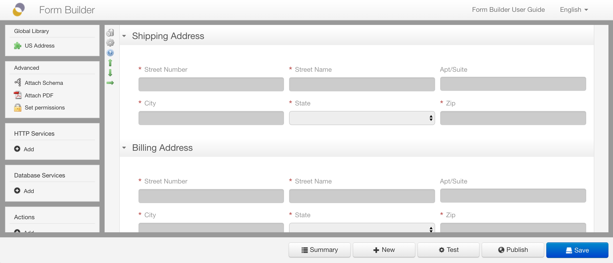
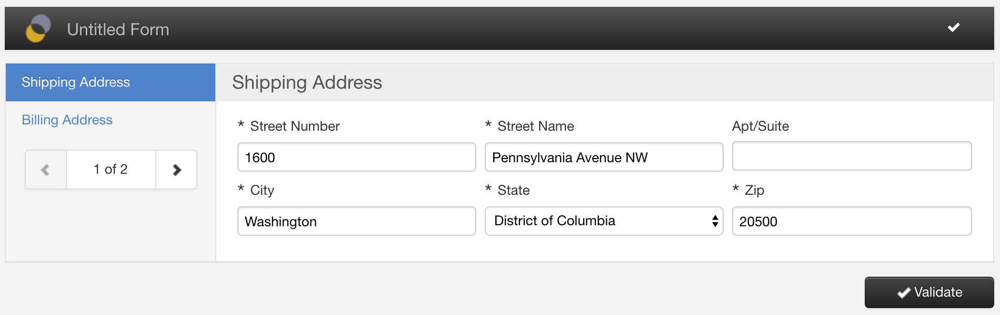
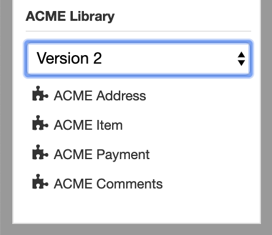
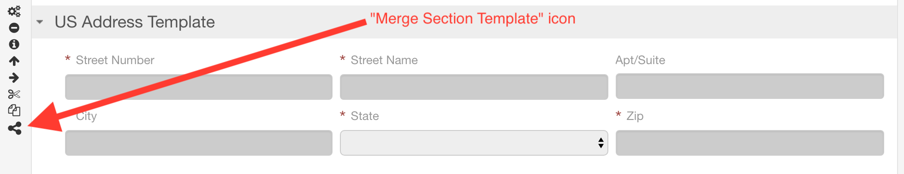

# Section templates

## Section template libraries

Form Builder supports defining reusable sections called *section templates*.

Section templates are grouped within *section template libraries*. There can be one library per application name. In addition, a global section template library with the `orbeon` application name is available. This library is made available to all form definitions, no matter what their application name is. 

## How section templates work

You create, edit, and publish a section template library from Form Builder as you do with a regular form definition. The only difference is that the form name for a section template library is `library`. This is a special name recognized by Form Builder.

When you publish a section template library form definition, all top-level sections in that form definition are made available to other form definitions created in Form Builder, depending on their application name, and appear in the Form Builder toolbox, which shows:

- __Global section templates.__
    - Those are created and updated with the `orbeon/library` form definition.
- __Application section templates.__
    - Those are created in the current application's `library` form definition.
    - For example all form definitions with app name `acme` can use section templates defined in the `acme/library` form definition in addition to the global `orbeon/library` section templates. 

The title of the section in the section template library form definition is used as the title of the section template that shows in the toolbox.

For example, you can create a generic "US Address" section and reuse it in multiple forms:

Section templates can contain:

- nested grids, with or without repeats
- nested subsections, with or without repeats
- services and actions (see below)

When you click on a given section template, the section is inserted into the form after the currently selected section. You can then select a new title for the section. It is possible to include a section template more than once.

The section appears with read-only fields (which means that you cannot change properties of the controls once inserted):

When deploying the form, section templates appear like regular editable sections:

[SINCE Orbeon Forms 2021.1]

In Form Builder, the inserted section templates show, at the top, the following information:

- section template library name
- section template section name
- section template library version

## Services and actions

### Introduction

Actions involving controls in a given section are automatically included with the section template, along with the services called by the actions.

### Cross-section actions

[SINCE Orbeon Forms 2021.1]

When editing a library form, you can define actions involving controls present in more than one section. For example, you can define an action that sets the value of a control in one section based on the value of a control in another section, and that is triggered by the activation of a button that is in a third section.

However, when using sections from the library in a form, nothing prevents you from only including one of the sections. What should then happen with cross-section actions?

With Orbeon Forms 2021.1, there is limited support for this kind of scenarios. For each section template:

1. Orbeon Forms gathers actions that:
    - can update at least one control of the current section (for example with "Set control value" result)
    - or update no control at all but are triggered by a control of the current section (for example with a button activation)
2. Gathers the services that are used by the actions kept in step 1. 

A resulting section template will include the actions and services gathered above in steps 1 and 2.

Following this logic, a given action or service can get included in multiple sections.

Limitations:

- In general, an action can update controls in multiple sections. If that's the case, then that action will be included in all sections that include the controls that are updated by the action. This means that the action and associated service can run more than once.
- If a section template includes cross-section actions, and the related sections are all included in the destination form, they will be automatically connected. If a section is missing, however, then the behavior might be unexpected. It is up to the form author to ensure that the resulting form includes the required section templates.

[SINCE Orbeon Forms 2022.1.2]

Actions and related listeners using the [Action Syntax](actions-syntax.md) are also included in section templates.

## Updating section templates

When you open Form Builder, the latest version of the controls and section templates is retrieved from the database and shown in the toolbox.

If you make changes to section templates by modifying and publishing a library form, you must reload the toolbox in your form to reflect the latest changes using the "Reload Toolbox" icon at the top of the toolbox (Orbeon Forms 2017.1 and earlier) or the "Reload Toolbox" button in the "Advanced" tab (Orbeon Forms 2017.2).

For more about reloading, see [Reloading the toolbox](toolbox.md#reloading-the-toolbox)

Note that when you publish your form, the section templates *currently* loaded in Form Builder at the time of publishing are included with the published form. This means that changes to section templates after the deployment of a form do not affect the deployed form. If you need to update a deployed form with a new version of controls, you must re-publish the form.

## Versioning of section templates

[SINCE Orbeon Forms 2019.1]

When [versioning](/form-runner/feature/versioning.md) is available:

- Form Builder allows you to publish multiple versions of a section templates library.
- Form Builder allows you to select which version of a section templates library you want to use in a particular form definition.

For example, if you have published versions 1, 2 and 3 of the `acme` library form, the toolbox shows a dropdown with those versions.

When you select a particular version, the toolbox reloads with the latest published form definition with that version.

A section templates library may contain different versions of a given section template, identified by section name, or add or remove section templates compared with other versions of the library.

If the form definition currently being edited is using a section template which is not present in the section template library chosen, the section content appears empty.

For more about reloading, see [Reloading the toolbox](toolbox.md#reloading-the-toolbox)  

## Merging section templates

### Availability

[SINCE Orbeon Forms 2017.2]

### Merging

You can merge section templates into your current form definition with the "Merge Section Template" icon associated with the section:

After activating the icon, a dialog shows:

The dialog shows a list of all control names within the section template and how they will be changed after the merge.
Since control names are unique within a form definition, two controls cannot have the same name. Names that are available
show in green. Names that conflict show in yellow and an automatic name is generated.

You can optionally set a prefix and/or a suffix for all names. This can help prevent automatic generation of names. For 
example, you could insert a US Address twice:

- first, with all control names prefixed by `shipping-` 
- second, with all control names prefixed by `billing-`

*NOTE: The enclosing section name itself is not part of this renaming process, as the section was already part of the
containing form definition and therefore its name was already unique.* 

After merging the section template, it becomes part of the current form definition and is completely unlinked from the
original section template. You can modify the section and its content as if it had been directly created by hand within
the form definition:

This also means that if you make changes to the section templates library and reload the toolbox, the merged section template
does not update.

### Limitations

Services and actions in the section template are *not* merged into the enclosing form. 

## See also

- [Toolbox](toolbox.md)
- [HTTP services](http-services.md)
- [Database services](database-services.md)
- [Actions](actions.md)

