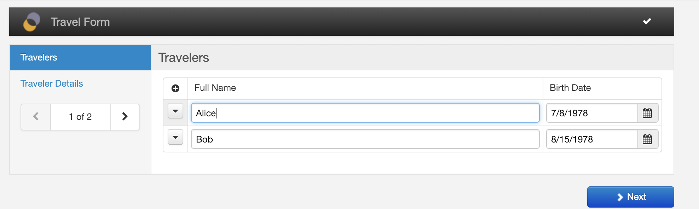
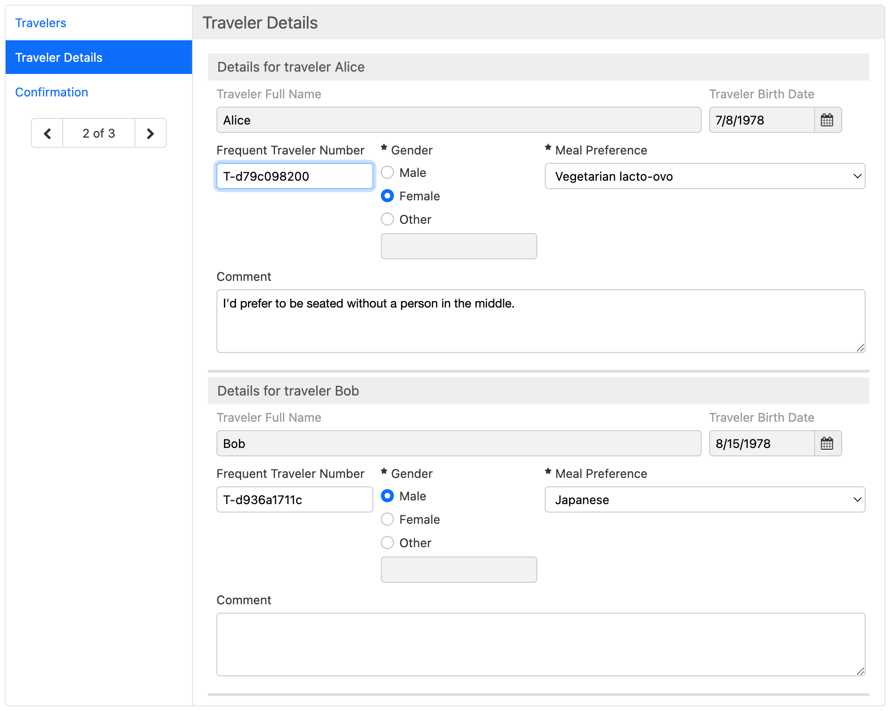
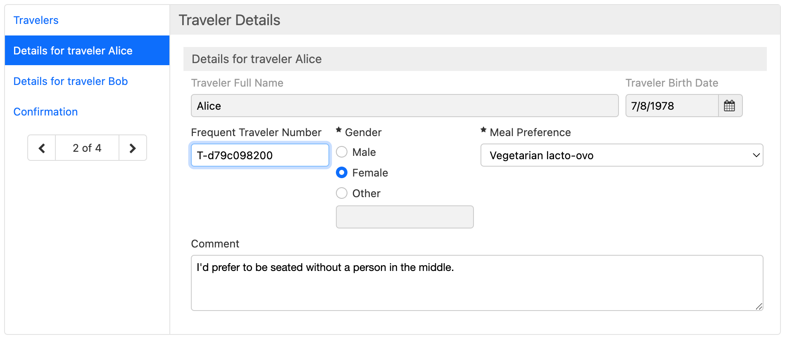
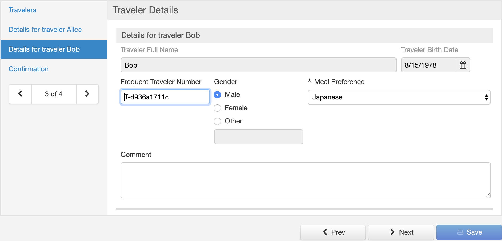

# Synchronizing repeated content

## Availability

This is available since Orbeon Forms 2018.2.

This is an Orbeon Forms PE feature.

## Rationale

Often, forms require some kind of [master-detail interface](https://en.wikipedia.org/wiki/Master%E2%80%93detail_interface), where you first enter a list of initial information, and then complete the information for each item of the list in more details on a separate screen.

A way of doing this with Orbeon Forms consists in:

- using a [repeated grid](repeated-grids.md) for the basic information
- using a [repeated section](section-settings.md#repeated-content), later in the form, for the details

The difficulty is how to synchronize the two. This is doable with custom XForms code, but it is difficult and error-prone. So Orbeon Forms 2018.2 and newer includes a component which does this synchronization automatically for you.

## Configuration

With Orbeon Forms 2018.2, there is no user interface for this yet. You insert the component by editing the source of the form definition with the ["Edit Source"](edit-source.md) toolbox button, and insert a piece of XML in the source.

The synchronization component looks like this:

```xml
<fr:synchronize-repeated-content>
```

It takes the following required XML attributes:

- `left`: the name of the source (or "left") repeated grid or repeated section 
- `right`: the name of the destination (or "right") repeated grid or repeated section
- `version`: must be `2018.2`  

Names are as you see them in the Form Builder user interface with the ["Grid Settings"](repeated-grids.md#grid-settings) or ["Section Settings"](section-settings.md#basic-settings) dialogs.

In addition, it can automatically copy the value of controls from the source to the destination. You specify this with nested `<fr:map>` elements. They take the following required XML attributes:

- `left`: the name of the source (or "left") control 
- `right`: the name of the destination (or "right") control

Names are as you see them in the Form Builder user interface with the ["Control Settings"](control-settings.md#basic-options) dialog.

## How synchronization works

The synchronization takes place from "left" to "right":

- Upon form initialization, the iterations and values are enforced, which means:
   - Extra iterations in the destination are removed from the end if needed, to match the number of iterations in the source.
   - New iterations in the destination are added at the end if needed, to match the number of iterations in the source.
   - For each iteration, the values of controls specified with `<fr:map>` are copied over.
- When iterations are added in the source:
    - Corresponding iterations are added in the destination, at the same position.
- When iterations are moved in the source:
    - Corresponding iterations are moved in the destination.
- When iterations are removed in the source:
    - Corresponding iterations are removed in the destination.
- When values of controls specified by `<fr:map>` change in the source:
    - The values of the matching controls in the destination are updated.

## Full example

The following example does the following:

- Synchronize repeated iterations between repeated grid `master-grid` and repeated section `detail-section`.
- For each iteration, copy over the value of the `traveler-name` and `traveler-birth-date` form controls.

```xml
    <!-- other Form Builder code here -->

    <fr:synchronize-repeated-content left="master-grid" right="detail-section" version="2018.2">
        <fr:map left="traveler-name"       right="traveler-name-readonly"/>
        <fr:map left="traveler-birth-date" right="traveler-birth-date-readonly"/>
    </fr:synchronize-repeated-content>
    
    <!-- Put `<fr:synchronize-repeated-content>` just above this. -->
</xf:model>
```

The following screenshots show how the form looks like when using the wizard view:





## Paging large repeated sections 

[SINCE Orbeon Forms 2019.1]

When paging of large repeated sections is enabled, optionally with a repetition label, each master repetition appears as its own wizard page. This reduces the size of wizard pages and makes it easier to fill out a form.





See [Paging large repeated sections](/form-runner/feature/wizard-view.md#paging-large-repeated-sections) for detail of the configuration.

## Limitations

With Orbeon Forms 2018.2, the  `<fr:synchronize-repeated-content>` has the following limitations:

- The *source* grid or section must be visible for the synchronization to work. The destination, on the other hand, can be hidden.
- Both repeated content must be at the top-level: they cannot be nested within other repeated sections.
- Synchronization within section templates is not supported.

## See also

- [Actions](actions.md)
- [HTTP services](http-services.md)
- [Database services](database-services.md)
- [Repeated grids](repeated-grids.md)
- [Repeated sections](section-settings.md#repeated-content)
- [Paging large repeated sections](/form-runner/feature/wizard-view.md#paging-large-repeated-sections)
- Blog posts
    - [Synchronized master-detail views](https://blog.orbeon.com/2019/01/synchronized-master-detail-views.html)
    - [Repeated sections](https://blog.orbeon.com/2014/01/repeated-sections.html)
