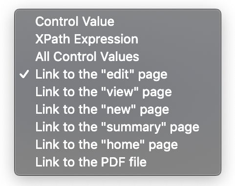
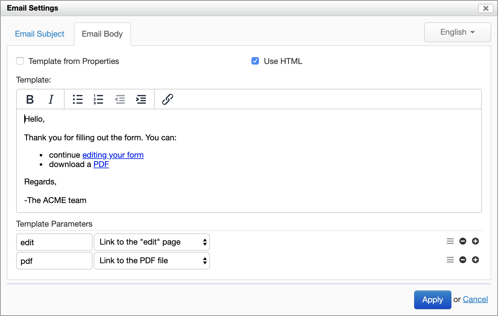
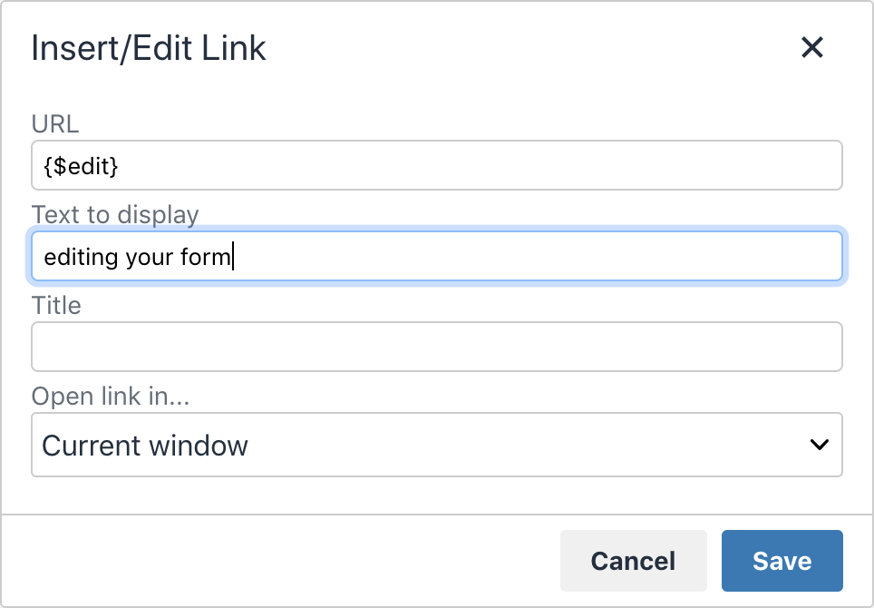

# Template syntax

## Availability

[SINCE Orbeon Forms 2018.1]

Templates apply to:

- Email Settings
    - Subject
    - Body
- Control Settings
    - Label
    - Hint
    - Help Message
    - Explanatory Text [SINCE Orbeon Forms 2019.1]

## Templates

You define a template by setting a placeholder with the following syntax:

```
{$foo}
```

where `foo` is a name which must match one of the template parameters configured below.

## Template parameters

You can add new parameters with the "+" icon and remove them with the "-" icon.

The following options are available for each template parameter:

<figure>
    
    <figcaption>Template parameter options</figcaption>
</figure>

- Parameter name: this must be unique among parameters.
- Parameter value:
    - __Control Value:__ the value of a form control.
    - __XPath Expression:__ calculated expression.
    - __All Control Values:__ the value of all form controls.
        - This is only available for the email body.
        - This is experimental as of Orbeon Forms 2018.1.
    - __Links__ [SINCE Orbeon Forms 2020.1]
        - Links are available for the following:
            - Email Body
            - Label
            - Hint
            - Help Message
            - Explanatory Text 
        - Links include:
            - Link to the "edit" page
            - Link to the "view" page
            - Link to the "new" page
            - Link to the "summary" page
            - Link to the "home" page
            - Link to the PDF file
    - __Automatic PDF only__ [\[SINCE Orbeon Forms 2023.1\]](/release-notes/orbeon-forms-2023.1.md)
        - Image (form logo by default)
        - Form title
        - Page number
        - Page count

*NOTE: For the email subject and body, an XPath expression runs in the context of the form data's root element. However, the [Form Runner function library](/xforms/xpath/extension-form-runner.md) is not yet available to expressions as of Orbeon Forms 2018.1. For labels, hints and help messages, the Form Runner function library is available.*

A template may omit references to any or all template parameters.

## Links

[SINCE Orbeon Forms 2020.1]

Links are intended to point to some Orbeon Forms pages or resources (namely, the PDF file). The end user might see such links in explanatory text and email bodies, in particular.

<figure>
    
    <figcaption>Links in an email template</figcaption>
</figure>

To insert the URL, you use the template syntax within the "URL" field of the link dialog:

<figure>
    
    <figcaption>Editing a link URL</figcaption>
</figure>

Form Runner requires the ability to know how to reach Form Runner. In some cases (use of a reverse proxy), Orbeon Forms cannot determine this automatically. For this purpose, the following property allows setting the external Form Runner URL. By default, it is empty, and can set it to an absolute URL as follows:

```xml
<property 
    as="xs:string"
    name="oxf.fr.external-base-url"
    value="https://orbeon.acme.org/forms"/>
```

You can't use links to point back to Form Runner when using [embedding](/form-runner/link-embed/java-api.md) or the [ [Form Runner proxy portlet](/form-runner/link-embed/liferay-proxy-portlet.md).

## Localization

When the form definition has more than one language:

- Each language has its own localized template.
- Template parameters are not localized and are available no matter what language is selected.

## Examples

In the following example of a dynamic control label, the `$name` variable refers to the subsequent `name` parameter. The Template Parameters section declares that `name` parameter to refer to the `name` control.

<figure>
    
    <figcaption>Dynamic label configuration</figcaption>
</figure>

This is how this would appear in the running form:

<figure>
    
    <figcaption>Dynamic label at runtime</figcaption>
</figure>

In the following example of dynamic email subject, the `$title` and `$author` variables refer also to the subsequent parameters.

<figure>
    
    <figcaption>Email Subject</figcaption>
</figure>

The text of the template is localized as usual when the form definition has more than one language.

## See also

- [Control settings](control-settings.md)
- [Email settings](email-settings.md)
