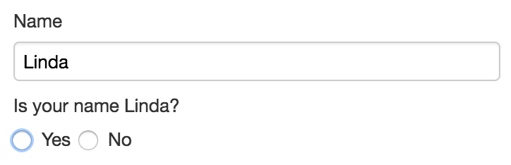

# Template syntax

## Availability

[SINCE Orbeon Forms 2018.1]

Templates, as of Orbeon Forms 2018.1, apply to:

- Email Settings
    - Subject
    - Body
- Control Settings
    - Label
    - Hint
    - Help Message
    - Explanatory Text [SINCE Orbeon Forms 2019.1] 

## Templates

You define a template by setting a placeholder with the following exact syntax:

```
{$foo}
```

where `foo` is a name which must match one of the template parameters configured below.

## Template parameters

You can add new parameters with the "+" icon and remove them with the "-" icon.

The following options are available for each template parameter:

- Parameter name: this must be unique among parameters.
- Parameter value:
    - __Control Value:__ the value of a form control.
    - __XPath Expression:__ calculated expression.
    - __All Control Values:__ the value of all form controls.
        - This is only available for the email body.
        - This is experimental as of Orbeon Forms 2018.1. 

*NOTE: For the email subject and body, an XPath expression runs in the context of the form data's root element. However, the [Form Runner function library](../xforms/xpath/extension-form-runner.md) is not yet available to expressions as of Orbeon Forms 2018.1. For labels, hints and help messages, the Form Runner function library is available.*

A template may omit references to any or all template parameters.

## Localization

When the form definition has more than one language:

- Each language has its own localized template.
- Template parameters are not localized and are available no matter what language is selected.

## Examples

In the following example of a dynamic control label, the `$name` variable refers to the subsequent `name` parameter. The Template Parameters section declares that `name` parameter to refer to the `name` control.


This is how this would appear in the running form:



In the following example of dynamic email subject, the `$title` and `$author` variables refer also to the subsequent parameters.


The text of the template is localized as usual when the form definition has more than one language.

## See also

- [Control settings](control-settings.md)
- [Email settings](email-settings.md)
