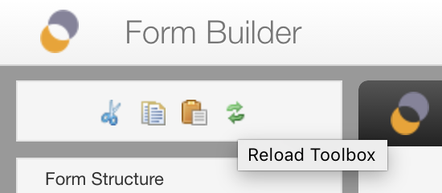
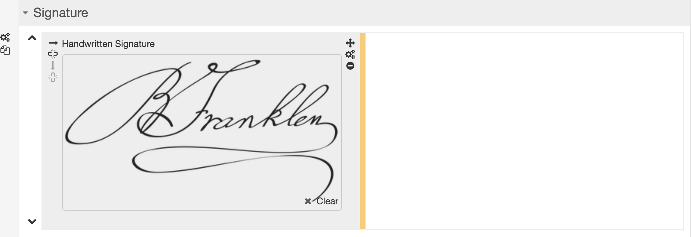

# Toolbox

## Introduction

The Form Builder toolbox provides the following:

- **Global icons:**
    - Form Settings [SINCE Orbeon Forms 2017.2]
    - Cut/copy/paste
    - Undo/redo [SINCE Orbeon Forms 2017.2]
    - "Reload toolbox" [UNTIL Orbeon Forms 2017.1]
- **Form structure:**
    - New Section
    - New Grid
    - New Repeated Grid
- **Form controls:**
    - Form control (also known as form fields) you can add to your form.
- **Metadata:**
    - Allows you to modify the application name and form name.
- **Advanced:**
    - Includes advanced features like XML Schema, PDF and source code view.
- **Services and Actions:**
    - Editors for simple services and actions.

Depending on your monitor or browser size, you can use the scrollbar to the right of the toolbox to see more toolbox content.

## Configuration of the toolbox

The toolbox can be configured via:
 
- [Properties](/configuration/properties/form-builder.md#toolbox): for selecting and ordering the components that show in the toolbox. 
- [Component metadata](form-builder/metadata.md): for the component names.

## Cut, copy and paste

See [Cut, copy and paste](form-builder/cut-copy-paste.md).

## Undo and redo

See [Undo and redo](form-builder/undo-redo.md).

## Reloading the toolbox

### Function

The "Reload Toolbox" icon or button reloads all the components in the toolbox. After reloading:

- The list of controls in the toolbox updates to reflect changes to the [`oxf.fb.toolbox.group` properties](/configuration/properties/form-builder.md#groups-of-controls).
- The [section templates](section-templates.md) libraries update.
- [Section templates](section-templates.md) used in your form also update to their latest published version.

[SINCE Orbeon Forms 2019.1]

- The list of all available (published) *versions* of section templates is updated.
- The currently-selected versions of section templates, if still available, are updated to reflect their latest published.

For more, see [Versioning of section templates](/form-builder/section-templates.md#versioning-of-section-templates).

### Orbeon Forms 2017.2 and newer

The "Reload Toolbox" button is located at the top of the "Advanced" tab.


### Orbeon Forms 2017.1 and earlier 

The "Reload Toolbox" icon is located at the top of the toolbox: 



## Form structure


### New Section button

Pressing this button inserts a new section into the form. The section is inserted after the currently selected section, that is the section containing the currently selected control.

After insertion, the new section has an empty title. You can change the section title by clicking on it.

### New Grid button

Pressing this button inserts a new grid into the form. The grid is inserted after the currently selected grid within the currently selected section, that is the section and grid containing the currently selected control.

### New Repeated Grid button

Pressing this button inserts a new repeated grid into the form. The grid is inserted after the currently selected grid within the currently selected section (the section and grid containing the currently selected control).

See also [Repeated grids](repeated-grids.md).

[SINCE Orbeon Forms 2019.1]

You can also switch a regular grid to be repeated. See [Repeat settings](repeat-settings.md).

## Form controls

The toolbox contains the user interface controls you can insert into your form, grouped by category:

| Category | Description |
| --- | --- |
| **Text Controls**      | for capturing text |
| **Utility Controls**   | for descriptions and calculations |
| **Typed Controls**     | for capturing other data like numbers, emails, phone numbers, etc. |
| **Date and Time**      | for capturing a date, a time or both |
| **Selection Controls** | for selecting one or more values, like dropdown menus, radio buttons, etc. |
| **Attachments**        | for attaching images or files |
| **Buttons**            | for action buttons |

To add a control to your form, simply click on the control. The following insertion logic is implemented:

- If the currently selected grid cell is empty, the control is inserted there.
- Otherwise, if the cell to the right of the currently selected grid cell is empty, the control is inserted there.
- Otherwise, if the control is the last control of the grid, a new grid row is inserted and the control is inserted in the first cell of the new row.
- Otherwise, the controls in the toolbox are disabled and you cannot insert a new control.

### Text Controls


| Name | Description |
| --- | --- |
| **Input Field**         | single-line input field |
| **Plain Text Area**     | multi-line plain text area |
| **Formatted Text Area** | formatted text area (AKA rich text editor) |
| **Password Field**      | input field that hides the characters you type |

The controls appear like this at design time:


### Utility Controls


| Name | Description |
| --- | --- |
| **Explanatory Text** | Explanatory text which does not capture a value ([blog post](https://blog.orbeon.com/2015/04/adding-explanatory-text-to-your-forms.html)) |
| **Calculated Value** | Like most other controls, this control has a label and hint, but unlike most controls it is not used to enter a value. Instead, it just *shows* a value, either fixed or calculated with a formula. |
| **Hidden Field** | This control supports most features of regular controls, but doesn't show in the form at runtime. See [Hidden field component](/form-runner/component/hidden.md). |

### Typed Controls


| Name | Description |
| --- | --- |
| **Number**          | number field with formatting, validation and rounding |
| **Email Address**   | text field which validates that the content is an email address |
| **Currency**        | US dollar currency |
| **US Phone Number** | US phone number with automatic formatting |
| **US State**        | US state selector |

The controls appear like this at design time:


### Date and time Controls


| Name | Description |
| --- | --- |
| **Date**          | date field with date picker |
| **Time**          | time field |
| **Date and Time** | combined date and time field |
| **Dropdown Date** | date chooser which uses dropdown menus |
| **Fields Date**   | date chooser which uses separate text fields |

The controls appear like this at design time:


### Selection Controls


| Name | Selection | Description |
| --- | --- | --- |
| **Dropdown Menu**              | single   | dropdown menu |
| **Radio Buttons**              | single   | radio buttons |
| **Radio Buttons with "Other"** | single   | radio buttons with "Other" option to a enter a custom option |
| **Checkboxes**                 | multiple | checkboxes |
| **Scrollable Checkboxes**      | multiple | scrollable checkboxes |
| **Yes/No Answer**              | single   | a simple "Yes" or "No" choice |
| **Dynamic Data Dropdown**      | single   | dynamic dropdown bound to a REST service |
| **Autocomplete**               | single   | autocompletion |

You edit the choices of most selection controls with the [Choices editor](itemset-editor.md).

The controls appear like this at design time:


_NOTE: The "Scrollable List" control is deprecated since Orbeon Forms 2016.1 and removed from the toolbox._

### Attachment Controls


| Name | Description |
| --- | --- |
| **Single File Attachment**   | - file which can be attached to the form at design time or at runtime<br>- the file can also be replaced or downloaded once attached |
| **Multiple File Attachments**| - [SINCE Orbeon Forms 2020.1]<br>- files which can be attached to the form at design time or at runtime<br>- the files can also be replaced or downloaded once attached |
| **Image Attachment**         | - image which can be attached to the form at design time or at runtime<br>- the image can also be changed at runtime once attached |
| **Image**                    | - image attached to the form at design time<br>- it is not possible to change the image at runtime |
| **Image Annotation**         | - image which can be attached to the form at design time or at runtime<br>- the image can then be annotated with graphic objects<br>- see also the [blog post](https://blog.orbeon.com/2013/08/new-image-annotation-control.html)<br>- SINCE Orbeon Forms 2016.3 |
| **Handwritten Signature**    | signature drawn with a mouse or touch screen |

The controls appear like this at design time:


This is the Handwritten Signature control (which of course you usually leave blank at design time):



### Button Controls


| Name | Description |
| --- | --- |
| **Button**      | standard button |
| **Link Button** | button appearing as a link |

Buttons do not allow entering data, and by default do nothing significant, but they can be used to trigger actions with the Actions Editor.

_NOTE: Buttons do not appear at all in preview mode._

The controls appear like this at design time:


### Choices

Choices (sometimes called options) refer to the items which are part of a selection control such as a dropdown menu or checkboxes.

For more, see the [Itemset Editor](itemset-editor.md).

### Data dropdown

From the perspective of people who will be filling out your form, the data dropdown works just like a regular dropdown. However, the data in the dropdown comes from a service. For instance, imagine you have a list to select a state and that you don't want to hard code the list of states in the form, either for convenience, or because the subset of selectable states is dynamic:

1. Insert a data dropdown field.
2. Click on cogwheel to bring up a _Control Settings_ dialog, similar to the one shown to the right.
3. In the _Resource URI_, enter the address of an HTTP service that returns the data you want to use to populate the dropdown. In most cases, the URL will look like `http://your-host/your-service`. If the address you specify start with a `/`, it is relative to the Orbeon Forms web app, which allows you to access a service you might have implemented in Orbeon Forms with XPL. For this example, let's assuming your service returns a list of states that looks like:

```xml
<states>
    <state abbreviation="AK" name="Alaska"/>
    <state abbreviation="AL" name="Alabama"/>
    <state abbreviation="AR" name="Arkansas"/>
    ...
</states>
```
4. In the _Items_ field, enter an XPath expression that returns one node per state. In this case, it will be: `/states/state`.
5. For each state (_item_), specify an expression relative to the node returning the label (shown to users in the dropdown) and the value (stored in the data). In this case, those expressions will be, respectively: `@name` and `@abbreviation`.

If the data in the dropdown depends on a value entered by users in another form field, you can pass that value to the service as a request parameter. For instance, let's say that in addition to the _State_ dropdown, you have a _City_ dropdown where you want to list all the cities in the currently selected state. If the service is at `/xforms-sandbox/service/zip-cities` and takes a request parameter `state-abbreviation`, assuming you named your _State_ field `state`, in the _Resource URI_ enter:

```
/xforms-sandbox/service/zip-cities?state-abbreviation={$state}
```

*Limitation: you can't yet use a variable as shown in the above example, to refer to another fields value. Instead, if the control is in the same section use `{../state}`. If in a different section with name other-section, use `{../../other-section/state}`. See [#431](https://github.com/orbeon/orbeon-forms/issues/431).*


### Autocomplete

The autocomplete control is a single item selection control that loads a list of suggestions from a service. It takes the same _Resource URI_, _Items_, _Label_, and _Value_ configuration parameters as the [Data dropdown control][46]. You may want to pass the value of other controls to the service, but you'll always want to pass the currently typed value, as the suggestions should depend on what users typed so far. You access to the currently typed by value with `$fr-search-value`, as in the following example:

```
/xforms-controls/services/countries?country-name={`encode-for-uri($fr-search-value)}
```

## See also

- [Section templates](section-templates.md)
- [Documented XBL components](../form-runner/component/README.md)
- [XBL components](../xforms/xbl/README.md)
- [Form Builder toolbox properties](/configuration/properties/form-builder.md#toolbox)
- [Component metadata](form-builder/metadata.md): for the component names.
