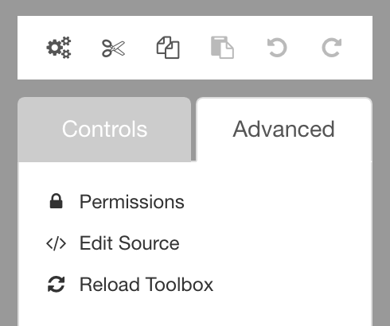

# Undo and redo

<!-- toc -->

## Availability

[SINCE Orbeon Forms 2017.2]

## Undo and redo icons

The toolbox shows familiar undo and redo icons.

## Using undo and redo

When hovering over the icons, a tooltip tells you which operation is undone or redone.

You can undo most operations which change important aspects of the form:

## Supported undo/redo actions

- insertion and deletion
    - control, grid, grid row, section and section template 
- moving
    - control (via drag and drop)
    - section (up/down/right/left arrows)
- settings
    - rename control, grid or section
    - other control, grid or section settings, including itemsets, labels, hint, and validations
- section template merging (new in 2017.2)

## Limitations

In this initial version, it is not yet possible to undo changes to the form definition's source code with Edit Source, or changes to actions, services, and other global form settings. We hope to support undoing these operations in the future.

## See also 

- Blog post: [New Orbeon Forms 2017.2 feature: undo and redo](http://blog.orbeon.com/2017/12/new-orbeon-forms-20172-feature-undo-and.html)
