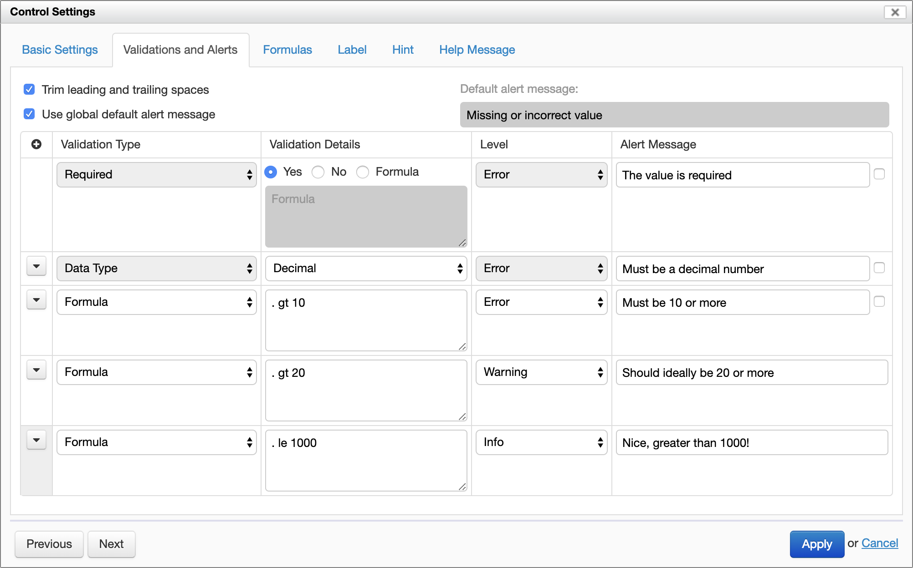
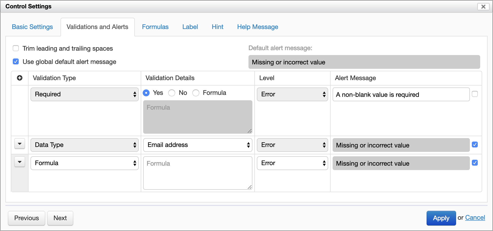
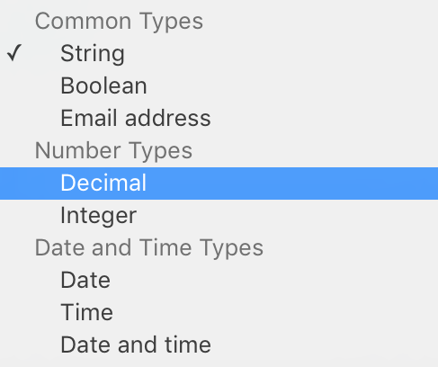
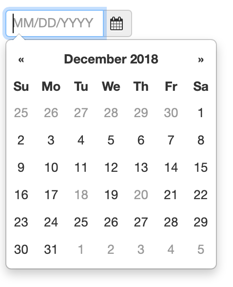
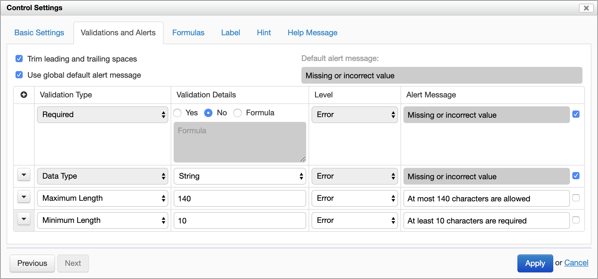
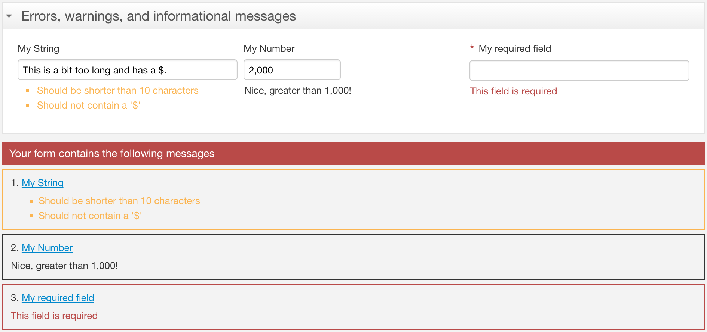

# Validation

## Introduction

An important part of designing a form is to prevent incorrect data from being captured. For example:

- an applicant's first and last names is required
- an applicant's age must be a positive number and has to be greater than a minimum
- an id number has to follow a specific syntax

If such conditions are not met, the user must see an *error* and cannot submit the form until they are corrected.

In addition, some values might be correct, but the user should be encouraged to pay special attention to them. In such cases, the user should see a *warning* or *informational message* before submitting the form.

Form Builder supports this kind of validations via the "Validations and Alerts" tab of the "Control Settings" dialog. You open the dialog with the "Control Settings" icon to the right of each control.

*NOTE: Prior to Orbeon Forms 4.3, the dialog was called "Validation Properties". Orbeon Forms 4.3 combines dialogs and adds functionality.*



## Validation types

### Introduction

The value associated with a control can be validated with 3 different validation types:

1. *Required*. This indicates whether the value can be empty or not.
2. *Data Type*. For example `string`, `decimal`, `date`, or `time`.
3. *Formula*. A custom formula, expressed in XPath, which determines whether the value is valid or not for a certain validation level.
4. *Common Constraints*. This includes constraints such as "Maximum Length", "Minimum Length", and more. [SINCE Orbeon Forms 4.10]

### Required validation

This simple validation has 3 possibilities:

- *Yes*: a value is required and cannot be empty. (*NOTE: Blank spaces count as "not empty".*)
- *No*: a value is not required and can be empty.
- *Formula*: an XPath expression to dynamically control whether the control is valid or not. [SINCE Orbeon Forms 4.7]


When the value is required, an asterisk appears next to the control to signify to the user that the value is required.

At runtime, if the value is required but not empty, the value is marked as invalid.

[SINCE Orbeon Forms 4.9]

The Required validation can have a custom alert message.

### Trimming leading and trailing spaces

[SINCE Orbeon Forms 2016.1]

When the "Trim leading and trailing spaces" option is enabled, leading and trailing spaces are removed from the value of the control before validation. This option is enabled by default for text and email fields.

When used in conjunction with the Required validation, this allows making sure that a required field doesn't contain just spaces and in fact contains some value.

This option is also useful for non-required fields which must not contain leading or trailing spaces. For example if the user enters "  Sam", the value is automatically converted into "Sam" as the user focuses out of the field.

See also [Required fields: more subtle than you might think](https://blog.orbeon.com/2016/02/required-fields-more-subtle-than-you.html).



### Data type validation

The list of data types includes:

- Built-in types
- XML Schema types (only if an XML Schema with simple types was attache to the form).

Built-in types include:

- Common Types
    - String: any string of characters
    - Boolean: `true` or `false`
    - Email address: an email address
- Number Types
    - Decimal: positive or negative decimal number, which can be fractional with an optional decimal point `.`
    - Integer: positive or negative integer decimal number
    - Double-precision floating-point
        - [UNTIL Orbeon Forms 4.10]
        - [SINCE Orbeon Forms 2021.1] (again, see below)
- Date and Time Types
    - Date: date stored in ISO format
    - Time: time stored in ISO format
    - Date and Time: date and time stored in ISO format



_NOTE: Prior to Orbeon Forms 4.3, the list of available types was longer, as explained in [this blog post](https://blog.orbeon.com/2013/07/simplifying-list-of-data-types-in-form.html)._

_NOTE: Until Orbeon Forms 4.10, the "Double-precision floating point" data type was available. It was removed with Orbeon Forms 2016.1, as explained in this [blog post](https://blog.orbeon.com/2016/01/removing-double-datatype.html), and re-added with Orbeon Forms 2021.1._

_The reason for the removal was that in the vast majority of cases, this is not the appropriate type ("Integer" or "Decimal" are), and users would often select the incorrect type and then get rounding errors in fields such as the Currency field._

_The reason for re-adding the double-precisiong floating-point data type is that it is appropriate for certain scientific calculations. This said, we recommend its use only in very specific circumstances._

At runtime, if the value is required and does not match the specified datatype, the value is marked as invalid.

*NOTE: When selecting certain controls from the toolbox, such as "Email", "Date", "Time", and "Date and Time", the appropriate data type is already selected by Form Builder. Changing the type to a different type might change the appearance of the control to match the type selected.*

If an XML Schema containing simple types has been attached to the form [Orbeon Forms PE only], the simples types are listed in the Schema Type menu.


Either a built-in data type or an XML Schema data type can be selected. If you select an XML Schema data type, the built-in data type is automatically reset. Similarly, if you select a built-in data type, the XML Schema data type is reset.

At runtime, if the value is required and does not match the specified datatype, the value is marked as invalid. For example, if the value must be an `integer`, the value "John" is invalid.

*NOTE: If the control is of type `string`, doesn't have a constraint and is not required, then any value entered is valid. This is the default for input fields and text areas.*

When an XML Schema data type is selected:

- If *Required* is set to *Yes*, the control is still made required, and an asterisk appears.
- If *Required* is set to *No*, the value must still match the definition of the XML Schema type to be valid. If the XML Schema type requires a non-empty value, setting *Required* to *No* does not make the value optional.

[SINCE Orbeon Forms 4.9]

The Required validation can have a custom alert message.

### Formula validation

A formula validation is a boolean XPath expression running with the XML element containing the value as context item. The validation *fails* if the expression doesn't return `true()`. This also means that it fails if there is an error while running the validation.

See also [Form Builder Formulas](formulas.md).

For example the following expression, which would make sense for a birthday date field, checks that the user is 18 year old or older:

```xpath
. <= (current-date() - xs:yearMonthDuration("P18Y"))
```

[SINCE Orbeon Forms 4.3]

There can be more than one formulas applied to a given control. You add formulas with the `+` icon and remove them with the `-` icon.

[SINCE Orbeon Forms 4.3]

Each formula can have a *level* associated with it and a custom alert message.

### Dates to Exclude constraint

[SINCE Orbeon Forms 2018.2]

The Dates to Exclude constraint takes a list (sequence) of dates to exclude, provided by a formula. The constraint fails if users type a date that is in the supplied list of dates to exclude. Also, dates in this list are disabled in the non-native date picker, so users cannot select them, as in the case of the 18th and 20th in the screenshot below. When the date picker is native, the dates are not disabled because the native date picker doesn't support disabling specific dates, but the validation still applies. 



You might have a service storing a the list of dates to exclude in a [dataset](/form-runner/feature/datasets.md), for example. From that dataset, you can extract and convert the dates to XPath dates.
 
For example, assuming the following `my-excluded-dates` dataset, with dates in the ISO format:

```xml
<result>
  <date>2018-12-31</date>
  <date>2019-01-15</date>
  <date>2019-01-31</date>
</result>
```

You can pass the following expression as parameter to the "Dates to Exclude" common constraint:

```xpath
for $d in fr:dataset('my-excluded-dates')/date return xs:date($d)
```

### Other common constraints

- "Maximum Length"
  - SINCE Orbeon Forms 4.10
  - applies to "String" and "Email" types only
  - the constraint fails if the length of the value converted to a string is larger than the specified integer value
- "Minimum Length"
  - SINCE Orbeon Forms 4.10
  - applies to "String" and "Email" types only
  - the constraint fails if the length of the value converted to a string is smaller than the specified integer value
- "Positive"
  - SINCE Orbeon Forms 2016.1
  - applies to "Decimal" and "Integer" types only
  - the constraint fails if the number is not positive
- "Positive or Zero"
  - SINCE Orbeon Forms 2016.1
  - applies to "Decimal" and "Integer" types only
  - the constraint fails if the number is not positive or zero
- "Negative or Zero"
  - SINCE Orbeon Forms 2016.1
  - applies to "Decimal" and "Integer" types only
  - the constraint fails if the number is not negative or zero
- "Negative"
  - SINCE Orbeon Forms 2016.1
  - applies to "Decimal" and "Integer" types only
  - the constraint fails if the number is not negative
- "Maximum Fractional Digits"
  - SINCE Orbeon Forms 2016.1
  - applies to "Decimal" type only
  - the constraint fails if the decimal number has more than the specified number of significant digits (trailing zeros are ignored)
- "Maximum Attachment Size"
  - SINCE Orbeon Forms 2017.1
  - applies to attachment types only ("URI")
  - the constraint fails if the attachment size is larger than the specified size
- "Supported File Types"
  - SINCE Orbeon Forms 2017.1
  - applies to attachment types only ("URI")
  - the constraint fails if the attachment mediatype doest not match one of the included mediatypes or mediatype wildcards

In the future, it is expected that more common constraints will be added (see [#2281](https://github.com/orbeon/orbeon-forms/issues/2281)).



## Control validity

A control value (entered by the user, constant, or calculated) is either *valid* or *invalid*. It is invalid if any of the following conditions is met:

- It is required but remains empty.
- It does not match the selected data type.
- There is at least one failed error formula or common constraint validation.

## Validation levels

[SINCE Orbeon Forms 4.3]

If a control is valid, it can have a *warning* level. This is the case if there is at least one failed warning validation.

If a control doesn't have a warning level, it can have an *info* level. This is the case if there is at least one failed info validation.

A warning or info level does not make the control value invalid and it is still possible to submit form data.

*NOTE: It is not possible to associate a validation level to the required or data type validations: they always use the error level.*

## Localization of messages

[Orbeon Forms PE only]

All alert messages can be localized.

When opening the dialog, the current language of the form determines the language used. To switch languages:

- close the dialog
- select another form language
- reopen the dialog

## Alert messages

When the user enters data, if the value is invalid or if the control has a warning or info level, the control is highlighted and one or more alert messages are shown. The message is selected as follows, generally following the philosophy of "more specific messages win over less specific messages":

*NOTE: Since 4.6.2, required validations take precedence over other validations, see [#1830](https://github.com/orbeon/orbeon-forms/issues/1830).*

- If a required validation has failed:
    - The default alert message for the control is used if available, or a global default Form Runner message is used otherwise.
    - Other messages are not used, even if there are data type or error formula or common constraint validations.
- If data type validation has failed:
    - The default alert message for the control is used if available, or a global default Form Runner message is used otherwise.
    - Other messages are not used, even if there are error formula or common constraint validations.
- If at least one error validation has failed:
    - If no specific alert message is specified for the validation, the default alert message for the control is used if available, or a global default Form Runner message is used otherwise.
    - If a specific alert message is specified, then it is used.
    - More than one message can show is several error validations have failed.
- Only if the control is valid, if at least one warning formula or common constraint has failed:
    - The specific alert message is used.
    - More than one message can show is several warning validations have failed.
- Only if the control is valid and doesn't have any failed warning s, if at least one info formula or common constraint has failed:
    - The specific alert message is used.
    - More than one message can show is several info validations have failed.

*NOTE: It is not possible to associate specific alert message to the required or data type validations: they always use the default or global alert message.*

Alert messages appear:

- under the control value
- in the Error Summary section of the form
- as badge counts in the navigation bar
- as general count in the browser's title bar



## Validation errors and review messages dialog

By default, when saving or sending form data, the following happens:

- If any control value is invalid, a dialog shows and the operation is stopped.
- If all controls are valid and there are no warning or info messages, the operation continues.
- If all controls are valid and there is at least one warning or info message, the "Review Messages" dialog shows. [SINCE Orbeon Forms 4.3]


The user has the following choices:

- Stop the operation, close the dialog and review the warnings and/or informational messages.
- Continue the operation, ignoring the warnings and/or informational messages.

These processes are entirely configurable. See [Buttons and Processes](../form-runner/advanced/buttons-and-processes/README.md) for more information.

Optionally, it is possible to annotate the XML data submitted with error, warning or informational messages. See [Buttons and Processes](../form-runner/advanced/buttons-and-processes/README.md) for more information.

## Using an external validation service

You can validate a field using an external validation service as follows:

1. In your form, you'll want to have:
    - (a) the field you want to validate,
    - (b) a [hidden field](../form-runner/component/hidden.md) used to store the result from the validation.
2. You create (c) an HTTP Service for your validation service
3. You create an action, which, when the value of the field you want to validate (a) changes, calls the service
   (c), passing the value of the field (a), and stores the result from the validation in the hidden field (b). That 
   result is typically be a boolean, `true` if valid, and `false` if invalid.
4. In the Control Settings for the field you want to validate (a), in the Validations and Alerts tab, you use a 
   formula to declare that the field is valid only of the value of the hidden field (b) is `true`.

## See also

- [Better formulas with XPath type annotations](https://blog.orbeon.com/2013/01/better-formulas-with-xpath-type.html)
- [Formulas for summing values, done right](https://blog.orbeon.com/2013/08/formulas-for-summing-values-done-right.html)
- [Control required values with formulas in Orbeon Forms 4.7](https://blog.orbeon.com/2014/09/control-required-values-with-formulas.html)
- [How Common Constraints Work](https://blog.orbeon.com/2015/07/how-common-constraints-work.html)
- [XForms Validation](../xforms/validation.md)
- [Required fields: more subtle than you might think](https://blog.orbeon.com/2016/02/required-fields-more-subtle-than-you.html)
