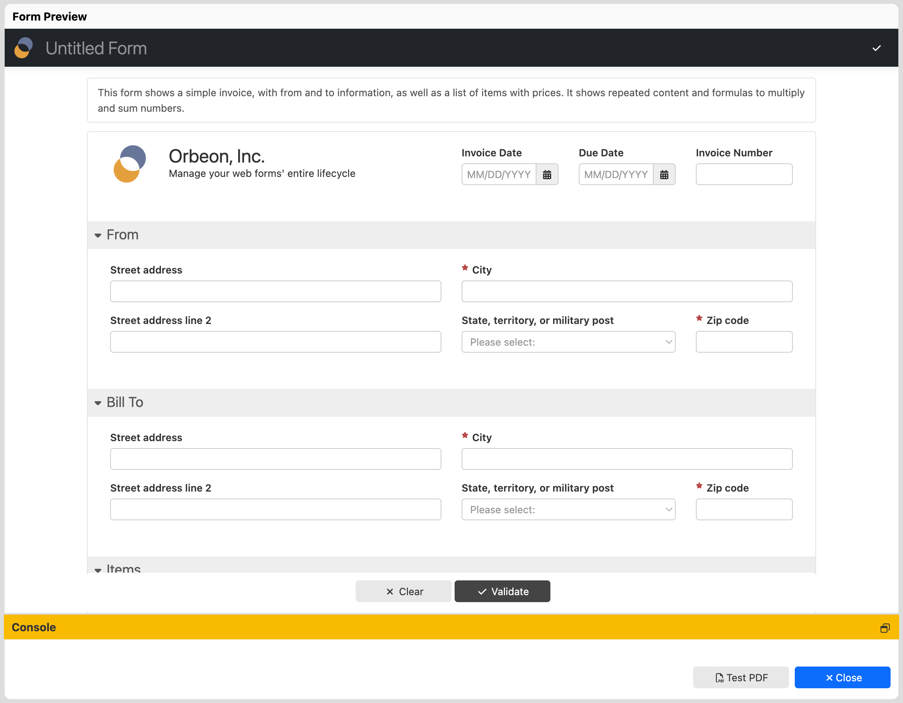

# Testing a form in web mode

## How to test a form

The Buttons bar includes a Test menu button. Clicking on it opens an overlay with a Preview of your form:

Here, many of your form's functions are available, including:

- entering data into fields
- running formulas
- showing the Wizard if it is configured
- running actions and services

You can also [test PDF production](pdf-test.md) from this overlay, using the "Test PDF" button. 

The following is not available:

- reading data from the database 
- saving data
- submitting data
- switching to the View mode and other page navigation

## See also 

- [Testing PDF production](pdf-test.md)
- [Testing the offline mode](offline-test.md)
- [The `open-rendered-format()` action](/form-runner/advanced/buttons-and-processes/actions-form-runner.md#open-rendered-format)
