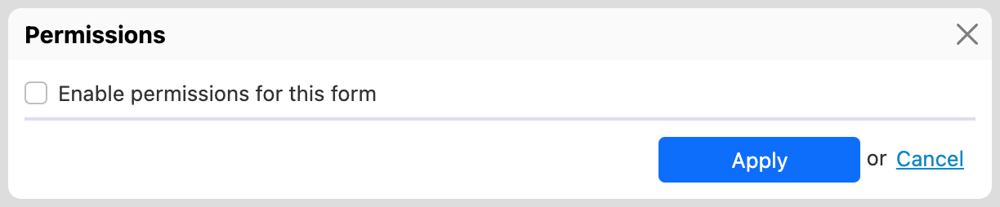
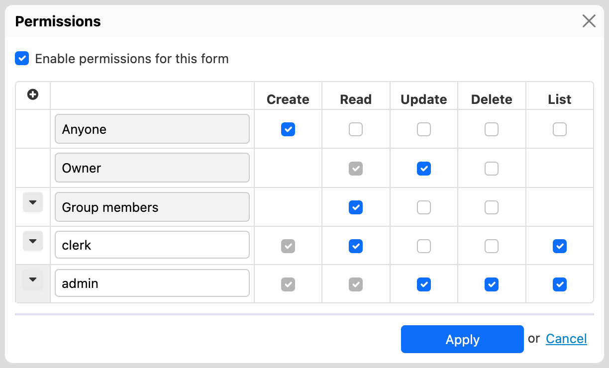

# Deployed forms

## Availability

This is an Orbeon Forms PE feature.

## Introduction

You can restrict which users can access which forms, and what operations they can perform. Those restrictions apply to the forms you create once they are deployed, not to editing those forms in Form Builder (for the latter, see [Access control for editing forms](editing-forms.md)).

## Enabling permissions

By default, no restriction is imposed on _who_ can do _what_ with forms you create in Form Builder. You enable permissions by going to the Form Builder toolbox, and under _Advanced_, clicking on _Permissions_.


This shows the following dialog:



After you click on the checkbox, you'll be able to set access restrictions on the _Create_, _Read_, _Update_, and _Delete_ operations.

## Setting permissions

### An example

In the example below:

* Any user (even anonymous) can fill out new form data.
* A logged-in user who created form data can later read and update it.
* A logged-in user member of the group of the user who created form data can read it but not update it.
* Users with the role _clerk_ can read any form data. They can also list data on the Summary page.
* Users with the role _admin_ can do any operation, including deleting form data and listing data on the Summary page.



### Role types

1. On the _Anyone_ line, set the operations allowed to all users.
2. [\[SINCE Orbeon Forms 2023.1\]](../../release-notes/orbeon-forms-2023.1.md) On the _Require Token_ line, specify that the _Read_ and _Update_ permissions above require a token to be satisfied.
3. [\[SINCE Orbeon Forms 2023.1\]](../../release-notes/orbeon-forms-2023.1.md) On the _Any Authenticated User_ line, set the operation allowed to authenticated users only.
4. On the _Owner_ line, set the operations allowed to the user who created the data. See also [Owner and Group Member Permissions](owner-group.md). \[SINCE Orbeon Forms 4.3]
5. On the _Group members_ line, set the operations allowed to users in the same group as the owner. See also [Owner and Group Member Permissions](owner-group.md). \[SINCE Orbeon Forms 4.3]
6. On the following lines, you can enter a role name, and define what operations users with that role can perform.

### Permissions in detail

Permissions you set in the dialog are _additive_ – Say you defined permissions for two roles, where users with the _reader_ role can read and users in the _clerk_ role can delete, users with both roles ( _reader_ and _clerk_) are allowed to perform both operations (reading and deleting).

Operation on _Anyone_ apply to all other rows – When you select a checkbox for a given operation on the first _Anyone_ row, that checkbox will be automatically checked and disabled so you can't change it, for any additional row, since you wouldn't want to authorize users with additional roles to perform less operations.

_Update_ implies _Read_ – On any row, if you check _Update_, then _Read_ will be automatically checked, as it wouldn't make sense to say that some users can update data, but can't read it, as when updating data, obviously, they must be shown the data they are updating.

_Create_ can't be set for the _Owner_ and _Group members_ – The owner/group is a piece of information attached to existing form data, keeping track of the user who create the data, and the group in which this user is. This information is only known for existing data, so assigning the _Create_ permission to the _Owner_ or _Group members_ doesn't make sense, and the dialog doesn't show that checkbox.

Permissions for the _Owner_ and _Group members_ can be set independently – If you want data to be accessible only by people who created it, check Read/Update/Delete/List for the owner but not for group members. If you want data to be accessible by all people in the same group, check Read/Update/Delete/List for the group members and don't check them for the owner if you want the owner to lose access to that data in case the owner changes group. (The latter highlights the need for permissions owner and group member to be set independently.)

### The _List_ permission

\[SINCE Orbeon Forms 2022.1]

The _List_ permission allows specifying that the user can list form data on the Form Runner Summary page. If a user navigates to the Summary page of a form and the _List_ permission is not granted to the user, the Summary page responds with an "Unauthorized" error.

With earlier versions of Orbeon Forms, the _List_ permission was not checked separately. However, the ability to "Read" implied the ability to _List_ on the Summary page.

Forms created and edited with earlier versions of Orbeon Forms that have the _Read_ permission enabled also implicitly have the _List_ permission enabled, for backward compatibility. Opening such a form in Form Builder will show both the _Read_ and _List_ permissions. If the form author deselects the _List_ permission, and then publishes the form, then the form will not allow the _List_ permission, as expected.

## Per-app and global permissions

### Introduction

\[SINCE Orbeon Forms 2022.1]

You can configure permissions per app, as well as globally. This is particularly useful when you have a large number of forms, and want to configure permissions for all of them at once. Per-app and global permissions are currently set using configuration properties in `properties-local.xml`.

### Properties

You configure permissions with the `oxf.fr.permissions.$app.$form` properties. For example:

```xml
<property as="xs:string"  name="oxf.fr.permissions.acme.sales">
  {
    ...
  }
</property>
```

As usual, you can use wildcards to specify whether the configuration is global:

```xml
<property as="xs:string"  name="oxf.fr.permissions.*.*">
  {
    ...
  }
</property>
```

Or whether it applies to a specific app:

```xml
<property as="xs:string"  name="oxf.fr.permissions.acme.*">
  {
    ...
  }
</property>
```

### Precedence of permissions configurations

If a form definition includes a Form Builder-defined set of permissions, then those permissions are used and the permissions set in `properties-local.xml` are ignored.

There is no merging of permissions between a Form Builder-defined set of permissions and properties-defined permissions, or between global and per-app permissions.

### Configuration detail

For each property, the configuration is a JSON format that follows the layout of the Form Builder user interface (see screenshot above):

```json
{
  "anyone":         [ "create" ],
  "owner":          [ "read", "update" ],
  "group-member":   [ "read", "update" ],
  "roles": {
    "orbeon-user":  [ "read", "update", "list" ],
    "orbeon-admin": [ "read", "update", "delete", "list" ]
  }
}
```

The configuration is a JSON object with the following properties:

* `anyone`: an array of operations that are allowed for all users
* `anyone-with-token`:
  * [\[SINCE Orbeon Forms 2023.1\]](../../release-notes/orbeon-forms-2023.1.md)
  * an array of operations that are allowed for users with a link including a token
  * see [Token-based permissions](tokens.md)
* `any-authenticated-user`
  * [\[SINCE Orbeon Forms 2023.1\]](../../release-notes/orbeon-forms-2023.1.md)
  * an array of operations that are allowed for users who are authenticated
  * this excludes, therefore, anonymous users
* `owner`: an array of operations that are allowed for the user who created the data
* `group-member`: an array of operations that are allowed for users in the same group as the owner of the data
* `roles`: a JSON object with the following properties:
  * each key is a role name
  * each value is an array of operations that are allowed for users with the given role

The operations are the same as the ones in the Form Builder user interface:

* `create`: create new data
* `read`: read data
* `update`: update data
* `delete`: delete data
* `list`: list data on the Summary page

To indicate that no operation is allowed:

* use an empty array
* or omit the property

### Impact on versioning

For permissions defined in Form Builder, the permissions are stored in the form definition, and this means that you can have multiple form versions published with different permissions.

However, for permissions defined in `properties-local.xml`, the permissions are per app/form name, and will apply to all published versions of the form under that app/form name.

## How permissions affect Form Runner pages

### Introduction

Which operations the current user can perform drives what page they can access, and on some pages which buttons are shown.

### Published Forms page

This was formerly known as the _Home_ page.

On the Form Runner Published Forms page, all the forms on which the current user can perform at least one operation are displayed. Then, for each one of those forms:

* If they can perform the _Create_ operation on the form, a link to the _New_ page is shown.
* If they can perform any of the _Read_, _Update_, or _Delete_ operation on the form, a link to the _Summary_ page for that form is shown.

### Summary page

* Access is completely denied if the current user can't perform any of the _Read_, _Update_, or _Delete_ operations.
  * \[SINCE Orbeon Forms 2022.1] Access is also completely denied if the user doesn't have the _List_ permission.
* The _Delete_ button is disabled if the current user can't perform the _Delete_ operation.
* The _review_ and _pdf_ button are disabled if the current user can't perform the _Read_ operation.
* Clicking in a row of the table will open the form in _Edit_ mode if the current user can perform the _Update_ operation, in _View_ mode if they can perform the _Read_ operation, and do nothing otherwise.

### View, New, and Edit pages

* For the _View_ page, access is denied if the current user can't perform the _Read_ operation.
* For the _New_ page, access is denied if the current user can't perform the _Create_ operation.
* For the _Edit_ page, access is denied if the current user can't perform the _Update_ operation.

## Compatibility note

\[SINCE 4.3] In Orbeon Forms 4.2 and earlier, role-based permissions set in Form Builder could only be driven by container-based roles and the value of the `oxf.fr.authentication.method` property was not taken into account. Since version 4.3, those permissions also apply if you are using header-driven roles.

## See also

* [Setup users for access control](users.md) - How to setup Orbeon Forms so that users and roles are provided.
* [Login & Logout](login-logout.md) - Optional user menu for providing links to login and logout functions.
* [Form fields](form-fields.md) - How to control access to specific form fields based on the user user's roles.
* [Access control for editing forms](editing-forms.md) - How to control access to Form Builder.
  * [Owner and group member permissions](owner-group.md) - Access based on ownership and groups.
  * [Organization-based permissions](organization.md) – Access based on organizational structure.
  * [Token-based permissions](tokens.md) - Token-based permissions
* [Scenarios](scenarios.md)
