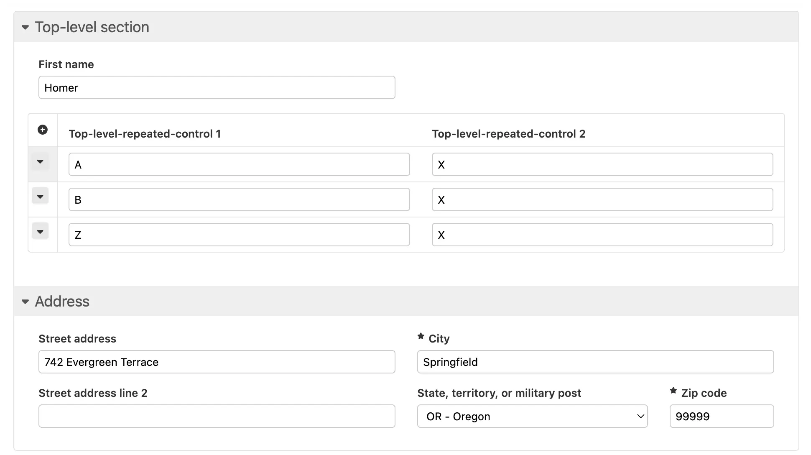

# Form Runner control-setvalue action


## Availability

[\[SINCE Orbeon Forms 2025.1.1\]](/release-notes/orbeon-forms-2025.1.1.md)

##  Introduction

The `control-setvalue` action sets the value of a form control. It matches the semantic of the `<fr:control-setvalue>` action in the [action syntax](/form-builder/actions-syntax.md#setting-the-value-of-a-control), but is called from [processes](README.md).

## Syntax and parameters

### General syntax

```
control-setvalue(
    control-name = "my-control",
    value        = "my-expression",
    at           = "end",
    section-name = "my-section"
)
```

### Parameters

| Parameter      | Mandatory | Value                                                                    | Comment                                                   |
|----------------|-----------|--------------------------------------------------------------------------|-----------------------------------------------------------|
| `control`      | Yes       | control name                                                             | identifies the control to modify                          |
| `value`        | Yes       | value expression                                                         | resolves to the value to set                              |
| `at`           | No        | space-delimited position tokens: `start`, `end`, `all`, positive integer | missing leading tokens default to `end`                   |
| `section-name` | No        | section name                                                             | section name to search, if it contains a section template |

- `value`
    - the value expression is evaluated in the context of the root element of the form data and the resulting value is set on the control
    - you can use the `$foo` syntax to refer to the value of another control, where `foo` is the name of that control in the same scope (i.e. in the same section template instance, or at the top level if not in a section template)
- `section-name`
    - specifies the name of a form section identifying one or more (in case of repeated sections) section template instances included in the form
    - the search is limited to searching within those sections
    - if the section name does not identify a section containing a section template, the function returns the empty sequence

## Examples

Set the value of a top-level form control called `contact-information-first-name` to the value "Homer":

```
control-setvalue(
    control-name = "contact-information-first-name",
    value        = "'Homer'
)
```

Set the value of a top-level repeated form control, on the first repetition:

```
control-setvalue(
    control-name = "top-level-repeated-control-1",
    value        = "'A'",
    at           = "start"
)
```

Set the value of a top-level repeated form control, on the second repetition:

```
control-setvalue(
    control-name = "top-level-repeated-control-1",
    value        = "'B'",
    at           = "2"
)
```

Set the value of a top-level repeated form control, on the last repetition:

```
control-setvalue(
    control-name = "top-level-repeated-control-1",
    value        = "'Z'",
    at           = "end"
)
```

Set the value of all repetitions of a top-level repeated form control:

```
control-setvalue(
    control-name = "top-level-repeated-control-2",
    value        = "'X'",
    at           = "all"
)
```

Set the value of a set of form controls in a section template, by specifying the section name `address-us`:

```
control-setvalue(
    control-name = "us-address-street-1",
    value        = "'742 Evergreen Terrace'",
    section-name = "address-us"
)
then control-setvalue(
    control-name = "us-address-city",
    value        = "'Springfield'",
    section-name = "address-us"
)
then control-setvalue(
    control-name = "us-address-state",
    value        = "'OR'",
    section-name = "address-us"
)
then control-setvalue(
    control-name = "us-address-zip",
    value        = "'99999'",
    section-name = "address-us"
)
```

The above actions can result in the following values in a test form:



Set the value of a top-level form control called `second-control` with the value from a first control called `first-control`:

```
control-setvalue(
    control-name = "second-control",
    value        = "$first-control"
)
```

## Earlier Orbeon Forms versions

With Orbeon Forms 2025.0 and earlier, you have to use the lower-level [`xf:setvalue` action](actions-xforms.md#xfsetvalue) to set the value of a control. The drawback is this is that you have to directly reach data in the XML document containing all of the form data. The new `control-setvalue` action allows you to set the value of a control without having to know where in the XML document the data for that control is stored.

## See also

- [`fr:control-setvalue` action](/form-builder/actions-syntax.md#setting-the-value-of-a-control)
- [`xf:setvalue` action](actions-xforms.md#xfsetvalue)
- [Form Builder actions syntax](/form-builder/actions-syntax.md)