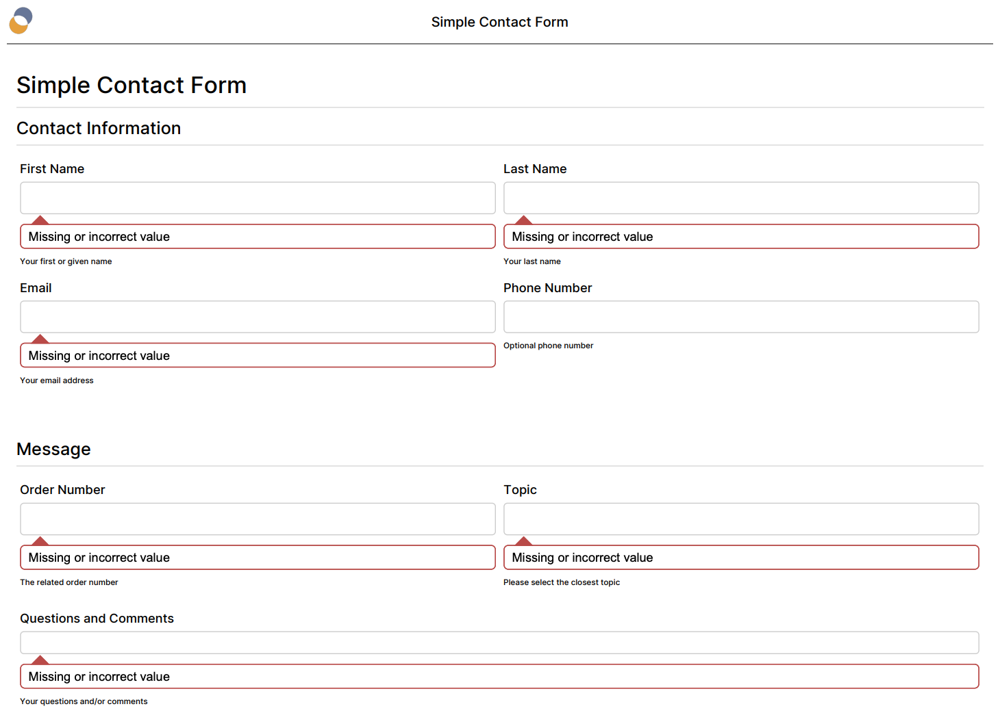

# Form Runner actions

## Children pages

- [`save` action](actions-form-runner-save.md)
- [`send` action](actions-form-runner-send.md)
- [`email` action](actions-form-runner-email.md)

## Introduction

These actions are specific to Form Runner. They allow you to validate, save and send data, in particular.

## validate

Validate form data.

- parameters
    - `level`: validation level to check: one of `error`, `warning`, or `info`
    - `property`: specifies a boolean property which, if `false`, skips validation (used for backward compatibility) [Orbeon Forms 4.2 only, removed in Orbeon Forms 4.3]
- result
    - success if data is valid
    - failure if data is invalid
    
[SINCE Orbeon Forms 2016.3]

When the validation mode is set to `explicit`, first update the validity of all controls with `explicit` validation and perform a refresh.

## wizard-update-validity

[SINCE Orbeon Forms 2016.3]

When the validation mode is set to `explicit`, first update the validity of all wizard pages up to the current wizard page included.

## pending-uploads

Check whether there are pending uploads.

- parameters
    - none
- result
    - success if there are no pending uploads
    - failure if there are pending uploads

## rollback

[SINCE Orbeon Forms 2017.2]

Rollback some of the changes that have taken place during the current process.

- parameters
    - `changes`: must be "in-memory-form-data"
    
At the beginning of a top-level process, the current state of:

- in-memory form data
- data status (see the `set-data-status` action)

is temporarily saved.

Upon running the `rollback` action, that stat is restored.
 
This means, for example, that if the instance data was changed due to actions such as:

- `xf:setvalue`
- `save` (which updates paths to attachments)

then the state of the data is restored to what it was prior to running the current top-level process.

Example:

```
xf:setvalue(ref = "my-section/my-name", value = "'Sam'")
then rollback(changes = "in-memory-form-data")
```

Limitations:

- This does not work across `suspend` / `resume` boundaries.
- There is no rollback at the database level.

## save

The documentation for the `save` action is on a [separate page](actions-form-runner-save.md).

## email

The documentation for the `email` action is on a [separate page](actions-form-runner-email.md).

## send

The documentation for the `send` action is on a [separate page](actions-form-runner-send.md).

## set-data-status

[SINCE Orbeon Forms 4.7]

Set the status of the in-memory form data.

- parameters
    - `status`: specifies the status of the data
        - `safe`: mark the data as in initial state or saved (default)
        - `unsafe`: mark the data as modified by the user and not saved

This action can be useful in conjunction with `send`. Upon successfully sending the data, if the data is not in addition saved to the local database, this action can be used to indicate to the user that the data is safe.

See also [the `oxf.fr.detail.warn-when-data-unsafe` property](/configuration/properties/form-runner-detail-page.md#warning-the-user-when-data-is-unsafe).

## set-workflow-stage

[SINCE Orbeon Forms 2020.1]

- parameters
    - `name`: the new workflow stage (is an XPath value template)

For instance:

- You can have an `approve` process that sets the current workflow stage with `set-workflow-stage(name = "approved")`
- You can also use a [value template](/xforms/attribute-value-templates.md) to dynamically determine the name of the workflow stage, as in `set-workflow-stage(name = "{if (//expense > 10000) then 'review-needed' else 'approved'}")`

Also see the [`fr:workflow-stage-value() function`](/xforms/xpath/extension-form-runner.md#fr-workflow-stage-value).

## navigate

Navigate to an external page via client-side `GET`.

- parameters
    - `uri`: an XPath value template which specifies the URL to navigate to
    - `property`: specifies a property containing the URL to navigate to
    - by default, try to guess based on the parameter
    - `target`
        - SINCE Orbeon Forms 2019.1
        - where to display the location
        - `_self|_blank` or name of the browsing context
    - `show-progress`
        - [SINCE Orbeon Forms 2022.1]
        - Boolean indicating whether to keep the loading indicator while the navigation is in progress
        - Optional, if missing defaults to `false`
        - Can be an XPath Value Template
        - Setting this parameter to `true` is particularly useful if you have enabled the [modal indicator](/configuration/properties/form-runner-detail-page.md#loading-indicator-for-buttons) for the button that triggers this process, and you would like to prevent double submissions or users from editing the form while the navigation is in progress

You can also use the `navigate` action to execute JavaScript:

```
navigate(uri = "javascript:myFunction()")
```

[SINCE Orbeon Forms 4.6]

The URL value, whether directly or via a property, can be an XPath Value Template, which runs in the context of the root element of the main form instance:

```
navigate(uri = "http://example.org/{xxf:get-request-parameter('bar')}/{.//code}")
```

## relinquish-lease

[SINCE Orbeon Forms 2017.2.1]

The `relinquish-lease` action will, if the current user has a lease on the data being  currently edited, relinquish that lease. The action has no effect if the [lease isn't enabled](../../feature/lease.md#enabling-the-lease-feature), or if the current user doesn't own the lease.

In most cases you'll want to use this action in conjunction with [`navigate`](#navigate) or [`send(replace ="all")`](actions-form-runner-send.md) to release a potential lease the user might have before you take that user to another page. This way other users will be able to access the current data without having to wait for the lease to expire.

## success-message and error-message

- `success-message`: show a success message
    - parameters
        - `message`: message to show (is an XPath value template)
        - `html`: [\[SINCE Orbeon Forms 2023.1\]](/release-notes/orbeon-forms-2023.1.md) `"true"` if the message is HTML (default is `"false"`)
        - `resource`: resource key pointing to the message
- `error-message`: show an error message
    - parameters
        - `message`: message to show (is an XPath value template)
        - `html`: [\[SINCE Orbeon Forms 2023.1\]](/release-notes/orbeon-forms-2023.1.md) `"true"` if the message is HTML (default is `"false"`)
        - `resource`: resource key pointing to the message
        - `appearance`: [SINCE Orbeon Forms 2021.1] This parameter is optional. If present, the value must be either `dialog` or `ephemeral`. If missing, the `dialog` is implied.
            - `dialog`: the message is shown in the modal dialog
            - `ephemeral`: the message is shown at the bottom of the form, and disappears when users perform an action

[SINCE Orbeon Forms 4.7] The value of the `message` parameter and the message to which points the resource key in the `resource` parameter are interpreted as an XPath Value Template.

## confirm

[SINCE Orbeon Forms 4.5]

Show a confirmation dialog. If the user selects "No", the current process is aborted. If the user selects "Yes", the current process is resumed.


- parameters
    - `message`: message to show (is an XPath value template)
    - `html`: [\[SINCE Orbeon Forms 2023.1\]](/release-notes/orbeon-forms-2023.1.md) `"true"` if the message is HTML (default is `"false"`)
    - `resource`: resource key pointing to the message

Example of use:

```
save
then confirm
then suspend
then send("oxf.fr.detail.send.success")'/>
```

*NOTE: The `confirm` action is not synchronous, so the process *must* be suspended right after or the process will continue before the dialog is shown to the user.*

You can use a specific confirmation message with the `message` parameter:

```xml
save
then confirm(message = "Please confirm that you would like to submit your data.")
then suspend
then send("oxf.fr.detail.send.success")'/>
```

You can also override the default confirmation message:

```xml
<property
  as="xs:string"
  name="oxf.fr.resource.*.*.en.detail.messages.confirmation-dialog-message"
  value="Are you sure you want to proceed?"/>
```

You can also use a path to a resource, including a custom resource. For example" 

```xml
save
then confirm(resource = "acme-resource-1")
then suspend
then send("oxf.fr.detail.send.success")'/>
```

If you have defined custom resources as follows:

```xml
<property
  as="xs:string"
  name="oxf.fr.resource.*.*.en.detail.messages.acme-resource-1"
  value="Resource 1 in English"/>

<property
  as="xs:string"
  name="oxf.fr.resource.*.*.fr.detail.messages.acme-resource-1"
  value="Resource 1 en français"/>
```

Note that only resources under `detail.messages` are searched, and the resource name cannot contain further `.`s.

## open-rendered-format

[SINCE Orbeon Forms 2017.1]

This action takes a `format` parameter, whose value must be either `pdf` or `tiff`, as in `open-rendered-format(format = "pdf")`. In addition to the `content` parameter, this action supports the parameters documented in [Controlling the format](actions-form-runner-send.md#controlling-the-format). 

Depending on the value of the parameter, it generates a view of the current form in the specified format, and sends the generated PDF or TIFF to the browser. This action will attempt to have the browser show the generated PDF or TIFF, and do so in a new browser tab or window. However, not all browsers support this completely:

- Showing the PDF or TIFF inline:
    - PDF – All browsers will show the PDF inline directly, except Edge which will first ask users if they want to save or open it.
    - TIFF – Browsers other than Safari don't know how to show a TIFF file inline, and thus will just download the file.
- Opening the PDF or TIFF in a [new tab or browser window](/xforms/submission-extensions.md#target-window-or-frame):
    - With Chrome, IE, and Edge the PDF or TIFF will show in a new window.
    - With Safari and Firefox the PDF or TIFF will show in the current window.

[SINCE Orbeon Forms 2021.1.3]

Two new formats are supported:

- `xml-form-structure-and-data`
    - Export an XML file containing information about the structure of the form as well as the current data.
    - This file format can also be used for later import.
    - The `xml-export` button and default process run `open-rendered-format(format = "xml-form-structure-and-data")`.
- `excel-with-named-ranges`
    - Export an Excel file approximating the structure of the form as well as the current data.
    - This file format can also be used for later import.
    - The `excel-export` button and default process run `open-rendered-format(format = "excel-with-named-ranges")`.

[\[SINCE Orbeon Forms 2023.1\]](/release-notes/orbeon-forms-2023.1.md)

The following parameters allow controlling hints, alerts, and required controls in the PDF:

- `show-hints`
    - defaults to the `oxf.fr.detail.static-readonly-hint` property, which itself defaults to `false`
    - when `true`, shows hints in the PDF
- `show-alerts`
    - defaults to the `oxf.fr.detail.static-readonly-alert` property, which itself defaults to `false`
    - when `true`, shows alerts in the PDF
- `show-required`
    - defaults to the `oxf.fr.detail.static-readonly-required` property, which itself defaults to `false`
    - when `true`, style required controls in the PDF

[SINCE Orbeon Forms 2018.1]

The following parameters allow controlling the use of PDF templates:

- `use-pdf-template`
    - This defaults to `true` if there is at least one PDF template attached to the form, `false` otherwise.
    - If at least one PDF template is available, the default is to use one of the PDF templates. But if
      `use-pdf-template = "false"`, then use of any PDF template is disabled and the automatic PDF is produced.  
- `pdf-template-name`
    - This contributes to selecting a specific PDF template.
    - If `pdf-template-name` specifies a name, such as with `pdf-template-name = "archive"`, the list of available PDF
      templates is reduced to those having an exactly matching name. If no matching name is found, an error is raised. 
- `pdf-template-lang` 
    - This contributes to selecting a specific PDF template.
    - If `pdf-template-lang` specifies a language, such as with `pdf-template-lang = "fr"`, the list of available
      PDF templates as reduced by `pdf-template-name` is used to find a PDF template with a matching language.
      If no matching language is found, an error is raised.
    - If `pdf-template-lang` is empty or missing:
        - The PDF template with the current form language is used, if there is a match.
        - If there is no match, the first available PDF template is used.

Example:

```xml
<property as="xs:string"  name="oxf.fr.detail.process.pdf.*.*">
    open-rendered-format(format = "pdf", show-alerts = "false", show-hints = "true")
</property>
```

The output contains alerts and/or hints if one of the values is set to `"true"`. For example:



See also [Testing PDF production](/form-builder/pdf-test.md).

## callback

### Action

[\[SINCE Orbeon Forms 2023.1\]](/release-notes/orbeon-forms-2023.1.md)

This action allows you to run a callback function on the client (in JavaScript) after the current process has completed.

The following parameters are supported:

- `name`: name with which the callback function or functions have been registered with

Example:

```xml
<property as="xs:string"  name="oxf.fr.detail.process.save-final.*.*">
    require-uploads
    then validate-all
    then save
    then new-to-edit
    then callback(name = "my-saved-callback")
    then success-message("save-success")
    recover error-message("database-error")
</property>
```

### Registering a callback function

[\[SINCE Orbeon Forms 2023.1\]](/release-notes/orbeon-forms-2023.1.md)

You register a callback function on the client when embedding a form in a page. For example:

```javascript
ORBEON.fr.API.embedForm(
    document.getElementById("my-container-element"),
    "/orbeon",
    "human-resources",
    "job-application",
    "new"
)
.then((form) => {
    console.log("`embedForm()` successfully loaded the form");
    form.addCallback("my-saved-callback", () => console.log("The data was successfully saved!"))
})
.catch((e) => {
  console.log("`embedForm()` returned an error");
  console.log(e);
});
```

See also:

- [`embedForm()` API](/form-runner/link-embed/javascript-api.md#embedform)
- [Adding and removing process callback functions](/form-runner/api/other/form-runner-javascript-api.md#adding-and-removing-process-callback-functions)

## Switching modes

### `new-to-edit`

[SINCE Orbeon Forms 2017.1]

- If possible, switch the detail page's URL from `new` mode to `edit` mode.
- Before this action, this was done automatically as part of the `save` action.
- If the form is not in `new` mode, this action has no effect.
- If permissions do not allow editing the data, this action has no effect.
- This preserves (and therefore does not reset) the current form data.

### `edit-to-new`
 
[SINCE Orbeon Forms 2023.1.4]

- If possible, switch the detail page's URL from `edit` mode to `new` mode.
- This also creates a fresh document id.
- If the form is not in `edit` mode, this action has no effect.
- If permissions do not allow creating new data, this action has no effect.
- This preserves (and therefore does not reset) the current form data.

## Other actions

- `captcha`: Trigger the captcha.
- `collapse-all`: Collapse all sections (when not using the wizard view).
- `expand-all`: Expand all sections (when not using the wizard view).
- `expand-invalid`: [SINCE Orbeon Forms 2018.1] This action expands all the sections that contain an error. Out-of-the-box, this action is used by the `require-valid` process, in turn called when validating data, say before save, so users can see all the sections that contain an error.
- `result-dialog`: Show the result dialog.
- `review`, `edit`: Navigate to these Form Runner pages.
- `show-relevant-errors`:
    - [SINCE Orbeon Forms 2018.1]
    - This is the new name for the `visit-all` action.
    - This shows all "relevant errors". When using the [wizard view](../../feature/wizard-view.md) in `lax` and strict` mode, this shows errors to show for all available wizard pages. Errors for controls on non-available pages are not shown.
- `summary`: Navigate to this Form Runner page (a predefined process since 4.7).
- `unvisit-all`:
    - Mark all controls as not visited.
- `visit-all`:
    - [DEPRECATED SINCE Orbeon Forms 2018.1]
    - See `show-relevant-errors` instead.
- `wizard-prev`: Navigate the wizard to the previous page.
- `wizard-next`: Navigate the wizard to the next page.
