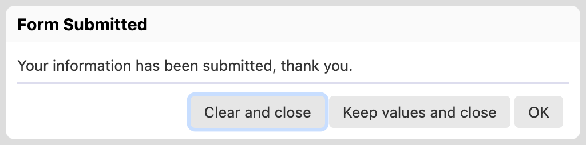

# Predefined buttons, processes and dialogs

## Predefined buttons

The following buttons are predefined and associated with the processes of the same name:

| Name            | Description                                                                                                                                                                                                                                                                  | Since            |
| --------------- | ---------------------------------------------------------------------------------------------------------------------------------------------------------------------------------------------------------------------------------------------------------------------------- | ---------------- |
| `clear`         | reset the form data to the default initial form data                                                                                                                                                                                                                         | 4.2              |
| `close`         | <p>navigate to the URL specified by <code>oxf.fr.detail.close.uri</code> or, if not specified, to the Summary page<br><em>NOTE: The button in fact navigates to a page, but doesn't just close the current window/tab, as there is no cross-browser way to do this.</em></p> | 4.2              |
| `collapse-all`  | run the action of the same name                                                                                                                                                                                                                                              | 4.2              |
| `edit`          | navigate to the edit page from the review page                                                                                                                                                                                                                               | 4.2              |
| `email`         | validate then email data                                                                                                                                                                                                                                                     | 4.2              |
| `excel-export`  | generate an Excel file approximating the structure of the form as well as the current data                                                                                                                                                                                   | 2021.1.3         |
| `expand-all`    | run the action of the same name                                                                                                                                                                                                                                              | 4.2              |
| `home`          | navigate to `/`                                                                                                                                                                                                                                                              | 4.2              |
| `pdf`           | generate a PDF version of the current form                                                                                                                                                                                                                                   | 4.2              |
| `review`        | navigate to the review page if the data is valid                                                                                                                                                                                                                             | 4.2              |
| `save-draft`    | save the form data even if it isn't valid                                                                                                                                                                                                                                    | 4.2 (deprecated) |
| `save-progress` | save the form data even if it isn't valid                                                                                                                                                                                                                                    | 2021.1           |
| `save-final`    | save the form data if it is valid                                                                                                                                                                                                                                            | 4.2              |
| `send`          | validate then send data to a service                                                                                                                                                                                                                                         | 4.2              |
| `summary`       | navigate to the Summary page                                                                                                                                                                                                                                                 | 4.2              |
| `tiff`          | generate a TIFF version of the current form (see [TIFF Production](../../feature/tiff-production.md))                                                                                                                                                                        | 4.2              |
| `validate`      | run `validate-all`                                                                                                                                                                                                                                                           | 4.2              |
| `wizard-next`   | runs the action of the same name and show an error when needed                                                                                                                                                                                                               | 4.2              |
| `wizard-prev`   | runs the action of the same name and show an error when needed                                                                                                                                                                                                               | 4.2              |
| `wizard-toc`    | show the separate table of content when the wizard is configured with a separate table of contents                                                                                                                                                                           | 2016.2           |
| `xml-export`    | generate an XML file containing information about the structure of the form as well as the current data                                                                                                                                                                      | 2021.1.3         |
| ~~`refresh`~~   | visit all controls and update the page (noscript mode only)                                                                                                                                                                                                                  | 4.2 to 2016.3    |

In fact all buttons except the `pdf` and `tiff` buttons can do the same tasks if they are configured appropriately! But by default the buttons above are preconfigured to do different tasks, for convenience.

\[SINCE Orbeon Forms 2021.1]

The `save-draft` button is replaced by `save-progress`. The button label is also renamed to say "Save Progress" instead of "Save Draft" by default. The reason for this renaming is that it reflects the intention better, and reduces confusion with the word "draft" also used for autosave drafts.

The `save-draft` button remains for backward compatibility. By default, it calls the `process("save-progress")` process.

We recommend that you review whether you have customized the `save-draft` process and/or button resources in your `properties-local.xml` and udpate them to the new name as needed,

\[SINCE Orbeon Forms 2022.1]

The `wizard-toc` button is included automatically by default when the wizard is configured with a separate table of contents.

## Predefined reusable processes

The following sub-processes are predefined and can be reused from other processes:

| Name               | Description                                                                                                                                 | Since |
| ------------------ | ------------------------------------------------------------------------------------------------------------------------------------------- | ----- |
| `require-uploads`  | check whether there are pending uploads and if so display an error message and interrupt the process                                        | 4.2   |
| `require-valid`    | mark all controls as visited, check whether data is valid and if not display an error message and interrupt the process                     | 4.2   |
| `review-messages`  | if there are any `error`, `warning` or `info` messages, open a dialog so the user can decide whether to review them or continue the process | 4.3   |
| `validate-all`     | combine `require-valid` and `review-messages`                                                                                               | 4.3   |
| `orbeon-home`      | navigate to '/'                                                                                                                             | 4.2   |
| `form-runner-home` | navigate to '/fr'                                                                                                                           | 4.2   |
| `summary`          | navigate to this Form Runner page                                                                                                           | 4.7   |

_NOTE: If you want to just check data for validity in a background process, instead of `require-valid`, use `validate("error")` instead. See also_ [_Run form in the background_](../../api/other/run-form-background.md)_._

## Processes that apply to services

### oxf.fr.service.duplicate.transform

\[SINCE Orbeon Forms 4.7]

This process is called by the `duplicate` service after the original data has been read and before it is written back. This allows performing simple value transformations on the data such as clearing or setting fields upon data duplication.

Examples:

```xml
<!-- Clear the value of the `first-name` element, if found -->
<property as="xs:string" name="oxf.fr.service.duplicate.transform.myapp.myform">
    xf:setvalue(ref = "//first-name")
</property>
<!-- Set the value of the `submit-date` element, if found, to the current date -->
<property as="xs:string" name="oxf.fr.service.duplicate.transform.myapp.myform">
    xf:setvalue(ref = "//submit-date", value = "current-date()")
</property>
```

## Standard dialogs

\[SINCE Orbeon Forms 4.3]

### Validation dialog


The following dialog can be opened with the `xf:show` action:

* `fr-validation-dialog`: the validation dialog which asks the user to review validation messages

Example:

```
xf:show(dialog = "fr-validation-dialog") then suspend
```

### The result dialog



The `result-dialog` action shows a configurable dialog. You can customize:

*   The **message** shown in the dialog, which can either be a static message informing users that the data has been submitted (the default), or a message returned by the persistence layer. In the later case, it is assumed that the persistence layer responds to a CRUD `PUT` operation with the HTML to display in the dialog. None of the persistence implementations that ship with Orbeon Forms do that, so this property is only relevant if you implement your own persistence layer. Otherwise, you will want to leave this property to its default value:

    ```xml
    <property
      as="xs:boolean"
      name="oxf.fr.detail.submit.content-from-persistence.*.*"
      value="false"/>
    ```
*   The **buttons** shows in the submit dialog, which can be:

    * `clear`: Sets all the fields to their default value and closes the dialog.
    * `keep`: Keeps the field values as they are and closes the dialog.
    * `go`: Go to a URL (see below for how the URL can be configured)
    * `close-window`: Closes the window. For this to work, the window in which the form is shown must have been opened by another page you created.

    ```xml
    <property
      as="xs:string"
      name="oxf.fr.detail.submit.buttons.*.*"
      value="go"/>
    ```
*   The **go URI**, if you have enabled the go button. When the "go" button is pressed, users will be taken to the URI specified by the following property. The value of the property is an XPath expression evaluated in the context of the form instance. This allows you both to have a "dynamic" URI (which depends on the initial data or data entered by users) or a "static" URI in the form of a URI between single quote in the XPath expression.

    ```xml
    <property
      as="xs:string"
      name="oxf.fr.detail.submit.go.uri-xpath.*.*"
      value="/book/details/link"/>
    ```

You use the action like a regular process action, for example:

```
save-final then result-dialog
```
