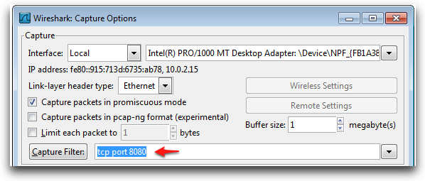
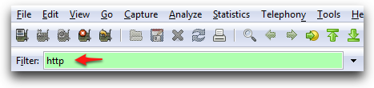

# Monitoring HTTP Requests

<!-- toc -->

## Introduction

When investigating issues, you often need to look at what goes "over the wire", in the HTTP requests between the client and the server. You may want to look at the HTTP requests as sent/received on the browser, on the application server, or somewhere in between. This page lists a few tool which might be of use in these cases.

### On the browser, the server, or in between:

* On OS X, [HTTP Scoop][1] ($15) is both simple and efficient. If you're on OS X, look no further.
* [Charles][2] (see also this [blog post][3])
* [WireShark][4] is a workhorse. It can do a lot more than monitoring HTTP requests, but can also be intimidating. Lately, usability, including the installing process, has improved significantly. (See below for more details on WireShark.)
* [Apache TCPMon][5] is very versatile tool; highly recommended; see the [TCPMon tutorial][6]

### On the server:

* [XForms logging][7]
* Request Dumper Filter; see below
* On Tomcat, you can use the Request Dumper Valve; see below

### On the browser-side

* Use the browser's dev tools (AKA "F12 Developer Tools" on IE)
* On Firefox, use [Firebug][8]'s Net tab, or the Console tab for Ajax requests.
* On the Mac (any browser), use [HTTPScoop][1]

## WireShark

After you install WireShark, click on _Capture Options_, and setup a setup the _Capture Filter_ to be `tcp port 8080`. (Replace `8080` with the port on which your application server or services are listening, as appropriate.)



Click Start, and since you only interested about HTTP (versus TCP) traffic, in _Filter_ type `http` and press enter to apply.



Next WireShark will show you all the HTTP traffic that goes through the machine it is running on, to the port you specified (here 8080).

## Request Dumper Filter

Note that the Request Dumper Filter only shows information about the HTTP headers of the request. If you want more information to be logged, use the Apache TCPMon.

1. The Request Dumper Filter comes with Tomcat, so even if you are not using Tomcat, start by [downloading Tomcat][11].
2. Unzip Tomcat, and copy the directory webapps/servlets-examples/WEB-INF/classes/filters to the WEB-INF/classes directory of your web application.
3. Edit WEB-INF/web.xml and add:
    * After the declaration of the filter ops-xforms-filter:

        ```xml
        <filter>
            <filter-name>request-dumper-filter</filter-name>
            <filter-class>filters.RequestDumperFilter</filter-class>
        </filter>
        ```

    * After the filter mapping for ops-xforms-filter:

        ```xml
        <filter-mapping>
            <filter-name>request-dumper-filter</filter-name>
            <url-pattern>/*</url-pattern>
        </filter-mapping>
        ```

* Restart your application server (e.g. Tomcat).
* On Tomcat, requests will be logged to the logs/localhost log file.

## Request Dumper Valve

The Request Dumper Valve doesn't log the body of POSTs, it can only be used on Tomcat, and we found its output to be less readable than what you get with the Request Dumper Filter. But if you still want to experiment with the Request Dumper Valve, add the following in server.xml inside <engine>:

```xml
<valve classname="org.apache.catalina.valves.RequestDumperValve">
```

## See also

- [Let Charles help you monitor HTTP requests](http://blog.orbeon.com/2013/04/let-charles-help-you-monitor-http.html)

[1]: http://www.tuffcode.com/
[2]: http://www.charlesproxy.com/
[3]: http://blog.orbeon.com/2013/04/let-charles-help-you-monitor-http.html
[4]: http://www.wireshark.org/
[5]: http://ws.apache.org/commons/tcpmon/
[6]: http://ws.apache.org/commons/tcpmon/tcpmontutorial.html
[7]: http://wiki.orbeon.com/forms/doc/developer-guide/xforms-logging
[8]: https://addons.mozilla.org/en-US/firefox/addon/1843
[11]: https://tomcat.apache.org/download-70.cgi
