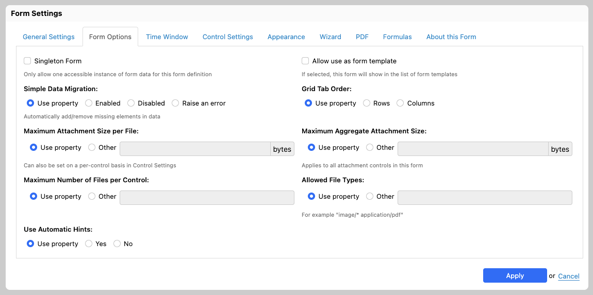

# Singleton form

## Use case

Most forms are filled out for a given purpose, and then submitted. When the initial purpose comes up again, the form is filled and submitted one more time. For instance, a _car registration_ form would be such an example. However, certain forms are often used more like "documents", that users create, and then come back to update, without creating another instance of that form/document. Those forms are here referred to as _singleton forms_.

## In Form Builder

As a form author, you can mark a form as _singleton_ in Form Builder by opening the _Form Settings_ dialog, and clicking on the _Singleton form_ checkbox.

## In Form Runner

### New page

When accessing the _new_ page of a singleton form, the following will happen depending on how many form data the current user can access for that form:

* 0: if she can't access any existing data for the current form, then she stays on the _new_ page for the form.
* 1: if she can access exactly one form data, she is redirected to the _edit_ page for that form.
* 2 or more: a message, as warns her she can't create any additional form data, and links to the _summary_ page for that form, which she can use to pick the form data she wants to edit.

\[SINCE Orbeon Forms 2024.1.3] Database checks now prevent a user who already has access to form data from creating additional data, protecting singleton forms against adversarial attempts to create multiple entries. This improvement is available on all supported databases except Oracle.

### Summary page

When accessing the _summary_ page for a singleton form, the _New_ button won't show if the user can access 1 or more form data.

### Driven by permissions

The simplest use case, described above, calls for having at most one form data per user. However, since the _singleton_ aspect is driven by what users can see, you can use permissions to control whether you want to have one form per user, per group, per users having a given role, or even in the whole system.

This also means that it might still be possible for certain users to see multiple forms, hence the third case above (_two or more_ form data). For example, if you set up permissions so regular users can only see their own data, they will be able to create at most one form data, but someone with the `admin` role can view all the data.

## See also

* [Form Settings](../../form-builder/form-settings.md)
