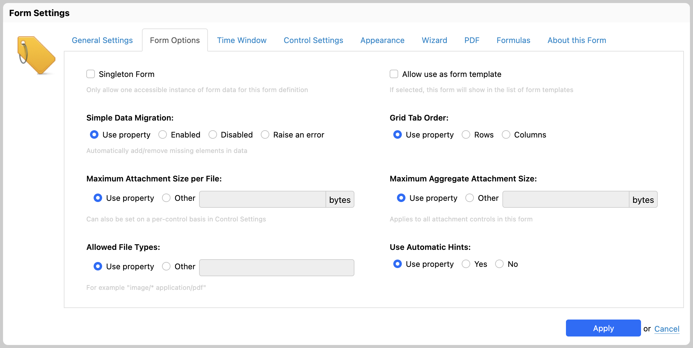

# Singleton form

## Use case

Most forms are filled out for a given purpose, and then submitted. When the initial purpose comes up again, the form is filled and submitted one more time. For instance, a _car registration_ form would be such an example. However, certain forms are often used more like "documents", that users create, and then come back to update, without creating another instance of that form/document. Those forms are here referred to as _singleton forms_.

## Configuration

### In Form Builder

As a form author, you can mark a form as _singleton_ in Form Builder by opening the _Form Settings_ dialog, and clicking on the _Singleton form_ checkbox.



### Properties

\[SINCE Orbeon Forms 2025.1.1\]

You can use the following property to enable the singleton behavior for forms that have the *Singleton Form* setting set to *Use property* in the *Form Settings* dialog.

```xml
<property
    as="xs:boolean"
    name="oxf.fr.detail.singleton.enabled.*.*"
    value="false"/>
```

You can set the following property to define what happens when users access the `/new` page of a singleton form and exactly one existing document is found. If set to `open` (the default), users are automatically redirected to the `/edit` page for the existing document. If set to `prompt`, users see a message informing them that existing form data was found, with a button to navigate to it. When two or more existing documents are found, a message is always shown regardless of this property, since automatic redirection is not possible in that case.

```xml
<property
    as="xs:string"
    name="oxf.fr.detail.singleton.if-one-exists.*.*"
    value="open"/>
```

## In Form Runner

### New page

When accessing the *new* page of a singleton form, the behavior depends on how many form records the current user can access for that form:

- 0: if the user has no access to any existing records for the form, they remain on the *new* page.
- 1: if the user can access exactly one record, they are redirected to the *edit* page for that form.
- 2 or more: a warning message (shown below) informs the user that no additional records can be created. A button allows them to navigate to the *summary* page, where they can select a record to edit.

\[SINCE Orbeon Forms 2024.1.3] Database checks now prevent a user who already has access to form data from creating additional data, protecting singleton forms against adversarial attempts to create multiple entries. This improvement is available on all supported databases except Oracle.

\[SINCE Orbeon Forms 2026.1, 2025.1.1, 2024.1.5] The above count doesn't take into account any autosaved documents that might exist for the current form. Moreover, if user stays on the _new_ page (case 0 above), then [autosave](../../form-runner/persistence/autosave.md) is disabled.


### Summary page

When accessing the _summary_ page for a singleton form, the _New_ button won't show if the user can access 1 or more form data.

### Driven by permissions

The simplest use case, described above, calls for having at most one form data per user. However, since the _singleton_ aspect is driven by what users can see, you can use permissions to control whether you want to have one form per user, per group, per users having a given role, or even in the whole system.

This also means that it might still be possible for certain users to see multiple forms, hence the third case above (_two or more_ form data). For example, if you set up permissions so regular users can only see their own data, they will be able to create at most one form data, but someone with the `admin` role can view all the data.

## See also

* [Form Settings](../../form-builder/form-settings.md)
