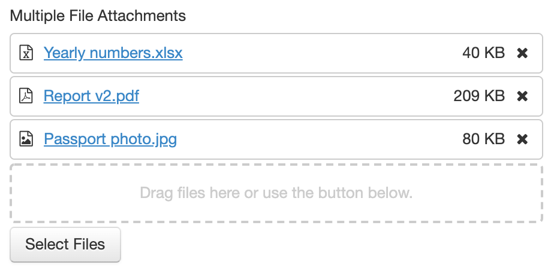
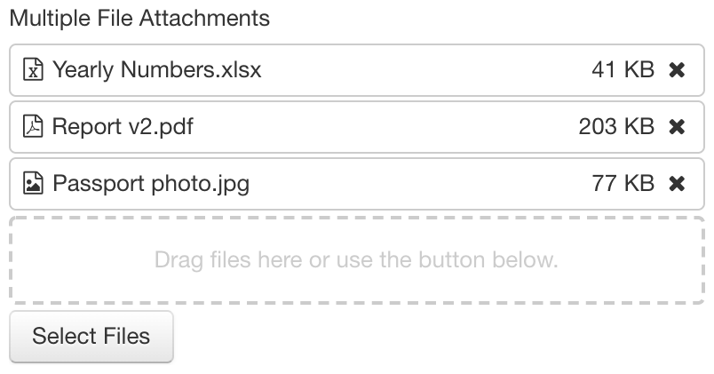

# Attachment component

## What it does

This component represents an attachment to a form.



## Accepted mediatypes

By default the component accepts any mediatype. 

[SINCE Orbeon Forms 2017.1]

If an [`upload-mediatypes` custom constraint](/xforms/xpath/extension-validation.md#xxfupload-mediatypes) is
present and not blank, it is applied to the enclosed upload control.

Otherwise, if an `accept` attribute or associated `oxf.xforms.xbl.fr.attachment.accept` property is defined and not blank, it is used. Example of system-wide property:

```xml
<property
    as="xs:string"  
    name="oxf.xforms.xbl.fr.attachment.accept"
    value="application/pdf"/>
```

Example of attribute on the control:
    
```xml
<fr:attachment
    bind="my-file"
    accept="application/pdf">
```

Otherwise, any mediatype is allowed.

## Support for multiple files

[SINCE Orbeon Forms 2020.1]

The `multiple="true"` attribute enables support for multiple files:

- The file selector allows multiple selection.
- The drop area (see below) allows multiple file being dropped at the same time or serially.
- A reorderable list of multiple files shows.

## Drag and drop of files

[SINCE Orbeon Forms 2020.1]

On supported browsers, you can drag and drop files from other applications (typically an operating system file explorer) to the drop area instead of selecting files with the file selector button.

As of Orbeon Forms 2020.1 the following browsers are known not to support drag and drop and the drop area is hidden:

- IE11
- Safari on iOS/iPadOS

## Disallowing attachment download

[SINCE Orbeon Forms 2020.1]

By default, the user can download back the attached files. In some cases, this is not desirable. The `allow-download="false"` attribute allows disabling downloads.

```xml
<fr:attachment
    id="attachments-control"
    bind="attachments-bind"
    multiple="true"
    allow-download="false"
    class="fr-attachment">
    ...
</fr:attachment>
```

Form Builder offers an option in the "Control Settings" dialog.




## Mediatype determination

Web browsers determine a mediatype (AKA content type or MIME type) for uploaded files. This determination is platform-dependent, not necessarily precise, and sometimes missing.

In all cases, the mediatype provided by the browser cannot be trusted and is indicative only. You can use the [file scan API](/form-runner/api/other/file-scan-api.md) to reject files that do not satisfy the indicated mediatype.

[SINCE Orbeon Forms 2020.1]

When the browser does not provide a mediatype, or provides a generic mediatype such as `application/octet-stream`, Orbeon Forms uses the file extension, when present, to guess a mediatype.

This means for example that a `.docx` file will map to `application/vnd.openxmlformats-officedocument.wordprocessingml.document` even if the browser is unaware of Microsoft Word files.    

## Events

[SINCE Orbeon Forms 2017.1]

This component dispatches the following events following the enclosed upload control:

- `xxforms-upload-start`
- `xxforms-upload-cancel`
- `xxforms-upload-done`
- `xxforms-upload-error`

## See also

- [Image component](image.md)
- [Image attachment component](image-attachment.md)
- Blog post: [The new Multiple File Attachments control](https://blog.orbeon.com/2020/05/the-new-multiple-file-attachments.html)
