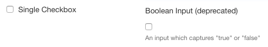

# Checkbox Input Component

<!-- toc -->

## Availability

[SINCE Orbeon Forms 4.11]

## What it does

The `fr:checkbox-input` component displays a single checkbox and by default stores a value of `true` when selected and `false` when deselected.



*NOTE: It differs from the (deprecated in Orbeon Forms 4.11) Boolean Input field (obtained by binding an `xf:input` to a field of `xs:boolean` type) in that the Checkbox Input displays the label right next to the checkbox.*


## Basic usage

You use `fr:checkbox-input` like a regular XForms controls. Example:

```xml
<fr:checkbox-input ref="initially-open">
    <xf:label>Initially Open</xf:label>
</fr:checkbox-input>
```

## Advanced usage

The datatype of the bound node is typically `xs:boolean` but doesn't have to.

The following attributes can be passed:

- `selected-value`: value to store when the checkbox is selected, by default `true`
- `deselected-value`: value to store when the checkbox is deselected, by default `false`

Example:

```xml
<fr:checkbox-input
    ref="whitespace"
    selected-value="trim"
    deselected-value="">
    <xf:label>Trim leading and trailing spaces</xf:label>
</fr:checkbox-input>
```

The control works like `xf:select` in that it adds and removes the selected value (by default `true`) into a space-separated list of tokens without affecting other tokens. With the following example, say the bound node initially contains:

```xml
<whitespace>foo bar</whitespace>
```

When the user selects the checkbox. The node now contains:

```xml
<whitespace>foo bar trim</whitespace>
```

And when the user deselects the checkbox. The node contains again:

```xml
<whitespace>foo bar</whitespace>
```

*NOTE: The control only store a value into the bound node when the user changes the checkbox selection. Say the data by default is blank: the control will not automatically change it to `false` (or to the value set by `deselected-value`) until the user selects then deselects the value again.*

## See also

- [Yes/No Answer Component](yesno-input.md)