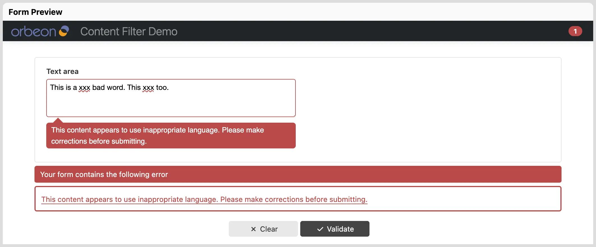
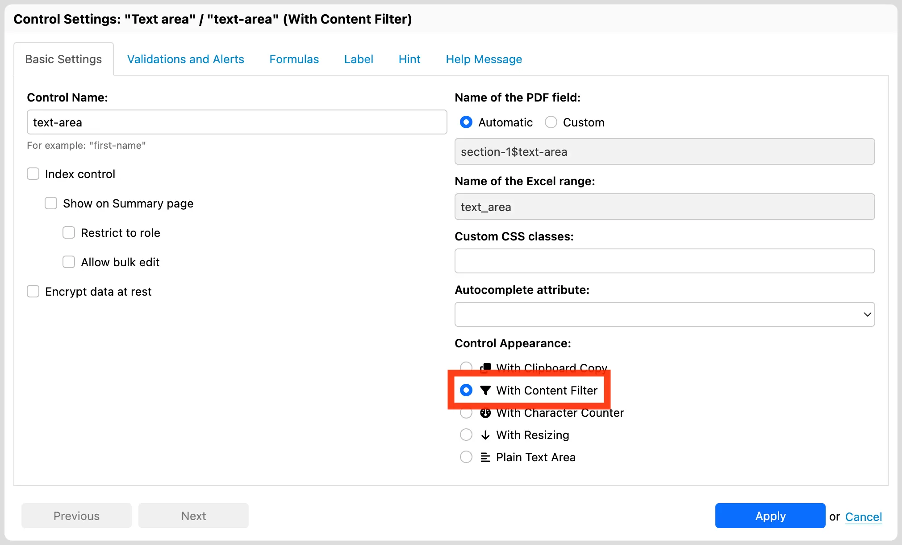

# Content filter

## Availability

[SINCE Orbeon Forms 2026.1]

## What it does

The `fr:content-filter` component (available as the "With Content Filter" appearance in Form Builder) checks text entered into fields or text areas against dictionaries of inappropriate words and profanity, providing real-time visual feedback and form validation.



Key capabilities:

* **Real-time visual feedback**: As the user types in the browser, any detected inappropriate words are immediately highlighted with a wavy red underline directly beneath the text.
* **Form validation**: The field is marked invalid if any prohibited content is present, preventing form submission until corrections are made.
* **Evasion resistance**: The filter automatically handles common evasion techniques:
    * Character substitutions / leet-speak (e.g. `@` &rarr; `a`, `0` &rarr; `o`, `1`/`!` &rarr; `i`, `$` &rarr; `s`, `3` &rarr; `e`, `5` &rarr; `s`, `7`/`+` &rarr; `t`, `8` &rarr; `b`, `9`/`6` &rarr; `g`, `#` &rarr; `h`)
    * Diacritics and accents (normalized via Unicode NFKD normalization)
    * Zero-width characters and combining marks
    * Separators, spaces, and punctuation inserted between letters
    * Boundary protection: Short words (3 characters or fewer) are only matched on word/token boundaries to prevent false positives within innocent words.
* **Multilingual dictionary support**: The built-in filter checks against word lists across multiple languages, including English, Spanish, French, Japanese, and Polish.
* **Server-side validation**: Content validation is always enforced on the server during form processing, ensuring security even if client-side validation is bypassed.
* **Read-only handling**: When a field or node is read-only, content filtering validation and visual highlights are disabled.

It supports the following controls:

* `xf:input` (Text Field)
* `xf:textarea` (Plain Text Area)

## Form Builder usage

In Form Builder, the content filter is available as an appearance option on **Text Field** and **Plain Text Area** controls.



To enable it:

1. Select the Text Field or Plain Text Area in the form canvas.
2. Click the gear icon to open **Control Settings**.
3. In the **Appearance** dropdown, select **With Content Filter**.
4. Click **Apply** to close the dialog.

## XForms usage

### Appearance attribute

The component is generally activated using the `appearance` attribute on `<xf:input>` or `<xf:textarea>`:

```xml
<xf:input ref="comment" appearance="content-filter">
    <xf:label>Comment</xf:label>
    <xf:alert>This content appears to use inappropriate language. Please make corrections before submitting.</xf:alert>
</xf:input>
```

```xml
<xf:textarea ref="description" appearance="content-filter">
    <xf:label>Description</xf:label>
</xf:textarea>
```

The component automatically encapsulates the specified control.

You can also combine appearances on `<xf:textarea>` (for example, combining auto-sizing with the content filter):

```xml
<xf:textarea ref="description" appearance="xxf:autosize content-filter">
    <xf:label>Description</xf:label>
</xf:textarea>
```

## Validation and error alerts

When inappropriate content is detected, the component triggers an internal constraint validation failure. The default English message is:

> *This content appears to use inappropriate language. Please make corrections before submitting.*

[//]: # (You can customize the alert message for a specific field by providing an `<xf:alert>` element in your XForms or Form Builder control configuration.)

## See also

* [Character counter](character-counter.md)
* [Form Runner functions](../../xforms/xpath/extension-form-runner.md)
* [Form Builder appearances](https://blog.orbeon.com/2015/06/how-new-form-builder-appearance.html)
