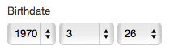

# Dropdown Date Component

## What it does

This component allows users to select a date with 3 drop-downs, for the year, month, and day.



## Configuration

The values for the start and end year are determined as follows:

1. [SINCE 2016.3] If you're on Orbeon Forms 2016.3 or newer, and your form was created with Form Builder, and you defined an app/form specific property as in the example below, then the values of these properties are used.

    ```xml
    <property 
       as="xs:string" 
       name="oxf.xforms.xbl.fr.dropdown-date.start-year.*.*" 
       value="2010"/>
    <property 
       as="xs:string" 
       name="oxf.xforms.xbl.fr.dropdown-date.end-year.*.*"
       value="2030"/>
    ```
2. [SINCE 4.2] If the conditions in point 1 don't apply, but you're on Orbeon Forms 4.2 or newer, and you defined a global property setting the start or end date, as in the example below, then the value of this property is used.

    ```xml
    <property 
       as="xs:string"
       name="oxf.xforms.xbl.fr.dropdown-date.start-year"
       value="1970"/>
    <property 
       as="xs:string"
       name="oxf.xforms.xbl.fr.dropdown-date.end-year"
       value="year-from-date(current-date())"/>
    ```
3. Finally, if none of the properties mentioned in points 1 and 2 above are usable, the start year is set to 1970, and the end year to the current year.

The values of all the properties mentioned earlier are XPath expressions. In particular, this allows you to set an end year which isn't hard coded and instead allows you to set it to, say, "this year".
