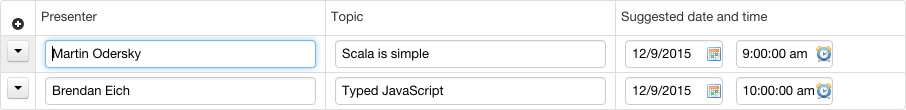
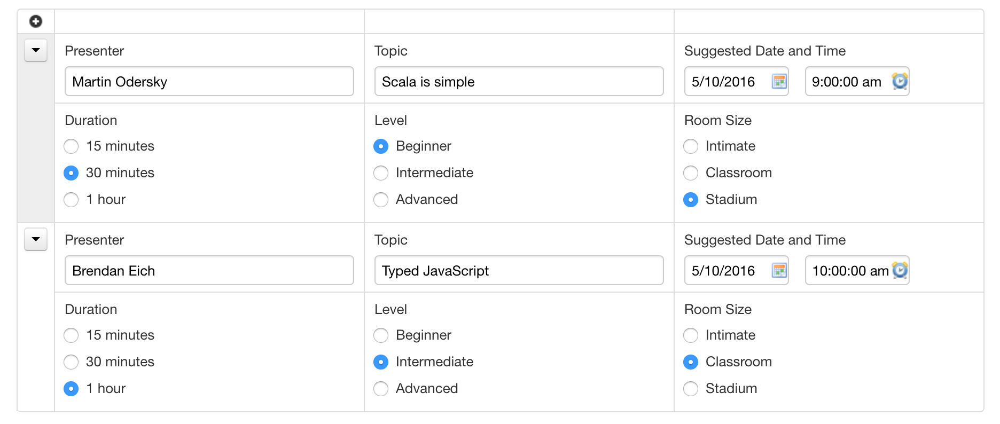
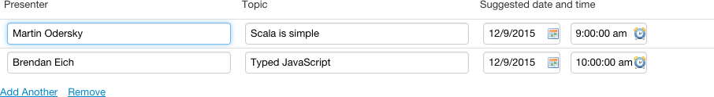
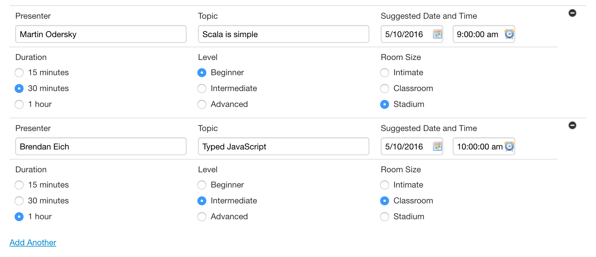

# Grid Component


## What it does

The `fr:grid` component organizes contained controls in a grid of rows and columns. Features:

- configurable number of rows and columns
- optional repetition of its content
  - configurable min/max number of iterations
  - can repeat over several heterogeneous rows
  - built-in icons and menus to add, remove, and move repeated rows
  - supports `relevant` and `readonly` MIPs [SINCE Orbeon Forms 4.8]

## Appearance

### Full repeat appearance





### Minimal repeat appearance

[SINCE Orbeon Forms 2016.1]





## Basic usage

### Format of rows and cells

#### Starting Orbeon Forms 2017.2

With Orbeon Forms 2017.2 and newer, the format for grid rows and cells produced by Form Builder has changed. Instead of using `<xh:tr>` and `<xh:td>`, it uses `<fr:c>`. `<xh:tr>` and `<xh:td>` are still supported for backward compatibility.

The following attributes are supported on `<fr:c>`:

- `x`:
    - x position
    - required
    - minimum: 1
    - maximum: 12
- `y`:
    - y position
    - required
    - minimum: 1
    - maximum: none 
- `w`:
    - width of the cell
    - required
    - minimum: 1
    - maximum: 12
- `h`:
    - height of the cell
    - optional, defaults to 1
    - minimum: 1
    - maximum: none 
    
The following must hold:

- cells must not overlap
- cells must not extend beyond column 12

In other words, the grid must be well-formed.

However, the grid may have holes, and not all cells need be present.

#### Until Orbeon Forms 2017.1

`<xh:tr>` and `<xh:td>` are used to indicate rows and cells, following the HTML tables `<tr>` and `<td>` scheme.

The following attributes are supported on `<xh:td>`:

- `rowspan`
    - optional, defaults to 1
    - as in HTML
    - supported in Form Builder
- `colspan`
    - optional, defaults to 1
    - as in HTML
    - NOT supported in Form Builder

### Non-repeated mode

#### General information

Attributes:

- `id`: optional grid id. Form Builder always places an id.
- `repeat`: can be optionally set to `false`

_NOTE: In the future `bind` and `ref` should be supported._

#### Starting Orbeon Forms 2017.2

```xml
<fr:grid id="note-grid">
    <fr:c y="1" x="1" w="12">
        <!-- A form control will be placed here -->
    </fr:c>
</fr:grid>
```

Example with multiple cells spanning rows and columns:

```xml
<fr:grid id="grid-1-grid">
    <fr:c y="1" x="1" w="6">
        <!-- A form control will be placed here -->
    </fr:c>
    <fr:c y="1" x="7" w="6" h="2">
        <!-- A form control will be placed here -->
    </fr:c>
    <fr:c x="1" y="2" w="3">
        <!-- A form control will be placed here -->
    </fr:c>
    <fr:c x="4" y="2" w="3">
        <!-- A form control will be placed here -->
    </fr:c>
</fr:grid>
```

#### Until Orbeon Forms 2017.1

```xml
<fr:grid id="note-grid">
    <xh:tr>
        <xh:td>
            <!-- A form control will be placed here -->
        </xh:td>
    </xh:tr>
</fr:grid>
```

### Repeated mode

#### General information

Attributes:

- `id`: optional grid id.
- `repeat`
  - `true`: legacy repeat mode
  - `content`: new repeat mode with an enclosing element [SINCE Orbeon Forms 4.8]
- `bind` or `ref`
  - with `repeat="content"`: single item binding which binds to the enclosing element
  - with `repeat="true"`: item sequence binding which binds to the repeated elements
- `template`
  - XML data template used to insert new data when iterations are inserted
  - optional when the grid is readonly
- `min` and `max`
  - minimum vs. maximum number of repeat iterations supported
  - can be an AVT
  - evaluation context
    - with `repeat="content"`: context of the binding (`bind` or `ref`)
    - with `repeat="true"`: context of the `fr:grid element`
  - are checked when the user attempts to add/remove iterations with the UI
- `remove-constraint`
  - optional XPath expression
  - evaluation context
    - context of the iteration item
  - if the constraint returns `false()`, the current row cannot be removed
- `freeze`
  - optional number of rows at the top which cannot be removed or moved
  - can be an AVT [SINCE Orbeon Forms 2016.3]
  - evaluation context
    - with `repeat="content"`: context of the binding (`bind` or `ref`)
    - with `repeat="true"`: context of the `fr:grid element`
- `readonly`
  - force the grid to be readonly when set to `true`
  - this cannot be an AVT
- `apply-defaults` [SINCE Orbeon Forms 2016.1]
  - `true`: dynamic initial values (via the `xxf:default` MIP) apply to new iterations
  - missing or `false: dynamic initial values do not apply to new iterations
  - can be an AVT
  - see also: [Evaluation of initial values upon insert](../../xforms/actions/repeat-insert-delete.md#evaluation-of-initial-values-upon-insert)
- `appearance` [SINCE Orbeon Forms 2016.1]
  - `full`
    - the default appearance, as with Orbeon Forms 4.10 and earlier
    - row menu
      - reordering of rows
      - insertion of rows at specific points
      - removing of specific rows
  - `minimal`
    - does not show the "+" button at the top left
    - does not show the row menu and associated features
    - instead just provides "Add another" and "Remove" links at the bottom
- `insert` [SINCE Orbeon Forms 2016.2]
  - `index`
    - the "Add Another" or "+" button adds a new repetition after the iteration currently with keyboard focus
    - this is the default in `full` appearance
  - `bottom`
    - the "Add Another" or "+" button adds a new repetition after the last iteration
    - this is the default in `minimal` appearance

#### Starting Orbeon Forms 2017.2

```xml
<fr:grid
    id="note-grid"
    repeat="content"
    bind="note-bind"
    template="instance('note-template')"
    min="0">
    <fr:c y="1" x="1" w="12">
        <!-- A form control will be placed here -->
    </fr:c>
</fr:grid>
```

#### Until Orbeon Forms 2017.1

```xml
<fr:grid
    id="note-grid"
    repeat="content"
    bind="note-bind"
    template="instance('note-template')"
    min="0">
    <xh:tr>
        <xh:td>
            <!-- A form control will be placed here -->
        </xh:td>
    </xh:tr>
</fr:grid>
```

## Data format

With `repeat="content"`:

- An enclosing element is present.
- Nested elements, typically suffixed with `-iteration`, enclose each repetition.

```xml
<note>
    <note-iteration>
        <note-text/>
    </note-iteration>
    <note-iteration>
        <note-text/>
    </note-iteration>
</note>
```

With legacy `repeat="true"`:

- No enclosing element is present.
- Elements are repeated at the top-level.

```xml
<note>
    <note-text/>
</note>
<note>
    <note-text/>
</note>
```

A template instance contains the XML data to insert for a new iteration:

```xml
<xf:instance id="note-template">
    <note-iteration xmlns="">
        <note-text/>
    </note-iteration>
</xf:instance>
```

## Relevance and readonly behavior

With `repeat="content"`:

- if the bound item is non-relevant, the grid is entirely hidden
- if the bound item is readonly, the grid is entirely readonly and menus and icons don't show

In either case, `fr:grid` contains the rows to repeat as `xh:tr`. Each `xh:tr` contains `xh:td` cells as needed.

## Events

[SINCE Orbeon Forms 2016.1]

The following events are dispatched to the `fr:grid` element:

| Event name | Description |
| --- | --- |
| `fr-iteration-added` | Dispatched when the user has just added an iteration |
| `fr-iteration-removed` | Dispatched when the user has just removed an iteration |

These events are not dispatched if the number of iterations changes by other means, for examle if the data is replaced, or inserts/deletes happen outside of the component.


## See also

- [Section component](section.md)
- [Form data format](../data-format/form-data.md)
- [Form Builder: Repeated Grids ](../../form-builder/repeated-grids.md)
- Example of use outside of Form Runner: [gist](https://gist.github.com/orbeon/5d592bfa4640569b116f)
- [Evaluation of initial values upon insert](../../xforms/actions/repeat-insert-delete.md#evaluation-of-initial-values-upon-insert)
