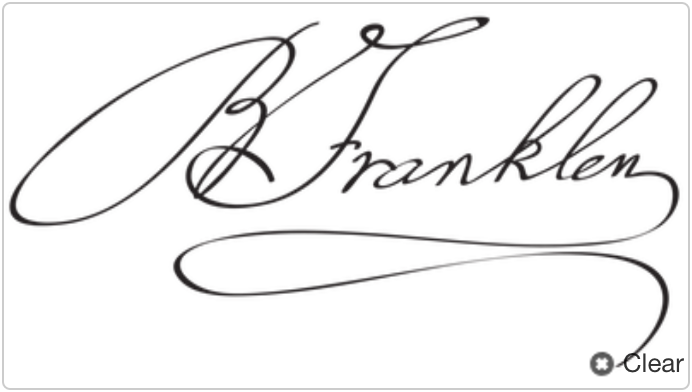

# Handwritten Signature Component

<!-- toc -->

## Rationale

[SINCE Orbeon Forms 4.11 PE]

This component allows you to capture a signature from people filling out the form, similar to what you would do if you had a paper form, except of course:

- The signature is stored digitally.
- On a desktop, the signature is drawn with a mouse or other pointing device, while one a mobile it is drawn with the user's finger or, more rarely, a stylus.

## Usage
In Form Builder, to add a *signature control* to your form, click on *Handwritten signature* on the left sidebar. You can then add a label to the component (e.g. "Applicant signature") and a hint (e.g. "You are hereby accepting the Acme application terms and conditions"), as necessary.

## Support and limitations

**HTML5 canvas**. For its implementation, this component uses the [HTML5 canvas](http://caniuse.com/#feat=canvas), which is supported on all modern browsers, including modern mobile browsers. On IE, it is supported with IE9 onwards.
