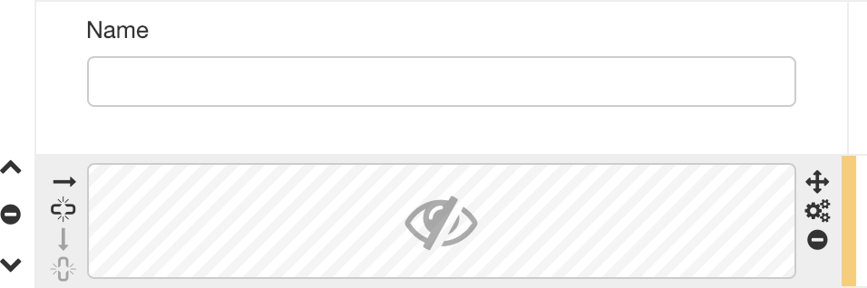

# Hidden field component

## Availability

[SINCE Orbeon Forms 2018.2]

## What it does

This control supports all the features of a regular control, including:

- label
- validations and alerts
- formulas

However, it doesn't show in the form at runtime. At design-time, the control shows as a box with an icon so that the form author knows that a hidden control is in use. 



This is useful in the following cases:
 
- __Holding intermediary calculations:__  If the control has a "Calculated Value" and/or "Initial Value" formula, it can be referred to by variable name (like `$my-intermediary-result`) from other formulas. 
- __Handling out-of-band validations:__  If the control has a label, alert and validations, a failing validation will show in the Error Summary. In addition, this also impacts the Wizard View's lax and strict validation modes, preventing forward navigation until the error is fixed by the user.

_NOTE: With Form Builder, you cannot directly edit the label of a hidden field inline. Instead, use "Control Settings"._

## Basic usage

```xml
<fr:hidden ref="validating">
    <xf:label>Validation</xf:label>
    <xf:alert>Please start the validation before proceeding to the import</xf:alert>
</fr:hidden>
```

## See also

- Blog post: [Hidden fields](https://blog.orbeon.com/2019/02/hidden-fields.html)
