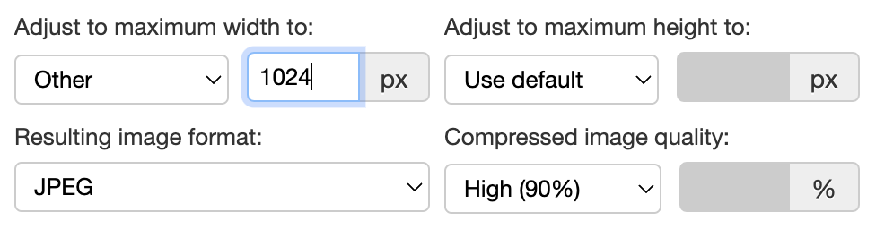

# Image attachment component


## What it does

This component represents an attachment to a form which has to contain an image. The image is displayed by the component
when attached.  

## Accepted mediatypes

By default the component accepts `image/*` mediatypes. 

[SINCE Orbeon Forms 2017.1]

If an [`upload-mediatypes` custom constraint](../../xforms/xpath/extension-validation.md#xxfupload-mediatypes) is
present and not blank, it is used applied to the enclosed upload control. If missing, the default is `image/*`.

## Events

[SINCE Orbeon Forms 2017.1]

This component dispatches the following events following the enclosed upload control:

- `xxforms-upload-start`
- `xxforms-upload-cancel`
- `xxforms-upload-done`
- `xxforms-upload-error`

## Image transformation

[SINCE Orbeon Forms 2022.1]

The component can transform the uploaded image. The following attributes control the transformation:

- `transform-max-width`:
    - no attribute: use the default (form-level then property) 
    - blank attribute value: don't constrain the image width
    - positive integer: scale the image width to the given value if the image is larger
    - the image's aspect ratio is preserved when used in conjunction with `transform-max-height` 
- `transform-max-height`:
    - no attribute: use the default (form-level then property) 
    - blank attribute value: don't constrain the image width
    - positive integer: scale the image hight to the given value if the image is larger
    - the image's aspect ratio is preserved when used in conjunction with `transform-max-width`
- `transform-format`:
    - no attribute: use the default (form-level then property) 
    - blank attribute value: preserve the input format
    - `jpg`: force the result to JPEG
    - `png`: force the result to PNG
- `transform-quality`:
    - no attribute: use the default (form-level then property) 
    - blank attribute value: use the default compression quality (80) 
    - for JPEG compression only
    - value between 1 (worst) and 100 (best), but typically between 50 and 90

The following matching properties allow setting global defaults. For example: 

```xml
<property 
    as="xs:string"
    name="oxf.xforms.xbl.fr.image-attachment.transform-max-width.*.*"
    value="1024"/>
<property 
    as="xs:string"
    name="oxf.xforms.xbl.fr.image-attachment.transform-max-height.*.*"
    value="768"/>
<property 
    as="xs:string"
    name="oxf.xforms.xbl.fr.image-attachment.transform-format.*.*"
    value="jpg"/>
<property 
    as="xs:string"
    name="oxf.xforms.xbl.fr.image-attachment.transform-quality.*.*"
    value="90"/>
```

## Form Builder customer settings

When used in Form Builder, the following custom settings for image transformation are available:



## See also

- [Image component](image.md)
- [Video component](video.md)
- [Attachment component](attachment.md)