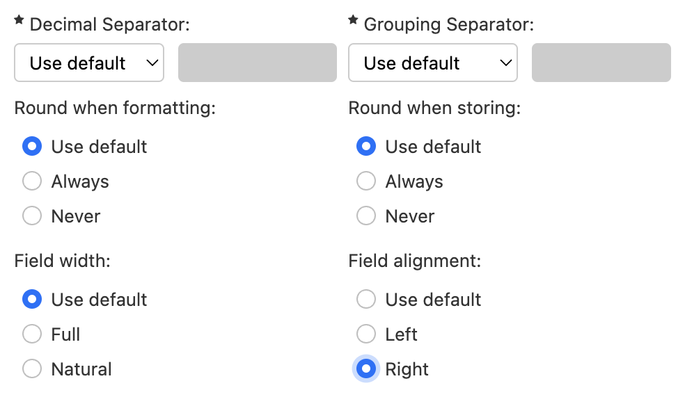
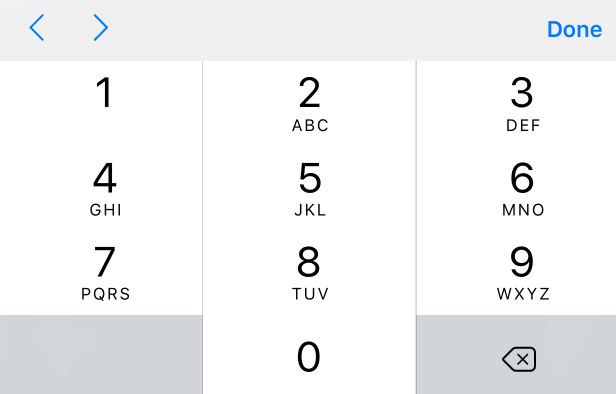

# Number component

## What it does

The number component is designed to enter integer or decimal numbers. See [Currency](../../form-runner/component/currency.md) for a similar component designed to enter currency amounts.


## Basic usage

You use the number component like a regular input field, for example:

```xml
<fr:number ref="my-number">
  <xf:label>Quantity</xf:label>
</fr:number>
```

### Form builder support

Form builder shows extended control settings for Number and Currency fields:



These are also available at the form level:


## Datatype

`fr:number` must be bound to either of:

- `xs:decimal`
- `xs:integer` [SINCE Orbeon Forms 2016.1]

## Parameters

`fr:number` supports parameters, which you can set via properties or directly on `fr:number`:

* `prefix`: optional prefix shown before the number
* `suffix`: optional suffix shown after the number
* `digits-after-decimal`: digits to show after the decimal point (by default 0, which means the number is an integer)

[//]: # (    * xxx TODO: default is probably not 0 but to show all digits)

[//]: # (    * xxx "means the number is an integer" is unclear; only for formatting, right?)

[//]: # (    * xxx use of )
* `decimal-separator`: single character to use as decimal separator
    * use `.` or `,` only
* `grouping-separator`: single character to use as thousands separator separator (can be blank)
* `round-when-formatting`: when formatting the number for display, whether to round the value to `digits-after-decimal` if there are more digits after the decimal point or not. The default is `false`.
    * SINCE Orbeon Forms 2016.1
    * UNTIL Orbeon Forms 2017.2: Rounding uses the [half to even](https://en.wikipedia.org/wiki/Rounding#Round_half_to_even) method.
    * SINCE Orbeon Forms 2018.1: Rounding uses the [half up](https://en.wikipedia.org/wiki/Rounding#Round_half_up) method.
* `round-when-storing`: when storing the number entered by the user, whether to round the value to `digits-after-decimal` if there are more digits after the decimal point or not. The default is `false`.
    * SINCE Orbeon Forms 2016.1
    * UNTIL Orbeon Forms 2017.2: Rounding uses the [half to even](https://en.wikipedia.org/wiki/Rounding#Round_half_to_even) method.
    * SINCE Orbeon Forms 2018.1: Rounding uses the [half up](https://en.wikipedia.org/wiki/Rounding#Round_half_up) method.
* `pattern`
    * SINCE Orbeon Forms 2016.1
    * overrides the HTML `pattern` attribute
* `field-align`: determines the alignment of the value in the field
    * SINCE Orbeon Forms 2022.1.1 
    * `left` (default): align content to the left
    * `right`: align content to the right

These are the default values of the properties:

```xml
<property
    as="xs:string"
    name="oxf.xforms.xbl.fr.number.prefix"
    value=""/>
<property
    as="xs:string"
    name="oxf.xforms.xbl.fr.number.suffix"
    value=""/>
<property
    as="xs:string"
    name="oxf.xforms.xbl.fr.number.digits-after-decimal"
    value=""/>
<property
    as="xs:string"
    name="oxf.xforms.xbl.fr.number.decimal-separator"
    value="."/>
<property
    as="xs:string"
    name="oxf.xforms.xbl.fr.number.grouping-separator"
    value=","/>
<property
    as="xs:boolean"
    name="oxf.xforms.xbl.fr.number.round-when-formatting"
    value="false"/>
<property
    as="xs:boolean"
    name="oxf.xforms.xbl.fr.number.round-when-storing"
    value="false"/>
```

## Validation vs. formatting

The `digits-after-decimal` parameter controls how the value entered by the user gets *formatted* when the field displays it. This does not impact validation of the data at all.

[SINCE Orbeon Forms 2016.1]

In order to validate the number to have a specific number of decimal digits, the `xxf:fraction-digits()` function should be used.

## Mobile support

[SINCE Orbeon Forms 2016.1]

On iOS, when the control identifies that the value is a non-negative integer, it shows a numeric keypad:



This is the case if:

- the control is bound to `xs:integer` OR is bound to `xs:decimal` and has an [`xxf:fraction-digits(0)`](../../xforms/xpath/extension-validation.html#xxffractiondigits) constraint
- AND has an [`xxf:non-negative()`](../../xforms/xpath/extension-validation.html#xxfnonnegative) constraint

Otherwise, the control shows the numeric pane of the regular keyboard:


## Examples

### Use of a suffix

Here is an example with a suffix:


```xml
<fr:number ref="my-number" suffix="m/s">
    <xf:label>Number</xf:label>
    <xf:hint>Number field with validation</xf:hint>
</fr:number>
```

### Rounding

[SINCE Orbeon Forms 2016.1]

#### Rouding when formatting only

Assume the following properties or corresponding attributes:

```xml
<property
    as="xs:string"
    name="oxf.xforms.xbl.fr.number.digits-after-decimal"
    value="2"/>
<property
    as="xs:boolean"
    name="oxf.xforms.xbl.fr.number.round-when-formatting"
    value="true"/>
<property
    as="xs:boolean"
    name="oxf.xforms.xbl.fr.number.round-when-storing"
    value="false"/>
```

Scenario:

- User types "12345.678".
- Because `round-when-storing` is `false`, the value is not rounded and stored as is in the data.
- When the user focuses out of the field, the value is formatted and rounded, because `round-when-formatting` is set to `true`.
- Field displays "12,345.68".

This is useful if you want to keep the full precision of decimal values in the data, but format them nicely to a given number of decimals.

#### Rounding when formatting and when storing

Assume the following properties or corresponding attributes:

```xml
<property
    as="xs:string"
    name="oxf.xforms.xbl.fr.number.digits-after-decimal"
    value="2"/>
<property
    as="xs:boolean"
    name="oxf.xforms.xbl.fr.number.round-when-formatting"
    value="true"/>
<property
    as="xs:boolean"
    name="oxf.xforms.xbl.fr.number.round-when-storing"
    value="true"/>
```

Scenario:

- User types "12345.678".
- Because `round-when-storing` is `true`, the value is rounded and stored as "12345.68" in the data.
- When the user focuses out of the field, the value is formatted and rounded, because `round-when-formatting` is set to `true`.
- Field displays "12,345.68".

*NOTE: Here rounding during formatting doesn't change the value since it was rounded when stored in the first place.*

This is useful if you don't want to keep the full precision of decimal values in the data and want to force a maximum number of digits after the decimal point.

### Right-aligned content

[SINCE Orbeon Forms 2022.1.1]

Regular controls:


Within a repeated grid:


## See also

- Blog post: [Better numeric input on mobile](https://blog.orbeon.com/2016/01/better-numeric-input-on-mobile.html)
- Blog post: [Right-aligning number and currency fields](https://blog.orbeon.com/2023/08/right-aligning-number-and-currency.html)
