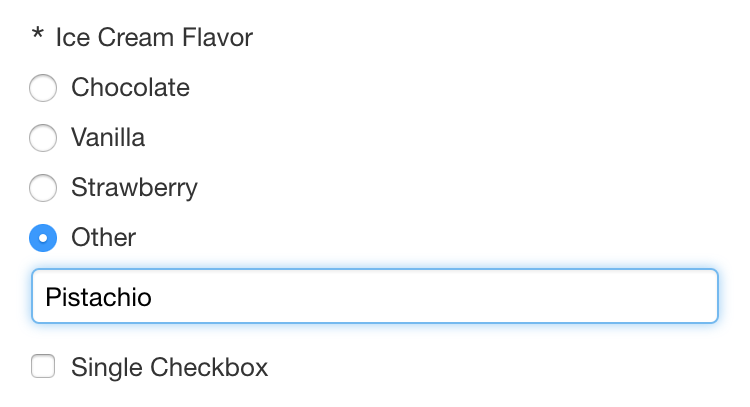

# Open Selection Component

<!-- toc -->

## What it does

The `fr:open-select1` component presents:

- a list of radio buttons predefined by the form author
- and a custom choice ("Other") which the user has the option to specify instead



## Usage

````xml
<fr:open-select1 id="flavor" bind="flavor-bind">
    <xf:label>Make your selection</xf:label>
    <xf:item>
        <xf:label>Chocolate</xf:label>
        <xf:value>chocolate</xf:value>
    </xf:item>
    <xf:item>
        <xf:label>Vanilla</xf:label>
        <xf:value>vanilla</xf:value>
    </xf:item>
    <xf:item>
        <xf:label>Strawberry</xf:label>
        <xf:value>strawberry</xf:value>
    </xf:item>
</fr:open-select1>
```

## Data format

The predefined radio buttons have a *label* and a *value*, and, like all radio buttons, store their *value* into the data. 

The text of the custom choice entered by the user is saved directly into the data.
