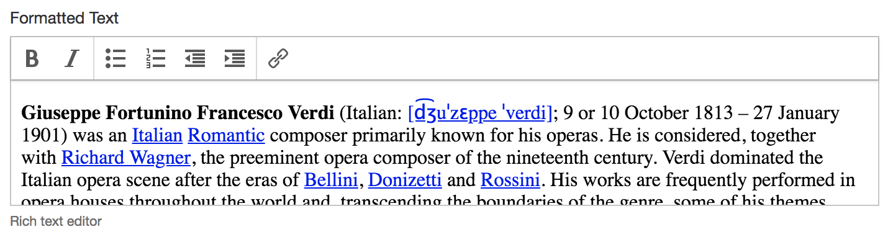

## Rationale

This components wraps the [TinyMCE][1] WYSIWYG editor. You can use it as an alternative to an `<xf:textarea mediatype="text/html">`, which uses the [YUI 2 RTE][2].



## Usage

Include the TinyMCE editor in your page with:

```xml
<fr:tinymce ref="..."/>
```

### Configuration

You can also customize the TinyMCE editor by adding JavaScript code to your form that defines a [TinyMCE configuration][4] and assign it to the `TINYMCE_CUSTOM_CONFIG` variable. If you don't set this variable, the component uses a [built-in default configuration][5]. The default configuration limits the number of buttons shown to users, and uses the [thebigreason TinyMCE skin][6].

### Read-only and relevant MIPs

The component supports being bound to a node which can be read-only or non-relevant, as defined by an `<xf:bind>`, and those properties can change dynamically, after the form is loaded. When bound to a read-only node, the toolbar and status bar are hidden, and the text can't be edited. When the bound node is non-relevant, the whole TinyMCE is hidden.

### Update heuristic

* Update of the bound node with the text typed by users — As users types in the editor, the TinyMCE generates [change events][7], upon which the latest text is stored in the bound node. This happens when the editor loses the focus, but also at other key points while editing, for instance when changing formatting, or starting a new paragraph.
* Update of the editor with a new value stored in the bound node — Whenever the value of the bound node is changed, for instance with an `<xf:setvalue>`, the content of the editor is update accordingly, _unless_ the editor has the focus. This prevents the cursor moving back to the top of the editor in the middle of users entering text, for instance if you have XForms code that updates the HTML to perform cleanup.

## Limitations

* Unlike the `<xf:textarea mediatype="text/html">`, the TinyMCE [doesn't automatically cleanup the HTML][8].
* Because of the update heuristic (see above), by design the TinyMCE won't update if the value of the bound node changes while the focus is on the TinyMCE.

[1]: http://www.tinymce.com/
[2]: http://developer.yahoo.com/yui/editor/
[4]: http://www.tinymce.com/wiki.php/Configuration
[5]: https://github.com/orbeon/orbeon-forms/blob/master/src/resources-packaged/xbl/orbeon/tinymce/tinymce-config.js
[6]: http://thebigreason.com/blog/2008/09/29/thebigreason-tinymce-skin
[7]: http://www.tinymce.com/wiki.php/API3:event.tinymce.Editor.onChange
[8]: https://github.com/orbeon/orbeon-forms/issues/23
