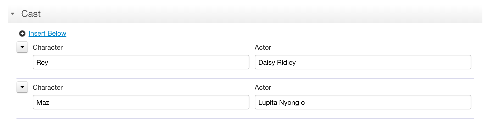
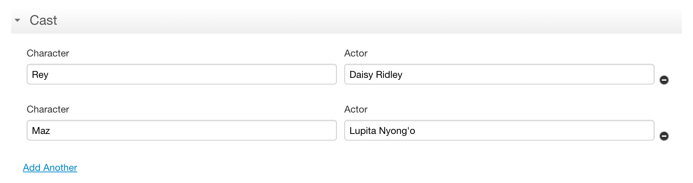
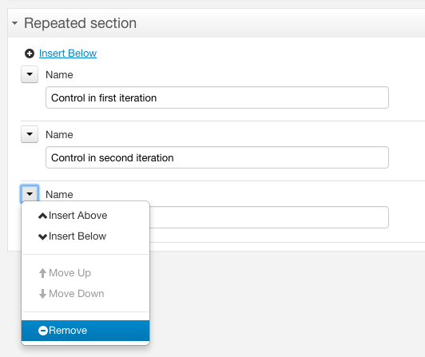

# Section Component

<!-- toc -->

## What it does

The `fr:section` component organizes [grids](grid.md) under a header or title. Features:

- collapsible section content
- optional repetition of its content
  - configurable min/max number of iterations
  - can repeat over several heterogeneous rows
  - built-in icons and menus to add, remove, and move repeated rows

## Appearance

### Full repeat appearance

### Minimal repeat appearance

[SINCE Orbeon Forms 2016.1]

## Basic usage

### Non-repeated mode

These attributes are supported when the section is in non-repeated mode.

- `open`
    - whether the section is initially open
    - `true` (default)
        - section is initially open
    - `false`
        - section is initially closed
    - _NOTE: When the Form Runner mode is readonly ("view" mode, "pdf" mode, etc.), `open` is forced to `true`._ 
- `animate`
    - whether the section animates when collapsing/expanding
    - `true` (default)
        - section animates
    - `false`
        - section does not animate 
- `collapsible` [SINCE Orbeon Forms 2016.1]
    - whether the section can be collapsed and expanded by clicking on its title
    - `true` (default)
        - allow section to be collapsed
    - `false`
        - don't allow section to be collapsed
    - _NOTE: If the section is initially closed and `collapsible` is `false`, the user won't be able to open the section._
- `level` [SINCE Orbeon Forms 2016.3]
    - level of the section, from `1` to `6`
    - default: `2`
    - alongside `base-level`, this value translates into an HTML heading `h1`  to `h6`
- `base-level` [SINCE Orbeon Forms 2016.3]
    - base level of the section, from `0` to `5`
    - default: `0`
    - when set to a non-zero value, this value is added to the value of `level` to produce the actual section level

### Repeated mode

These attributes are supported in addition to the non-repeated mode attributes when the section is in repeated mode:

- `freeze`
    - optional number of rows at the top which cannot be removed or moved
    - can be an AVT [SINCE Orbeon Forms 2016.3]
- `readonly`
    - whether to disallow the user to add/remove iteration with the menu or the "-" button (depending on appearance)
    - `false` (default)
        - show the iteration menu and buttons, unless the section binds to a readonly node or unless the Form Runner
          mode is readonly ("view" mode, "pdf" mode, etc.)
    - `true` (default)
        - don't show the iteration menu and buttons
- `appearance` [SINCE Orbeon Forms 2016.1]
    - `full`
        - the default appearance, as with Orbeon Forms 4.10 and earlier
        - iteration menu
            - reordering of iterations
            - insertion of iterations at specific points
            - removing of specific iterations
    - `minimal`
        - does not show the "+" button at the top left
        - does not show the iteration menu and associated features
        - instead just provides "Add another" and "Remove" links at the bottom and a "-" button to the right
- `insert` [SINCE Orbeon Forms 2016.2]
    - `index`
        - the "Add Another" or "+" button adds a new repetition after the iteration currently with keyboard focus
        - this is the default in `full` appearance
    - `bottom`
        - the "Add Another" or "+" button adds a new repetition after the last iteration
        - this is the default in `minimal` appearance

You move, insert, and remove iterations using the left menu:

## Data format

TODO

## Events

### Events supported

| Event name | Description |
| --- | --- |
| `fr-expand`   | Expand the section |
| `fr-collapse` | Collapse the section |

### Events dispatched

[SINCE Orbeon Forms 2016.1]

The following events are dispatched to the `fr:section` element:

| Event name | Description |
| --- | --- |
| `fr-iteration-added` | Dispatched when the user has just added an iteration |
| `fr-iteration-removed` | Dispatched when the user has just removed an iteration |

These events are not dispatched if the number of iterations changes by other means, for examle if the data is replaced, or inserts/deletes happen outside of the component.

## See also

- [Grid component](grid.md)