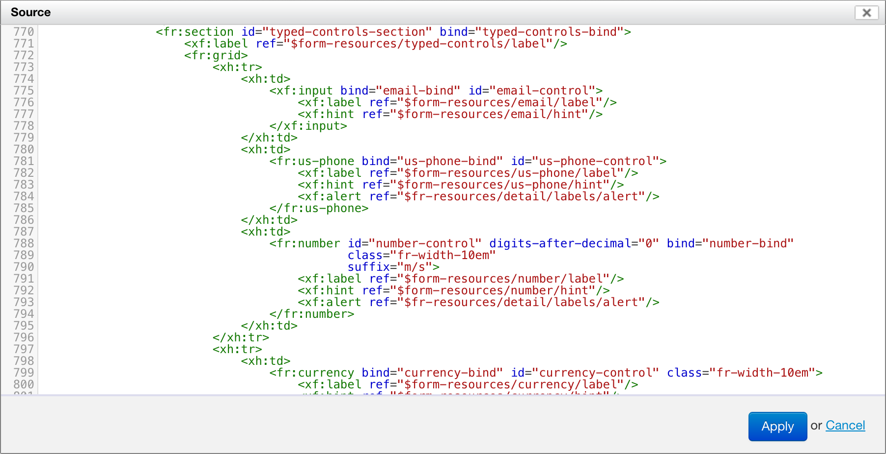

# Source Code Editor Component

<!-- toc -->

## Overview

The source code editor component uses the excellent [CodeMirror][1] library, hence the name of the XBL element name: `<fr:code-mirror>`. You can use it in situations where you want to users to be able to view or edit source code. You bind it to the node that contains the text to view or edit, just like you would with an `<xforms:textarea>`. If the node you bind it to is readonly, then users will be able to view the source but not edit it.



[LIMITATION] At this point, the source editor can't be configured, and it always does syntax coloring interpreting the source as XML.

## Styling

By default, the editor takes 100% of the available width, and has a fixed height of 300 pixels. You can set to use a width and height of your choosing with CSS, as follows:

```css
.xbl-fr-code-mirror .CodeMirror {
    height: 20em;
    width: 50em;
}
```
