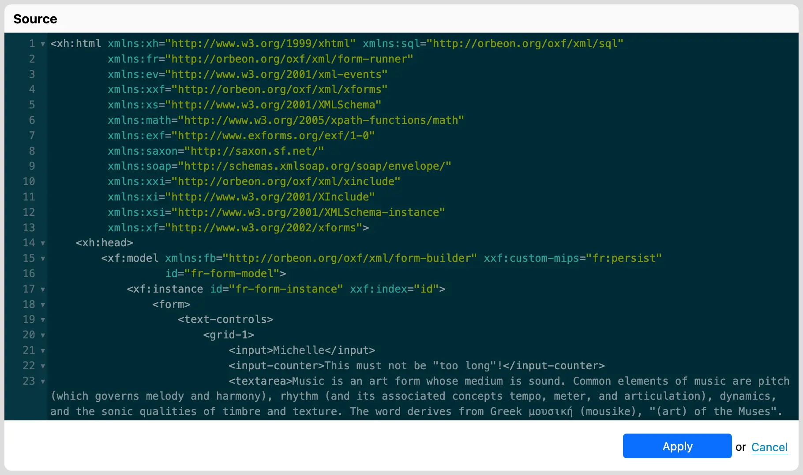

# Source code editor

## Overview

The source code editor component uses the excellent [CodeMirror](https://codemirror.net/) library.

## Form Builder usage

Form Builder uses this component to edit the source of a form.



## Configuration

[\[SINCE Orbeon Forms 2025.1.1\]](/release-notes/orbeon-forms-2025.1.1.md)

You can change the default theme used by the editor by setting the following property:

```xml
<property
    as="xs:string"
    name="oxf.xforms.xbl.fr.code-mirror.theme"
    value="default"/>
```

For Form Builder, the following values are supported:

- `solarized dark` (used by default by Form Builder with 2025.1, 2024.1)
- `solarized light`

## XForms usage

### Element name and binding 

The name of the XBL element name is `<fr:code-mirror>`. You bind it to the node that contains the text to view or edit, just like you would with an `<xf:textarea>`. If the node you bind it to is readonly, then users will be able to view the source but not edit it.

[\[SINCE Orbeon Forms 2025.1.1\]](/release-notes/orbeon-forms-2025.1.1.md)

The `theme` attribute allows you to specify the theme to use for the editor. The value of this attribute takes precedence over the `oxf.xforms.xbl.fr.code-mirror.theme` property.

### Styling

By default, the editor takes 100% of the available width, and has a fixed height of 300 pixels. You can set to use a width and height of your choosing with CSS, as follows:

```css
.xbl-fr-code-mirror .CodeMirror {
    height: 20em;
    width: 50em;
}
```
