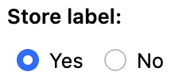

# Static and dynamic dropdown

<!-- Diagrams: https://docs.google.com/drawings/d/1MbNMY-mfp05BIBHsZtCryr-10B7nuSmfn7cHhJtkz94/edit -->

[SINCE Orbeon Forms 2019.1]

## Possible combinations

Combinations of static vs. dynamic, with vs. without search:

|                | Static                         | Dynamic                         |
|----------------|--------------------------------|---------------------------------|
| Without search | Static dropdown without search | Dynamic dropdown without search |
| With search    | Static dropdown with search    | Dynamic dropdown with search    |

### Static vs. Dynamic

In the Form Builder Toolbox you'll find 2 dropdown components, as shown in the screenshot below. The *Static Dropdown* is for cases when you, as a form author, want to provide, ahead of time, in Form Builder, the list of all the different choices users will be able to choose from. This is in contrast with the *Dynamic Dropdown* where the list of choices will be loaded at runtime from a service you provide.

Typically, you'll want to use the Static Dropdown for cases where the number of choices is limited, and doesn't change much over time, and the Dynamic Dropdown for cases where you have a long list of choices and/or those choices can change over time.

<figure>
    
    <figcaption>Static Dropdown and Dynamic Dropdown in the Toolbox</figcaption>
</figure>

### With vs. without search

You can choose to have each one of your Static or Dynamic Dropdown show as a regular dropdown native to the browser, or as a dropdown with search. You make that choice in the Control Settings dialog, as highlighted in the screenshot below.

<figure>
    
    <figcaption>Choosing between a regular dropdown and a dropdown with search</figcaption>
</figure>

The dropdown "with search" doesn't use the native browser dropdown, but instead uses a dropdown implemented in JavaScript that allows users to search for the choice they want to select by typing part of the label, which is typically useful when the list of choices can be pretty long, and it is thus hard for users to visually just pick one of the choices offered when the dropdown opens.

### Example with search

<figure>
    
    <figcaption>Doing a search to select a country</figcaption>
</figure>

## Dynamic dropdowns

### Features combinations

The Venn diagram below illustrates the various ways in which the features of dynamic dropdowns can be combined:

- Areas marked with an "x" indicate combinations that are not feasible. Specifically, enabling both the service to perform the search and auto-selection simultaneously is impossible. This is because auto-selection requires knowing all possible choices beforehand, necessitating the service to return all possible options. However, when the service conducts a search, it only returns a subset of the possible choices based on the user's input.
- The remaining areas depict the six feasible combinations of features.
- Among those areas, caution is advised regarding #6, i.e., combining open selection with auto-selection. Consider a dropdown for a street number and a service that returns all known numbers on a given street. After the user selects a street, if the service only knows about one number on that street, that number will be auto-selected. If open selection is enabled, the user will be able to change the number, but the experience of having an unwanted number selected by default might be confusing. Therefore, it might be wise to be cautious about enabling both features simultaneously.

<figure>
    
    <figcaption>Different combinations of features</figcaption>
</figure>

### Extracting choices from your service response

Your service must either return XML or JSON. (If it returns JSON the result will first be [converted to XML](/xforms/submission-json.md), so Orbeon Forms can run XPath expressions on it.) Say your service returns a list of countries as follows, here including just the first 3 countries:

```xml
<countries>
    <country>
        <name>Afghanistan</name>
        <us-code>af</us-code>
    </country>
    <country>
        <name>Akrotiri</name>
        <us-code>ax</us-code>
    </country>
    <country>
        <name>Albania</name>
        <us-code>al</us-code>
    </country>
</countries>
```

You specify how to extract the necessary information to populate the dropdown through 3 XPath expressions, which you enter in the Control Settings dialog:

- The "Choices XPath expression" must return one item per choice in the dropdown, or in our example, per country, which is done with `/countries/country`.
- The "Label XPath expression" is relative to a given choice as returned by the first expression, and must return the label shown to users in the dropdown. In our example, this will point to the `name` element.
- The "Value XPath expression" is similar to the "Label XPath expression" but points to the value stored in the data when users make a selection.

<figure>
    
    <figcaption>Extracting choices with XPath in Control Settings</figcaption>
</figure>

### Services performing the search

In most cases, it will be simpler to have your service return all the possible values. But in some cases, the list of all possible values could be extremely large, and returning all them to Orbeon Forms would be prohibitively expensive, or outright impossible. In those cases you'll want the service to only return a subset of all possible choices, based on what users have typed so far. To do so:

- Make sure you've checked the "With Search" appearance.
- Select the "Yes" radio button under "Service performs search".
- Pass the value typed by users as a request parameter to your service by adding `{$fr-search-value}` as appropriate on the URL, for instance: `/fr/service/custom/orbeon/controls/countries?country-name={$fr-search-value}`.

With this, Orbeon Forms will automatically call your service repeatedly as users type in the field, this to retrieve a new list of possible choices, and update the dropdown.

<figure>
    
    <figcaption>Service performing search</figcaption>
</figure>

### Paging

Services that implement their own search can also implement paging. This is useful for cases where the number of possible values is so large, that you don't want your service to return all the possible values even filtered down by what the user has typed so far, but instead want to return the first, say, 20 choices, and only show the following 20 after users scroll down in the dropdown past the first 20 choices. To do so:

- Setup your service as described in the previous section about [services performing search](#services-performing-the-search).
- Add a request parameter `{$fr-search-page}` to the URL. The first time the service is called, the value will be `1`. If users scroll down in the dropdown, and reach the bottom, they will see a message informing them that more results will be loaded, and your service will be called with the parameter set to 2, and so on.
- At some point, users might reach the last page, as your service doesn't have more choices to list for the given search string. You'll want to include some information in your response as to whether the last page has been reached, and provide an XPath expression under "Is last page XPath expression" returning `true` when on the last page.

<figure>
    
    <figcaption>Service performing search</figcaption>
</figure>

### Open selection

[\[SINCE Orbeon Forms 2023.1\]](/release-notes/orbeon-forms-2023.1.md)

You can mark a dynamic search dropdown as *open* in cases where you want users to be able to enter a value that is not returned by the service. For example, you may use a service that returns all known addresses in a given city, but the service may not be aware of new developments.

In the Control Settings dialog box, open selection can be disabled (using the No radio button, which is the default), enabled (using the Yes radio button), or conditionally enabled (using the Formula radio button). When set to Yes or Formula, the Label and Value formulas must be the same; therefore, the Label formula input field is disabled and its value is automatically set to the Value formula.

<figure>
    
    <figcaption>Open selection inside the Control Settings</figcaption>
</figure>

### Auto-select unique choice

[SINCE Orbeon Forms 2023.1.1, 2024.1]

In certain scenarios, the list of choices offered by the dropdown may depend on values entered by users through other controls in the form. You might encounter situations where this list includes only one item. In such cases, it may seem redundant to require users to select that single item, as it is their only choice. Therefore, you might want to enable the 'Auto-select unique choice' option, as shown below.

<figure>
    
    <figcaption>Option in the Control Settings dialog</figcaption>
</figure>

### Store label

[\[SINCE Orbeon Forms 2024.1.2\]](/release-notes/orbeon-forms-2024.1.2.md)

When using the options "With Search" and "Service performs search", the label associated with the selected value is automatically stored in an attribute in the data.

However, when the "Service performs search" option is not selected, by default the label is not stored.

The "Store label" option allows you to store the label also when the "Service performs search" option is not selected. This is useful if the service cannot run. For example, a user might be filling the form in a first environment and another user viewing it in another. If this option is not selected, the field will not be able to show a label associated with the selected value. Enabling this option allows the label to show even if the service is not running. In that case, it is useful to make the field readonly as well.

<figure>
    
    <figcaption>Store label option in the Control Settings dialog</figcaption>
</figure>

The following table summarizes the behavior of the options:

| **With Search option** | **Service performs search option** | **Store label option** | **Label stored** |
|------------------------|------------------------------------|------------------------|------------------|
| Deselected             | N/A                                | N/A                    | No               |
| Selected               | Selected                           | N/A                    | Yes              |
| Selected               | Deselected                         | Deselected             | No               |
| Selected               | Deselected                         | Selected               | Yes              |

_NOTE: In a multilingual form, only the label in the current language, as returned by the service, will be stored._  

### Minimum input length

You can specify a minimum input length, in characters, before a dropdown with search starts displaying choices. This is useful if you have a large number of choices, and the subset of choices returned is unlikely to be useful if users don't type at least a few characters. This is configured by setting the following property.

[\[SINCE Orbeon Forms 2023.1\]](/release-notes/orbeon-forms-2023.1.md)

```xml
<property 
    as="xs:integer"
    name="oxf.xforms.xbl.fr.databound-select1-search.min-input-length.*.*"
    value="2"/>
```

[SINCE Orbeon Forms 2023.1.1]

```xml
<property 
    as="xs:integer"
    name="oxf.xforms.xbl.fr.dropdown-select1-search.min-input-length.*.*"
    value="2"/>
```

## See also

- Live example
    - [Form Runner](https://demo.orbeon.com/demo/fr/orbeon-features/dependent-dropdowns/new?form-version=1)
    - [Form Builder](https://demo.orbeon.com/demo/fr/orbeon/builder/edit/df4e5accdd12b409495abaf541e61914c0b1d272)
