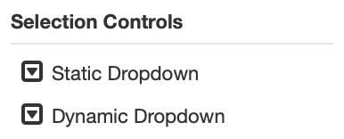
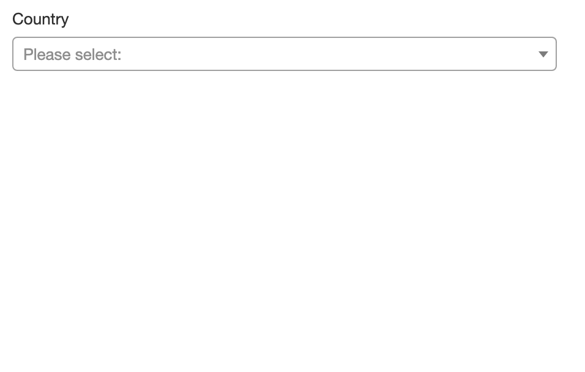
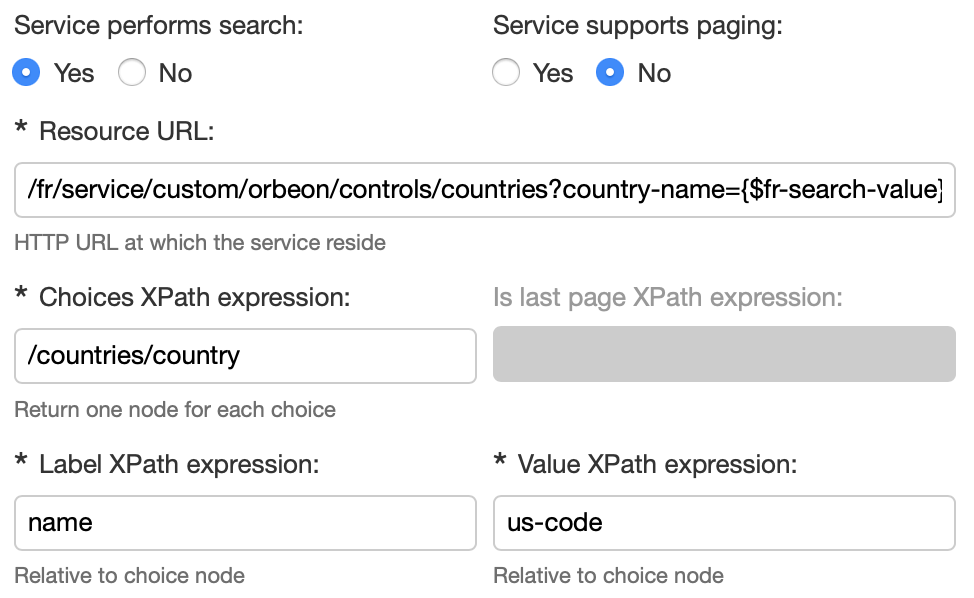
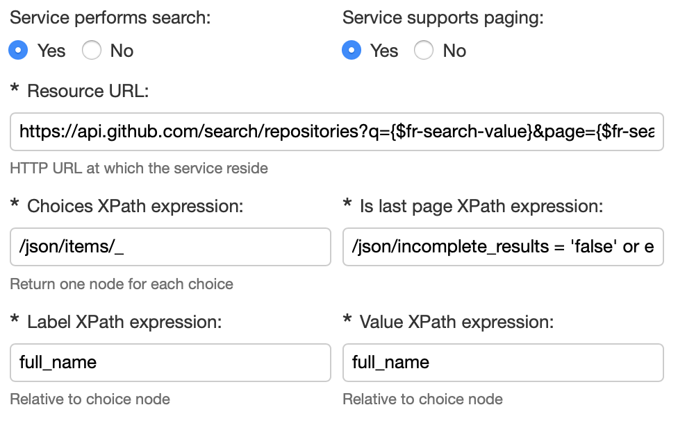

# Static and dynamic dropdown

<!-- Diagrams: https://docs.google.com/drawings/d/1MbNMY-mfp05BIBHsZtCryr-10B7nuSmfn7cHhJtkz94/edit -->

[SINCE Orbeon Forms 2019.1]

## Possible combinations

Combinations of static vs. dynamic, with vs. without search:

|   |Static|Dynamic|
|---|------|-------|
|Without search|Static dropdown without search|Dynamic dropdown without search|
|With search   |Static dropdown with search   |Dynamic dropdown with search   |

### Static vs. Dynamic

In the Form Builder Toolbox you'll find 2 dropdown components, as shown in the screenshot below. The *Static Dropdown* is for cases when you, as a form author, want to provide, ahead of time, in Form Builder, the list of all the different choices users will be able to choose from. This is in contrast with the *Dynamic Dropdown* where the list of choices will be loaded at runtime from a service you provide.

Typically, you'll want to use the Static Dropdown for cases where the number of choices is limited, and doesn't change much over time, and the Dynamic Dropdown for cases where you have a long list of choices and/or those choices can change over time.



### With vs. without search

You can choose to have each one of your Static or Dynamic Dropdown show as a regular dropdown native to the browser, or as a dropdown with search. You make that choice in the Control Settings dialog, as highlighted in the screenshot below.


The dropdown "with search" doesn't use the native browser dropdown, but instead uses a dropdown implemented in JavaScript that allows users to search for the choice they want to select by typing part of the label, which is typically useful when the list of choices can be pretty long, and it is thus hard for users to visually just pick one of the choices offered when the dropdown opens.



## Dynamic dropdowns

### Extracting choices from your service response

Your service must either return XML or JSON. (If it returns JSON the result will first be [converted to XML](/xforms/submission-json.md), so Orbeon Forms can run XPath expressions on it.) Say your service returns a list of countries as follows, here including just the first 3 countries:

```xml
<countries>
    <country>
        <name>Afghanistan</name>
        <us-code>af</us-code>
    </country>
    <country>
        <name>Akrotiri</name>
        <us-code>ax</us-code>
    </country>
    <country>
        <name>Albania</name>
        <us-code>al</us-code>
    </country>
</countries>
```

You specify how to extract the necessary information to populate the dropdown through 3 XPath expressions, which you enter in the Control Settings dialog:

- The "Choices XPath expression" must return one item per choice in the dropdown, or in our example, per country, which is done with `/countries/country`.
- The "Label XPath expression" is relative to a given choice as returned by the first expression, and must return the label shown to users in the dropdown. In our example, this will point to the `name` element.
- The "Value XPath expression" is similar to the "Label XPath expression" but points to the value stored in the data when users make a selection.


### Services performing the search

In most cases, it will be simpler to have your service return all the possible values. But in some cases, the list of all possible values could be extremely large, and returning all them to Orbeon Forms would be prohibitively expensive, or outright impossible. In those cases you'll want the service to only return a subset of all possible choices, based on what users have typed so far. To do so:

- Make sure you've checked the "With Search" appearance.
- Select the "Yes" radio button under "Service performs search".
- Pass the value typed by users as a request parameter to your service by adding `{$fr-search-value}` as appropriate on the URL, for instance: `/my-service?search={$fr-search-value}`.

With this, Orbeon Forms will automatically call your service repeatedly as users type in the field, this to retrieve a new list of possible choices, and update the dropdown.



### Paging

Services that implement their own search can also implement paging. This is useful for cases where the number of possible values is so large, that you don't want your service to return all the possible values even filtered down by what the user has typed so far, but instead want to return the first, say, 20 choices, and only show the following 20 after users scroll down in the dropdown past the first 20 choices. To do so:

- Setup your service as described in the previous section about [services performing search](#services-performing-the-search).
- Add a request parameter `{$fr-search-page}` to the URL. The first time the service is called, the value will be `1`. If users scroll down in the dropdown, and reach the bottom, they will see a message informing them that more results will be loaded, and your service will be called with the parameter set to 2, and so on.
- At some point, users might reach the last page, as your service doesn't have more choices to list for the given search string. You'll want to include some information in your response as to whether the last page has been reached, and provide an XPath expression under "Is last page XPath expression" returning `true` when on the last page.


