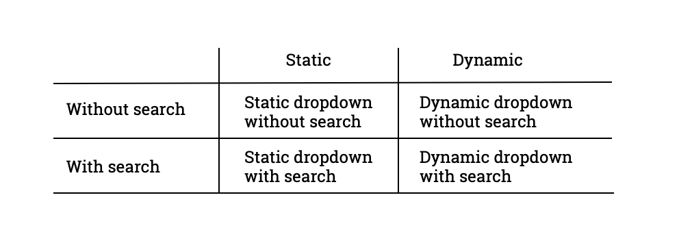

# Static and dynamic dropdown

<!-- Diagrams: https://docs.google.com/drawings/d/1MbNMY-mfp05BIBHsZtCryr-10B7nuSmfn7cHhJtkz94/edit -->

[SINCE Orbeon Forms 2019.1]

## Overview

### Static vs. Dynamic

In the Form Builder Toolbox you'll find 2 dropdown components, as shown in the screenshot below. The *Static Dropdown* is for cases when you, as a form author, want to provide, ahead of time, in Form Builder, the list of all the different choices users will be able to choose from. This is in contrast with the *Dynamic Dropdown* where the list of choices will be loaded at runtime from a service you provide.

Typically, you'll want to use the Static Dropdown for cases where the number of choices is limited, and doesn't change much over time, and the Dynamic Dropdown for cases where you have a long list of choices and/or those choices can change over time.

### With vs. without search

You can choose to have each one of your Static or Dynamic Dropdown show as a regular dropdown native to the browser, or as a dropdown with search. You make that choice in the Control Settings dialog, as highlighted in the screenshot below.

The dropdown "with search" doesn't use the native browser dropdown, but instead uses a dropdown implemented in JavaScript that allows users to search for the choice they want to select by typing part of the label, which is typically useful when the list of choices can be pretty long, and it is thus hard for users to visually just pick one of the choices offered when the dropdown opens.

