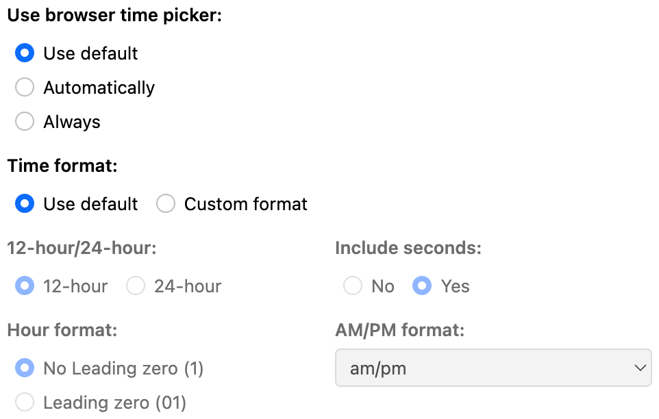

# Time component

## Availability

[SINCE Orbeon Forms 2018.2]

Prior to that, Form Builder was using `<xf:input>` bound to an `xs:time` type.

[SINCE Orbeon Forms 2022.1]

There is no more support for `<xf:input>` bound to an `xs:time` type. Use this component directly instead.

## What it does

The Time component allows the user to enter a time of day. The component has two major features:

- __Smart input:__ lets the user enter a time in a variety of formats that are recognized, parsed, and then formatted
- __Formatting:__ formats the time according to a specified format 

The time is a local time, which does not contain a timezone, and stored in the data in ISO Format (`HH:mm:ss`).

With smart input, when the field loses the focus, the value you entered is parsed and, if recognized, replaced with a value in a canonical format.

Here are examples of supported smart time formats:

| Example      | Note                       |
|--------------|----------------------------|
| now          | current local time         |
| 3:34:56 p.m. | full time with seconds     |
| 3:34:56 pm   | same as above              |
| 3:34 p.m.    | equivalent to 3:34:00 p.m. |
| 3:34 pm      | same as above              |
| 3 p.m.       | equivalent to 3:00:00 p.m. |
| 3 pm         | same as above              |
| 3:34:56 a.m. | full time with seconds     |
| 3:34:56 am   | same as above              |
| 3:34 a.m.    | equivalent to 3:34:00 a.m. |
| 3:34 am      | same as above              |
| 3 a.m.       | equivalent to 3:00:00 a.m. |
| 3 am         | same as above              |
| 12 a.m.      | midnight                   |
| 12 p.m.      | noon                       |
| 21           | equivalent to 9:00:00 pm   |
| 3p           | equivalent to 3:00:00 pm   |

## Form Builder support

The Time component is directly accessible from the Form Builder toolbox.

The Control Settings dialog features a user interface for configuring the control width and output format.



## Configuration

### Field width

The `field-width` parameter can have two values:

- `natural`: takes a width defined by the component
- `full`: takes the entire width of the grid cell 

This parameter can be specified at the control level, form level, or in properties-local.xml. The default is:

```xml
<property
    as="xs:string"
    name="oxf.xforms.xbl.fr.time.field-width"
    value="{if (fr:created-with-or-newer('2018.2')) then 'full' else 'natural'}"/>
```

### Output format

The `oxf.xforms.format.input.time` global property configures the default output format for all instances of the Time component. The default value is:

```xml
<property
    as="xs:string"
    name="oxf.xforms.format.input.time" 
    value="[h]:[m]:[s] [P,*-2]"/>
```

The format is a "picture string". These are examples of values supported:

| Format                 | Example      | Description                                  | Since    |
|------------------------|--------------|----------------------------------------------|----------|
| `[h]:[m]:[s] [P]`      | 2:05:12 p.m. | with dots in a.m. and p.m.                   |          |
| `[h]:[m] [P]`          | 2:05 p.m.    | with dots in a.m. and p.m., no seconds       | 2020.1   |
| `[h]:[m]:[s] [P,*-2]`  | 2:05:12 pm   | without dots in am and pm                    |          |
| `[h]:[m] [P,*-2]`      | 2:05 pm      | without dots in am and pm, no seconds        | 2020.1   |
| `[h]:[m]:[s] [PN]`     | 2:05:12 P.M  | uppercase A.M. and P.M.                      | 2022.1.1 |
| `[h]:[m] [PN]`         | 2:05 P.M.    | uppercase A.M. and P.M.                      | 2022.1.1 |
| `[h]:[m]:[s] [PN,*-2]` | 2:05:12 PM   | uppercase AM and PM                          | 2022.1.1 |
| `[h]:[m] [PN,*-2]`     | 2:05 PM      | uppercase AM and PM                          | 2022.1.1 |
| `[H]:[m]:[s]`          | 14:05:12     | 24-hour time                                 |          |
| `[H]:[m]`              | 14:05        | 24-hour time                                 |          |
| `[H01]:[m]:[s]`        | 03:05:12     | 24-hour time, 2-digit hour                   | 2022.1.1 |
| `[H01]:[m]`            | 03:05        | 24-hour time, 2-digit hour (without seconds) | 2022.1.1 |

Important:

- The order of components (hours, minutes, etc.) cannot be changed.
- The separator is always `:`. 
- Milliseconds are not supported.

When seconds are omitted, the user is still allowed to enter non-zero seconds. However, they will not be shown by the control when the user leaves the control.

[SINCE Orbeon Forms 2022.1.1]

The Time component adds an `output-format` parameter. This parameter can be used to override the global property at the control level, the form level, or via properties-local.xml with the following new property:

```xml
<property
    as="xs:string"
    name="oxf.xforms.xbl.fr.time.output-format"
    value=""/>
```

As usual, the property can use an app name and form name (with possible wildcards) to specify a default value for all controls in a given app/form:

```xml
<property
    as="xs:string"
    name="oxf.xforms.xbl.fr.time.output-format.acme.*"
    value="[H01]:[m]"/>
```

The value is in the same format as the global `oxf.xforms.format.input.time` property.

By default, the `output-format` parameter is not set, and the global `oxf.xforms.format.input.time` property is used.

## Output format in readonly modes

The Time control uses the `oxf.xforms.format.output.time` property to format the time value.

The default value is:

```xml
<property as="xs:string"  name="oxf.xforms.format.output.time">
    if (. castable as xs:time) then format-time(xs:time(.), '[h]:[m]:[s] [P,*-2]', xxf:lang(), (), ()) else .
</property>
```

[SINCE Orbeon Forms 2022.1.1]

The Time components uses the `output-format` parameter to format the time in readonly modes, including `view` and `pdf`. The value of this parameter can come from the control, the form, or the global property `oxf.xforms.format.output.time`. The value is in the same format as the global `oxf.xforms.format.output.time` property.

## Example usage

```xml
<fr:time 
    bind="time-24hour-bind" 
    id="time-24hour-control" 
    field-width="natural"
    output-format="[H]:[m]:[s]">
    <xf:label ref="$form-resources/time-24hour/label"/>
    <xf:hint ref="$form-resources/time-24hour/hint"/>
</fr:time>
```

[//]: # (## See also)

[//]: # ()
[//]: # (- Blog post: xxx)