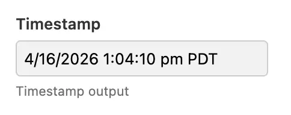

# Timestamp

## Availability

[\[SINCE Orbeon Forms 2025.1.1\]](/release-notes/orbeon-forms-2025.1.1.md)

## What it does

The timestamp component is a readonly form control able to show an instant in time, with date, time, and timezone. It does not support user input: instead, it is meant to show a value, for example the last modified date of a form.



## Datatype

`fr:timestamp` must be bound to the `xs:dateTime` type.

In addition, it expects a value with a timezone offset or the suffix `Z` for UTC. For example, `2024-06-30T12:34:56Z` or `2024-06-30T12:34:56+02:00` are valid values, while `2024-06-30T12:34:56` is not. The standard `current-dateTime()` function returns a value with the timezone offset, so it can be used to set the value of a timestamp component to the current time.

While the timezone offset in the value can have meaning, the main function it serves is to refer to an absolute point in time (or *instant*). That timezone offset is not used for formatting the value to the user, see below.

## Timezone

### Client-side

When displaying a timestamp, the value is converted to the current user's local timezone as provided by the web browser.

### Server-side

When providing a value on the server, for example when producing a PDF file, the value is converted to a timezone provided on the server, as follows:

- `user.timezone` property, if set, for example to `Europe/Paris`
- `oxf.fr.default-timezone` property, if set
- UTC timezone, if none of the above is set

## Configuration

### Date format

The format by default is done with the following property:

```xml
<property
    as="xs:string"
    name="oxf.xforms.xbl.fr.timestamp.output-format" 
    value="[M]/[D]/[Y] [h]:[m]:[s] [P,*-2] [ZN]"/>
```

The above includes:

- a date format (see the [Date](date.md) control)
- a separator string (here a space)
- a time format (see the [Time](time.md) control)
- a timezone format

The timezone formats are the following:

| Symbol | Meaning                                 |
|--------|-----------------------------------------|
| `[Z]`  | Short offset, for example `+02:00`      |
| `[z]`  | Long offset, for example `GMT+02:00`    |
| `[ZN]` | Timezone short name, for example `CEST` |

The format described above allows placing the date or time first, and choosing the middle separator.

As of Orbeon Forms 2025.1.1, there is no UI to specify the date format, but the `output-format` attribute on the `<fr:timestamp>` component allows overriding the default format on a per-component basis.

## XForms usage

You use the timestamp component:

```xml
<fr:timestamp ref="signature-dateTime">
  <xf:label>Signature date and time</xf:label>
</fr:timestamp>
```

## See also 

* [Date](date.md)
* [Time](time.md)
* [Dropdown Date](dropdown-date.md)