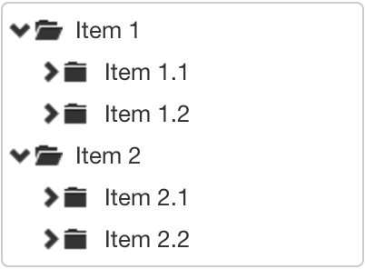

# Single-selection tree


## Availability

[SINCE Orbeon Forms 2017.1]

_NOTE: As of Orbeon Forms 2017.1, this control is not present in the Form Builder toolbox because Form Builder lacks the ability to created hierarchical itemsets, making this control less useful in that context._

## What it does

This control allows the user to select a single item from a hierarchical tree representation.


## Basic usage

You:

- specify `appearance="tree"` on an `<xf:select1>` control
- generally use an `<xf:itemset>` element to point to items which are organized in a hierarchy

```xml
<xf:select1 appearance="tree" ref="value">
    <xf:itemset ref="instance('tree-items')//item">
        <xf:label ref="@label"/>
        <xf:value ref="@value"/>
    </xf:itemset>
</xf:select1>
```

The `tree-items` instance might look like:

```xml
<xf:instance id="tree-items">
    <items>
        <choices>
            <item label="Item 1" value="1">
                <item label="Item 1.1" value="1.1">
                    <item label="Item 1.1.1" value="1.1.1">
                        <item label="Item 1.1.1.1" value="1.1.1.1"/>
                        <item label="Item 1.1.1.2" value="1.1.1.2"/>
                    </item>
                    <item label="Item 1.1.2" value="1.1.2">
                        <item label="Item 1.1.2.1" value="1.1.2.1"/>
                        <item label="Item 1.1.2.2" value="1.1.2.2"/>
                    </item>
                </item>
                <item label="Item 1.2" value="1.2">
                    <item label="Item 1.2.1" value="1.2.1">
                        <item label="Item 1.2.1.1" value="1.2.1.1"/>
                        <item label="Item 1.2.1.2" value="1.2.1.2"/>
                    </item>
                </item>
            </item>
            <item label="Item 2" value="2">
                <item label="Item 2.1" value="2.1">
                    <item label="Item 2.1.1" value="2.1.1">
                        <item label="Item 2.1.1.1" value="2.1.1.1"/>
                        <item label="Item 2.1.1.2" value="2.1.1.2"/>
                        <item label="Item 2.1.1.3" value="2.1.1.3"/>
                    </item>
                </item>
                <item label="Item 2.2" value="2.2">
                    <item label="Item 2.2.1" value="2.2.1"/>
                    <item label="Item 2.2.2" value="2.2.2"/>
                </item>
            </item>
        </choices>
    </items>
</xf:instance>
```

The user can expand or collapse tree nodes. This doesn't have an impact on the currently-selected value:


## Readonly appearance

If the control is readonly, it appears grayed out. It is not possible to select items in this case, but it is possible to open/close tree nodes:


## Controlling which tree nodes are initially open

The `<xf:itemset>` element supports the `xxf:open` extension attribute, which determines which nodes of the tree are open when the tree is first rendered. You can use `<xf:itemset xxf:open="true">` if you want all the nodes to be open. If you have a condition under which nodes should be open, use an AVT. For instance, the following will open just the first level of the tree. If you wanted to open all the nodes up to 3 levels of depth, you would instead write `{count(ancestor-or-self::item) le 3}`.

```xml
<xf:select ref="value">
    <xf:itemset
            ref="instance('tree-items')//item"
            xxf:open="{count(ancestor-or-self::item) = 1}">
        <xf:label ref="@label"/>
        <xf:value ref="@value"/>
    </xf:itemset>
</xf:select>
```

The result:



## Adding class attributes

You can use an AVT in the the `class` attribute on the `<xf:itemset>` element to produce different CSS classes for different nodes.

```
class="my-class-{position()}" 
```

## Static readonly mode

When used in Form Runner's readonly modes, the control doesn't show a tree but a field with the label associated with the user selection.

## Usage from plain XForms

You need the following configuration to use from a plain XForms (non-Form Runner) page, as the component's JavaScript is part of Form Runner:


```xml
<xh:script type="text/javascript" src="/apps/fr/resources/scalajs/orbeon-form-runner.js"/>
```

And then, on your main XForms model, put the `xxf:assets.baseline.excludes` attribute like this:

```xml
<xf:model xxf:assets.baseline.excludes="/ops/javascript/scalajs/orbeon-xforms.js">
```  

## Custom styling

As of Orbeon Forms 2017.1, the implementation of the `tree` appearance uses the [Fancytree](https://github.com/mar10/fancytree) JavaScript library.

_NOTE: This is subject to change in new versions of Orbeon Forms._

However you can look at the markup produced by Fancytree with your browser's development tools and apply custom CSS to style the tree. All icons are set with CSS. Here is an example of the HTML layout:
 
```html
 <ul class="ui-fancytree fancytree-container fancytree-plain" tabindex="0">
    <li class="">
        <span class="fancytree-node fancytree-expanded fancytree-folder fancytree-has-children fancytree-exp-e fancytree-ico-ef">
            <span class="fancytree-expander"/>
            <span class="fancytree-icon"/>
            <span class="fancytree-title">Item 1</span>
        </span>
        <ul>
            <li class="">
                <span class="fancytree-node fancytree-folder fancytree-has-children fancytree-exp-c fancytree-ico-cf">
                    <span class="fancytree-expander"/>
                    <span class="fancytree-icon"/>
                    <span class="fancytree-title">Item 1.1</span>
                </span>
            </li>
            <li class="fancytree-lastsib">
                <span class="fancytree-node fancytree-folder fancytree-has-children fancytree-lastsib fancytree-exp-cl fancytree-ico-cf">
                    <span class="fancytree-expander"/>
                    <span class="fancytree-icon"/>
                    <span class="fancytree-title">Item 1.2</span>
                </span>
            </li>
        </ul>
    </li>
    <li class="fancytree-lastsib">
        <span class="fancytree-node fancytree-expanded fancytree-folder fancytree-has-children fancytree-lastsib fancytree-exp-el fancytree-ico-ef">
            <span class="fancytree-expander"/>
            <span class="fancytree-icon"/>
            <span class="fancytree-title">Item 2</span>
        </span>
        <ul>
            <li class="">
                <span class="fancytree-node fancytree-folder fancytree-has-children fancytree-exp-c fancytree-ico-cf">
                    <span class="fancytree-expander"/>
                    <span class="fancytree-icon"/>
                    <span class="fancytree-title">Item 2.1</span>
                </span>
            </li>
            <li class="fancytree-lastsib">
                <span class="fancytree-node fancytree-folder fancytree-has-children fancytree-lastsib fancytree-exp-cl fancytree-ico-cf">
                    <span class="fancytree-expander"/>
                    <span class="fancytree-icon"/>
                    <span class="fancytree-title">Item 2.2</span>
                </span>
            </li>
        </ul>
    </li>
</ul>
```

See [`tree-select1.less`](https://github.com/orbeon/orbeon-forms/blob/master/form-runner/jvm/src/main/assets/xbl/orbeon/tree-select1/tree-select1.less) for the style applied by Orbeon Forms as of version 2017.1.
