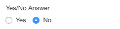

# Yes/No Answer Component


## Availability

[SINCE Orbeon Forms 2016.1]

## What it does

The `fr:yesno-input` component displays a simple choice between "Yes" and "No". It stores a value of `true` when "Yes" is selected and `false` when "No" is selected.



This control is generally recommended over the [Checkbox Input Component](checkbox-input.md) for binary (or boolean) selection, because:

- A "Yes/No" choice is usually clearer to the user.
- The control can be marked as "Required", in which case he user has to make a selection to pass validation. With a single checkbox, it is easier to miss making a selection.

[\[SINCE Orbeon Forms 2023.1\]](/release-notes/orbeon-forms-2023.1.md)

A "Clear value" button is available in Form Builder to clear the value of the control without editing the source of the form definition or recreating the control.

## Basic usage

You use `fr:yesno-input` like a regular XForms controls. Example:

```xml
<fr:yesno-input ref="happy-camper">
    <xf:label>Are you a happy camper?</xf:label>
</fr:yesno-input>
```

## See also

- [Checkbox Input Component](checkbox-input.md)
