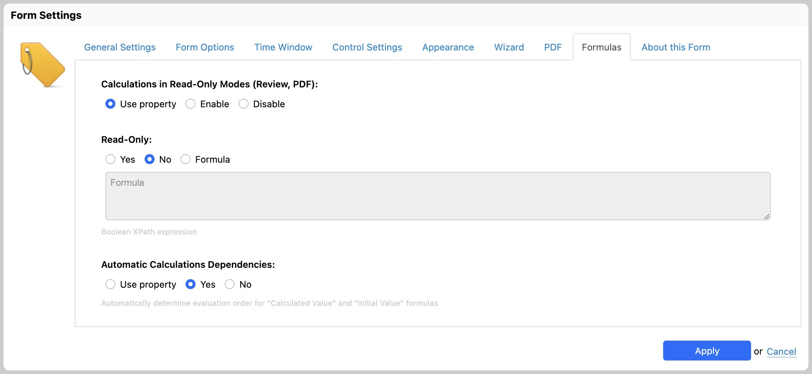

# Automatic calculations dependencies

## Rationale

Calculated and initial values expressed with formulas can depend on the value of other form controls. In turn, those form controls can be calculated from yet other form controls. Such controls may appear further down in the form, or, in fact, in any place.

It is therefore important to compute calculated and initial values in an order based on the *dependencies* of that value, not just in the order in which the controls appear in the form. This is very similar to what happens in a spreadsheet.

Form Runner supports dependencies of calculated and initial values when the associated formulas refer to other controls via *variables* (such as `$units`, where `units` is the *name* of a control on the form).

## Availability

[SINCE Orbeon Forms 2018.1]

Orbeon Forms features a user interface option to enable and disable automatic calculations dependencies in the "Form Settings" dialog's "Formulas" tab.:

- Use property: use the `oxf.xforms.analysis.calculate` property
- Always or Never: enable or disable automatic calculation dependencies, no matter how the property is configured. 

In addition, for *new form definitions*, the "Automatic Calculations Dependencies" option is enabled by default starting with Orbeon Forms 2018.1.

_NOTE: Existing form definitions which do not have the `xxf:analysis.calculate="true"` attribute set in the form definition source are not automatically upgraded to enable automatic calculations dependencies. You must enable dependencies explicitly in the "Form Settings" dialog._



_NOTE: Prior to Orbeon Forms 2022.1.1, this setting was under the "Form Settings" dialog's "Form Options" tab._

[SINCE Orbeon Forms 4.10]

The feature was available for the first time with Orbeon Forms 4.10, but without a user interface. With such older versions of Orbeon Forms, you enable the feature by adding the `xxf:analysis.calculate="true"` attribute on the first model of the form, via "Edit Source".

## Renaming of controls and formulas

[SINCE Orbeon Forms 2019.1]

See [Renaming of controls and formulas](/form-builder/formulas.md#renaming-of-controls-and-formulas).

## Examples

Consider the following grid, where the Total Total appear on each line item row:


Each Row Total is expressed with the following calculated value formula:

```xpath
$units * $unit-price
```


And the Total Units and Total Price are expressed with the following calculated value formula:

```xpath
sum($units)
```

and:

```xpath
sum($row-total)
```


Automatic calculations dependencies ensure that the totals update correctly as the user modifies the "Units" and "Unit Price" fields. This is the case whether the totals are positioned after or before the fields they depend on in the form.

_NOTE: It is important to note that using *variable* is key for the dependencies to work. Using other expressions referring to form data, such as `/form/my-section/my-control`, or `//my-control`, will not work for the purpose of dependencies._

## See also 

- Blog post: [Automatic calculation dependencies](https://blog.orbeon.com/2018/10/automatic-calculation-dependencies.html)
- [Formulas](../../form-builder/formulas.md)
- [Control settings](../../form-builder/control-settings.md)
