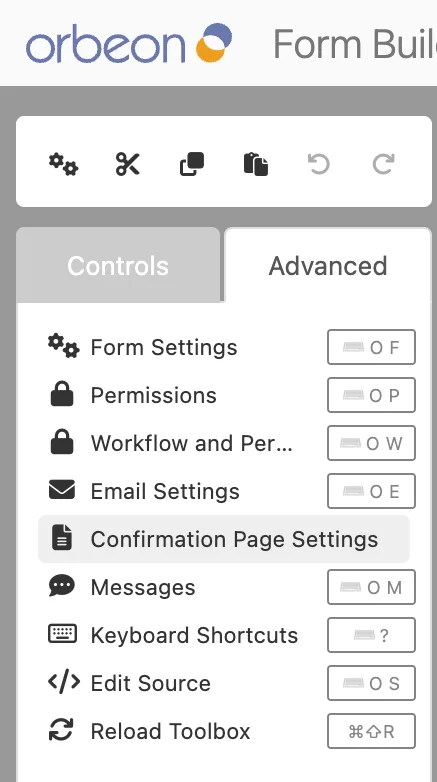
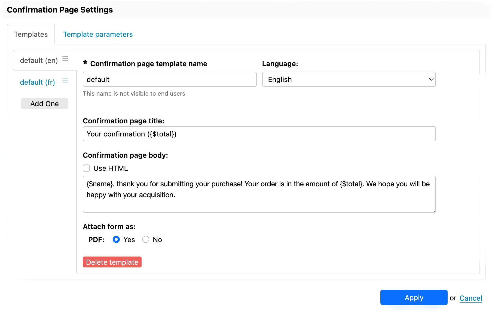
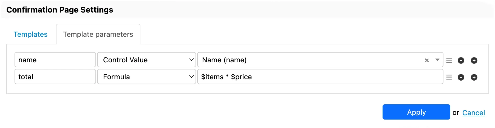

# Confirmation page

## Availability

[\[SINCE Orbeon Forms 2025.1\]](/release-notes/orbeon-forms-2025.1.md)

## Introduction

It is useful for a form to be able to show a confirmation page to the user once processing is complete. The confirmation page is a built-in feature which allows:

- displaying a message to the user once the form is successfully submitted
- allowing the user to download a PDF copy of the submitted data

<figure>
    
    <figcaption>Confirmation page example</figcaption>
</figure>

Like email templates, the confirmation page can be customized using Form Builder, using *confirmation page templates*.

## Form Builder user interface

You open the "Confirmation Page Settings" dialog from the Form Builder "Advanced" tab.

<figure>
    
    <figcaption>Advanced tab in Form Builder toolbox</figcaption>
</figure>

The "Confirmation Page Settings" dialog allows you to create multiple templates, each with a name and optional language. The confirmation page selects a template as follows:

- All the templates that are for a specific language which doesn't correspond to the current language are filtered out.
- If at least one template which corresponds to the current language exists, the first such template is used, following the order in which they are defined in the form.z
- The first remaining template is used, following the order in which they are defined in the form.

__NOTE: As of Orbeon Forms 2025.1, unlike with email templates, it is not possible to choose a template by name.__

Templates can specify a title and a message body.



Both title and message body can be configured with templates parameters which can include:

- control values
- formulas



You can also choose whether a PDF download button is available. The PDF is produced as follows:

- If, in a previous page, a process used the `send()` or `email()` action and a PDF was produced at that time, then that PDF is used.
- Else, the PDF is produced at the time the confirmation page is shown.

## Form Runner configuration

By default, Form Runner does not show a confirmation page. You navigate to a confirmation page by using the `change-mode(mode = "confirmation")` action in a process, such as a `submit` process. For example:

```xml
<property as="xs:string"  name="oxf.fr.detail.process.confirmation.acme.order">
    send(
        uri     = "https://example.org/",
        method  = "POST",
        content = "xml",
        replace = "none"
    )
    then email(template = "my-template")
    then change-mode(mode = "confirmation")
</property>
```

## See also

- [Email settings dialog](/form-builder/email-settings.md)
- [Form Runner email action](/form-runner/advanced/buttons-and-processes/actions-form-runner-email.md)
- [Custom modes](custom-modes.md)