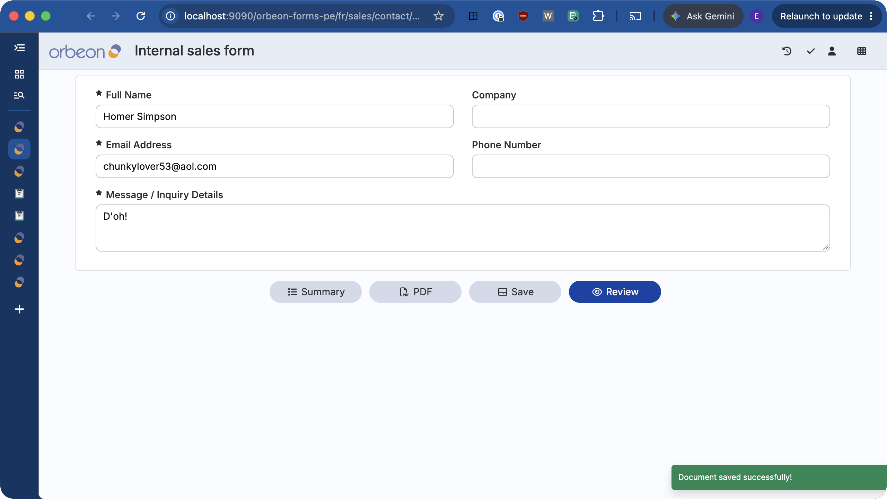

# Ephemeral messages

## Availability

[SINCE Orbeon Forms 2026.1] For toast notification appearance, custom positioning, and auto-dismiss delay configuration.

## Overview

In Form Runner, processes can display feedback messages to users upon completing actions, such as saving draft data, sending an email, or performing background submissions. These messages are triggered by the [`success-message`](../advanced/buttons-and-processes/actions-form-runner.md#success-message-and-error-message) and [`error-message(appearance = "ephemeral")`](../advanced/buttons-and-processes/actions-form-runner.md#success-message-and-error-message) actions.

Starting with Orbeon Forms 2026.1, ephemeral messages are rendered as floating **toast notifications** fixed to the viewport.



Key benefits of toast notifications:

* **Always visible**: Toast messages remain pinned to the screen regardless of the user's scroll position, ensuring users never miss important feedback on long forms.
* **Auto-dismissal**: Messages automatically fade away after a configurable timeout (default: 10 seconds).
* **Manual close button**: Users can dismiss the notification at any time using the close (`×`) button.
* **Non-intrusive focus behavior**: Unlike legacy inline alerts (which were dismissed as soon as a user focused any field), toast notifications remain visible while the user continues interacting with the form.

## Configuration properties

You can configure the appearance, screen position, and display duration of ephemeral messages using properties in `properties-local.xml`.

### Appearance

```xml
<property
    as="xs:string"
    name="oxf.fr.detail.messages.appearance.*.*"
    value="toast"/>
```

Supported values:

* `toast` (default): Displays ephemeral messages as floating toast notifications.
* `inline`: Restores legacy behavior, displaying messages as inline alert banners at the bottom of the form above the buttons bar. In `inline` mode, the message is automatically dismissed whenever the user focuses a form control.

### Position

```xml
<property
    as="xs:string"
    name="oxf.fr.detail.messages.position.*.*"
    value="bottom-right"/>
```

When `appearance` is set to `toast`, this property controls where the toast container is positioned on screen. Supported values:

| Value                    | Description                                       |
|:-------------------------|:--------------------------------------------------|
| `bottom-right` (default) | Pinned to the bottom-right corner of the viewport |
| `bottom-left`            | Pinned to the bottom-left corner of the viewport  |
| `top-right`              | Pinned to the top-right corner of the viewport    |
| `top-left`               | Pinned to the top-left corner of the viewport     |

### Auto-dismiss delay

```xml
<property
    as="xs:integer"
    name="oxf.fr.detail.messages.delay.*.*"
    value="10000"/>
```

This property defines the duration in milliseconds before a toast notification is automatically dismissed.

* Default: `10000` (10 seconds).
* Set to `0` (or a negative value) to disable auto-dismissal; in this case, the toast remains on screen until the user manually clicks the close button or a new message replaces it.

## Triggering ephemeral messages

Ephemeral messages can be shown using Form Runner process actions:

### Success messages

The `success-message` action always displays an ephemeral message (styled in green):

```
save
then success-message("save-success")
```

You can pass a literal message, an XPath value template, or a resource key:

```
save
then success-message(message = "Your submission has been received.")
```

### Ephemeral error messages

By default, the `error-message` action displays a modal dialog. To display an ephemeral notification instead (styled in red), set the `appearance` parameter to `"ephemeral"`:

```
error-message(message = "A non-critical error occurred.", appearance = "ephemeral")
```

Or using a resource key:

```
error-message(resource = "database-warning", appearance = "ephemeral")
```

### HTML formatting

[SINCE Orbeon Forms 2023.1] Both `success-message` and `error-message` support formatted HTML content by setting `html = "true"`:

```
success-message(message = "Changes saved to <b>Production</b>.", html = "true")
```

## See also

* [Detail page configuration properties](../../configuration/properties/form-runner-detail-page.md#ephemeral-messages)
* [Form Runner actions: `success-message` and `error-message`](../advanced/buttons-and-processes/actions-form-runner.md#success-message-and-error-message)
* [Form Builder Messages dialog](../../form-builder/messages.md)
* [Buttons and Processes](../advanced/buttons-and-processes/)
