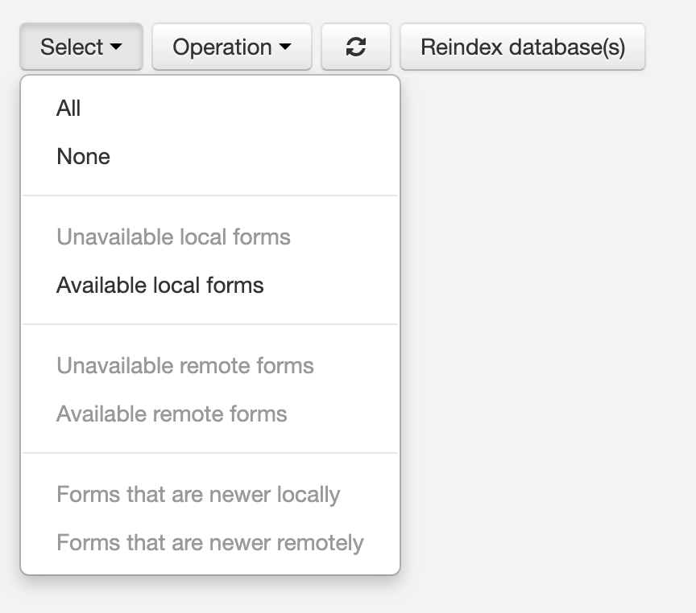
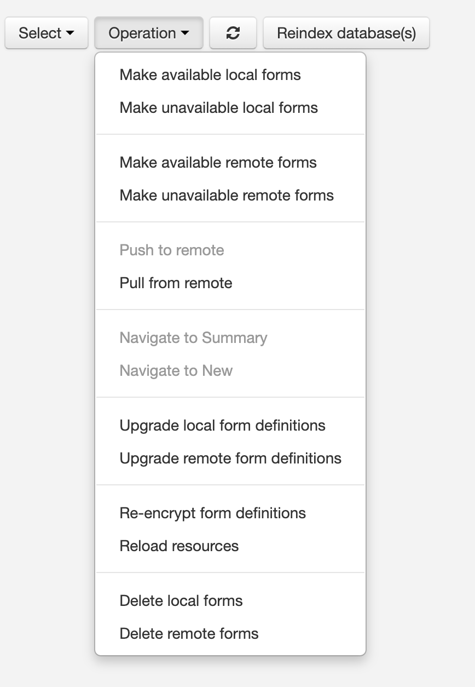
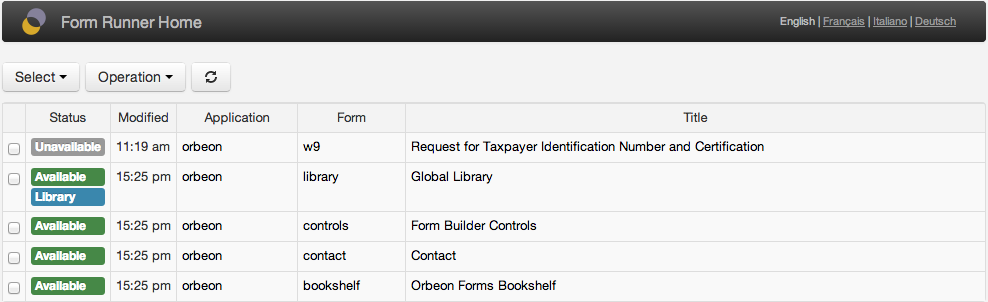
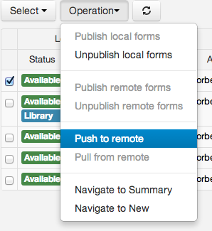
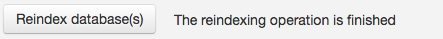

# Forms Admin page

## Introduction

The Forms Admin page allows you to perform admin tasks on published forms. 

You access the Forms Admin page by adding `fr/admin` to the path on which you deployed Orbeon Forms. If you deployed Orbeon Forms on `https://www.example.com/orbeon/`, then you can access the Forms Admin page at `https://www.example.com/orbeon/fr/admin`.

The Forms Admin page is very similar to the [Published Forms](published-forms-page.md) page, but features additional administration functions and shows library forms.

This page is also accessible directly from the [Landing page](landing-page.md).


## Availability and compatibility

[SINCE Orbeon Forms 2022.1]

Until Orbeon Forms 2021.1, this page was combined with the [Published Forms page](published-forms-page.md) under the name [Home page](home-page.md) and accessible at the path `/fr/`. Starting with Orbeon Forms 2022.1, the Home page is replaced with separate Published Forms and Forms Admin pages at paths `/fr/forms` and `/fr/admin`. The `/fr/` path now reaches the [Landing page](landing-page.md).

## Permissions

If the user has permissions set in `form-builder-permissions.xml`, the Forms Admin page shows and is linked from the Landing page.

The list of forms listed depends on the roles set in `form-builder-permissions.xml`. For example, with:

```xml
<role name="*" app="*" form="*"/>
```

the user can perform any admin operation on any form. But with:

```xml
<role name="orbeon-user" app="acme" form="*"/>
```

the user can perform admin operations on `acme` forms only.

## Admin operations on published forms

In addition to information shown in the [Published Forms page](published-forms-page.md), the Forms Admin page shows the following information:

- whether the form is available or unavailable
- whether the form is a library form

Unavailable forms remain on the server, but any user access to an unavailable form behaves as if the form definition had never been published. Data associated with the form definition is not touched, but cannot be read or updated via the form definition when it is unavailable.

Administrators can select forms in two ways:

- by using the checkboxes next to the form
- by using the *Select* menu to automatically select all forms matching a certain condition



The operations listed in the Operation menu are then available depending on the current selection:



## Controlling form definitions availability

- __Make available local forms:__ make an unavailable form definition available again.
- __Make unavailable local forms:__ make a published form definition unavailable.



Initially, when publishing a form definition with Form Builder, the form definition is made available, unless you choose the option "Make published form available" to "No".


[SINCE Orbeon Forms 2020.1]

Making a form definition available or unavailable also takes into account the *version* of the form definition(s) selected.  

## Deleting published form definitions

[SINCE Orbeon Forms 2021.1]

- __Delete local forms:__ delete a locally-published form definition.
- __Delete remote forms:__ delete a remotely-published form definition.

Unlike the "Make unavailable" operations, this operation removes the selected published form definitions. Once this is done, the form definitions are no longer visible in the Admin page and they can no longer be accessed.

This feature is useful in cases a form definition was published by mistake, for testing, or if at a later time the form definition is deemed unnecessary.

Important notes:

1. This does not cause any data entered using this form definition to be removed. The data will remain in the database. However, that data is no longer accessible by a form definition. If a form definition with the same application name, form name, and form version is later published, then it will have access to that data again.
2. This action cannot be undone. However, the [auditing trail](/form-runner/persistence/auditing.md) in the database might allow recovery of a deleted form definition at the database level.

## Upgrading form definitions

### Introduction

[SINCE Orbeon Forms 4.6]

- __Upgrade local form definitions:__ upgrade the selected local published form definitions, including using published section templates.
- __Upgrade remote form definitions:__ upgrade the selected remote published form definitions, including using published section templates.
 
This operation, for each selected form definition:

1. Reads the latest version (or the selected version [SINCE Orbeon Forms 2020.1]) of the published form definition, whether it is marked available or unavailable.
2. Loads published section templates used by the form definition if needed:
    - With 2020.1 and earlier: loads the *latest* versions of the published section templates that are associated with that form definition.
    - With 2021.1 and newer: loads the *specific versions* of the published section templates that are associated with that form definition.
3. Upgrades the form definition markup to the latest format, as if loading it in Form Builder and saving it again.
4. Includes the latest section templates loaded above into the form definition.
5. Publishes back the form definition, either as a new version or as the same version:
    - From Orbeon Forms 4.6 (included) to 2016.1 (excluded): a *new* form definition version is created when the form definition is upgraded.
    - From Orbeon Forms 2016.1 (included): the upgraded form definition *overrides* the previously-published form definition (which means that it has the same application name, form name, and form definition version). 

In general, it is not required to run this function even after upgrading to a new version of Orbeon Forms, since form definitions are backward compatible.

### Upgrading section templates

Here is how you can use this operation to update your form definitions' section template to the latest published section templates:

1. Publish your section templates from Form Builder (see [Section templates](/form-builder/section-templates.md)). 
2. In the Forms Admin page, select which forms you want to update.
3. Run the "Upgrade local form definitions" action.

We advise that you only republish form definitions which use section templates if you know that the format of the data covered by the section templates remains compatible, or that [Simple Data Migration](/form-runner/feature/simple-data-migration.md) is enabled and expected to cover changes such as adding fields.

## Remote server operations

[SINCE Orbeon Forms 4.4]

This is an Orbeon Forms PE feature.

### Introduction

This feature allows you to configure access to a remote server and to make available, make unavailable, and transfer (push/pull) forms between the local and remote server.

### Configuration on the local server

In order to configure a remote server, you need to setup a property.

With Orbeon Forms 4.7 and newer, use the `oxf.fr.home.remote-servers` property, which allows configuring multiple remote servers:

```xml
<property as="xs:string" name="oxf.fr.home.remote-servers">
  [
    {
      "label": "Staging",
      "url":   "http://staging.example.org:8080/orbeon"
    },
    {
      "label": "Production",
      "url":   "http://prod.example.org:9090/orbeon"
    }
  ]
</property>
```


The format is a JSON array containing any number of JSON objects. Each object must have a non-empty `label` property indicating the label to display to the user when selecting a remote server, and a non-empty `url` property indicating the location of the remote server.

With Orbeon Forms 4.4 to 4.6, use the `oxf.fr.production-server-uri` property:

```xml
<property
  as="xs:anyURI"
  name="oxf.fr.production-server-uri"
  value="http://remote.server:8080/orbeon/"/>
```

*NOTE: Since Orbeon Forms 4.7, the `oxf.fr.production-server-uri` is deprecated. Since Orbeon Forms 4.7 and newer, if the `oxf.fr.production-server-uri` is set and not empty, it takes precedence over the new `oxf.fr.home.remote-servers` property, for backward compatibility.*

### Configuration on the remote server

You also need to authorize the remote server to accept incoming connections for services. One way of doing this is to use the Orbeon Forms delegating `orbeon-auth.war`, documented [here](../../xml-platform/controller/authorization-of-pages-and-services.md).

You deploy this WAR file alongside `orbeon.war` on the remote server, and you add this property to the remote server's `properties-local.xml`:

```xml
<property
  as="xs:anyURI"
  processor-name="oxf:page-flow"
  name="authorizer"
  value="/orbeon-auth"/>
```

This tells the remote server to use the `orbeon-auth` webapp to authenticate requests for services or pages which are not public.

By default, `orbeon-auth` requires that all external requests to Form Runner services are authenticated with `BASIC` authentication and have the `orbeon-service` role. It blocks any other request.

If you are using Tomcat, you can then configure a user with role `orbeon-service`. For example, in `tomcat-users.xml`:

```xml
<role rolename="orbeon-service"/>
<user username="orbeon-admin" password="changeme" roles="orbeon-service"/>
```

Then, on the local server, you would use username `orbeon-admin` and password `changeme` when prompted.

With this configuration, the local Orbeon Forms connects to services on the remote Orbeon Forms, which calls up `orbeon-auth` to authenticate the connection. `orbeon-auth` requires that the username/password provided authenticate as a valid Tomcat user with the `orbeon-service` role. If that's successful, then the service proceeds, otherwise it fails.

### Remote operations

When the remote server is configured as above, the first time you go to the Forms Admin page you are prompted for credentials:


Once the credentials are correct, the Forms Admin page retrieves the remote server's list of deployed forms and metadata, which appears in a new *Remote* column group. You then have access to new operations:

- __Make available remote form:__ make an unavailable form available again on the remote server.
- __Make unavailable remote form:__ make a previously published form unavailable on the remote server.
- __Push to remote:__ copy a form definition and its attachments from the local to the remote server.
- __Pull from remote:__ copy a form definition and its attachments from the remote to the local server.
- __Upgrade remote form definitions:__ upgrade the remote form definition (see [Upgrading form definitions](#upgrading-form-definitions)).



You are always prompted to confirm the operation to perform:


In addition, if the latest modification time of the form definitions differ, a *Newer* label appears:


## Re-encryption

[SINCE Orbeon Forms PE 2018.1]

Also see [Field-level encryption](/form-builder/field-level-encryption.md).

### Limitations to re-encryption

Currently, re-encryption is only supported in the built-in implementation of the persistence API for relational databases. The built-in implementation of the persistence API for eXist doesn't support re-encryption, and custom implementations can't yet support re-encryption.

### Creating a database backup before re-encryption

Unlike typical update and delete operations that are performed at the database level by adding a new row, thus keeping the old data, re-encryption is done *in-place*. All data is being re-encrypted, including historical data that is part of the "journal". This means that you could loose data if something were to go wrong during re-encryption. As such, we strongly recommend you create a backup of your data before re-encryption.

### Starting re-encryption

To re-encrypt all the data for certain forms, from the Forms Admin page:

1. Mark the checkboxes corresponding to the relevant forms.
2. Click on the "Operations" button, and in the menu click on "Re-encrypt form definitions". If that entry is greyed out, make sure that you haven't selected a form for which data is stored with a persistence layer that doesn't support re-encryption.
3. After you confirm you desire to go ahead with the re-encryption, you will see, in the "Status" column:
	- "Re-encryption started," right after you triggered the re-encryption.
	- "Re-encrypting 392/2401," while the re-encryption is in progress, here assuming it has already re-encrypted 391 documents out of 2401 it needs to re-encrypt.
	- "Re-encryption finished," when the re-encryption is done for that form.

## Reloading resources

[SINCE Orbeon Forms 2019.2]

Because Orbeon Forms caches form resources, if you override resources with the [`oxf.fr.resource` properties](/configuration/properties/form-runner.md#overriding-resources), those resources are not updated until the server restarts.    

Using the "Reload resources" action will invalidate the cached resources of all the selected forms immediately. The next time the form is loaded, it will use up to date resources including those overridden in properties. 

## Reindexing

[SINCE Orbeon Forms 2016.2]

### Upgrading to 2016.2

Orbeon Forms 2016.2 adds two index tables: `orbeon_i_current` and `orbeon_i_control_text`, so when upgrading to 2016.2, for Form Runner to work properly, you'll need to initially populate those tables in an operation referred to as *reindexing*. After you've upgraded and done the initial reindexing, you shouldn't need to reindex the database manually, as Form Runner will incrementally update the index when needed.

Depending on how much data you have, the reindexing operation can take a while, and during reindexing some features of Orbeon Forms 2016.2, like Form Runner summary pages and the [search API](../api/persistence/search.md), won't work as expected. Because of this, upgrading requires some additional steps if you're using those features. If end users don't access Form Runner summary pages on your production system, and you don't have custom code calling the search API (which is rare), then go to point 1 below; otherwise, go with point 2 below.

1. If you're not relying on those features in production, you can upgrade Orbeon Forms as you normally would when you need to make changes to the database: take the previous version of Orbeon Forms offline, run the [relevant DDL to upgrade your database schema](../persistence/relational-db.md), and take the new version of Orbeon Forms online. This requires Orbeon Forms to be offline, but this, typically, only for a matter of a few minutes.
2. If you're relying on those features in production, since reindexing can take a while and you can't run Orbeon Forms 2016.2 while reindexing, we suggest you start by cloning your database, run the [relevant DDL to upgrade your database schema](../persistence/relational-db.md) on that cloned database, run 2016.2 on another server, and have it reindex the cloned database. This will give you an idea of how long reindexing takes, and how long of an offline window you need. With this information in mind, schedule an offline window of the appropriate length, and at that time, do the upgrade procedure again, but this time on the production database.

### UI

In admin view, the Forms Admin page shows a reindex button:


After you click it, and confirm you want to go ahead, if this is indeed what you want to do (see above paragraph for more information about what happens during reindexing), the Forms Admin page shows the reindexing status:


If, for some reason, you want to stop reindexing, you can do so by clicking on the *Stop reindexing* button. When doing so, the index is left in an incoherent state, and you should restart indexing at a latter time. While reindexing stops, you'll see the following message:


Finally, once reindexing is done, you'll see:



### Logging

While reindexing happens, the indexer writes to the log:

- When indexing starts and ends.
- Which providers it will reindex.
- For each provider how many document it will reindex.
- A "progress message" for each document being reindexed.

The last message is logged at the `debug` level, to avoid your log growing unnecessarily in case you have lots of documents, while all the other messages are logged at the `info` level. For instance, you'll see something along those lines in your `orbeon.log`:

```
INFO  - Reindex status - Starting, will index [oracle_dev, oracle_staging]
INFO  - Reindex status - Indexing oracle_dev 1/2
INFO  - Reindex status - Indexing oracle_dev 1/2, 8475 documents
DEBUG - Reindex status - Indexing oracle_dev 1/2, document 1/8475
DEBUG - Reindex status - Indexing oracle_dev 1/2, document 2/8475
…
INFO  - Reindex status - Stopped
```

If you'd like to enable logging at the `debug` level, add the following to your `log4j.xml`:

```xml
<category name="org.orbeon.relational">
    <priority value="debug"/>
</category>
```

## Form definitions and form data Zip Export

See [Form definitions and form data Zip Export](exporting-form-definitions-and-form-data.md).

## Purging historical data

See [Purging historical data](purging-historical-data.md).

## Search and sorting

[\[SINCE Orbeon Forms 2024.1\]](/release-notes/orbeon-forms-2024.1.md)

The Forms Admin page allows you to search and sort forms by status, last modification date/time, application name, form name, version, and title.

To display search fields, click on the "Show Search Options" button.

To sort the forms, click on the column headers.

## Configuration properties

The same configuration properties as for the [Published Forms page](published-forms-page.md#configuration-properties) apply.

## Orbeon Forms 4.0 to 4.2

For each form definition the current user has access to, the following links are shown if allowed:

- Link to the summary page: shown if the current user can perform either one of the read, update, or delete operations on the form.
- Link to the new page: shown if the current user can perform the create operation on the form.


## See also

- [Published Forms page](published-forms-page.md)
- [Landing page](landing-page.md)
- [Summary Page](summary-page.md)
- [Access control for deployed forms](/form-runner/access-control/deployed-forms.md)
- [Form Builder permissions](/form-runner/access-control/editing-forms.md#form-builder-permissions)
