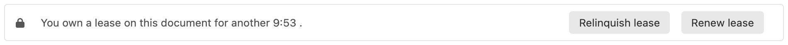
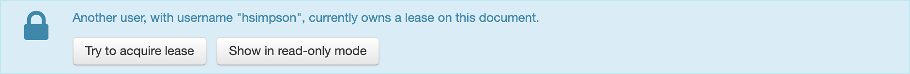
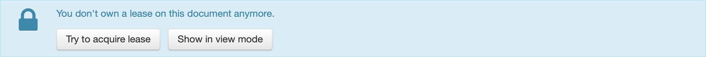

# Lease feature

## Availability

Since Orbeon Forms 2017.2.

This is an Orbeon Forms PE feature.

## Overview

When the Lease feature is enabled, Form Runner prevents multiple users from concurrently editing the same form instance. When a first user, let's call him Homer, opens a form instance for editing, Homer is assigned a *lease* on that form instance for a given duration, say 10 minutes. The lease gets automatically extended when Homer updates the form, say by changing the value of a field, or when Homer clicks on a button to request a lease extension (more on this below).



If a second user, let's call her Marge, opens the same form instance for editing while Homer has a lease, Marge will be told she can't edit this form right now, has Homer has a lease. She can click on the first button to try to acquire the lease again, or [SINCE Orbeon Forms 2020.1] on the second to view data in read-only mode.



The lease given to Homer will end either because it expires without being renewed, or because Homer clicked on a button to explicitly relinquish the lease. At this point, Homer can click on the first button to try to acquire the lease again, or [SINCE Orbeon Forms 2020.1] on the second to view the data in read-only mode. [SINCE Orbeon Forms 2021.1.5 and 2022.1] As the "Show in read-only mode" button does a page navigation, and as page navigations aren't supported by the JavaScript or Java embedding API, that button is hidden in those cases. You can override this behavior through the `oxf.fr.detail.button.lease.show-in-view-mode.visible.*.*` property.   



[\[SINCE Orbeon Forms 2024.1\]](/release-notes/orbeon-forms-2024.1.md) The Lease feature is also available in Form Builder, where it prevents multiple users from concurrently editing the same form definition.

## Enabling the Lease feature

By default, the Lease feature is disabled. It is enabled when the following conditions are met:

- You've set the property `oxf.fr.detail.lease.enabled.*.*` to `true`, as shown below (the default is `false`, so you do need to set this property).
- The user is authenticated.
- The implementation of the persistence API used by the current app/form supports the Lease feature. As of Orbeon Forms 2018.2, this is the case of all the built-in implementations of the persistence API for relational databases, but not of the implementation of the persistence API for eXist.

If the Lease feature is enabled, when non-authenticated users try to edit the data, they receive a [403 Forbidden](https://en.wikipedia.org/wiki/HTTP_403).

```xml
<property 
    as="xs:boolean" 
    name="oxf.fr.detail.lease.enabled.*.*"
    value="true"/>
```

The above property will not enable the Lease feature for Form Builder.

[\[SINCE Orbeon Forms 2024.1\]](/release-notes/orbeon-forms-2024.1.md)

To enable the Lease feature specifically for Form Builder, use the following property:

```xml
<property
    as="xs:boolean"
    name="oxf.fr.detail.lease.enabled.orbeon.builder"
    value="true"/>
```

## Configure lease duration and thresholds

When users get a lease, by default its duration is of 10 minutes. You can change this default by setting the property below. The timeout can be set for all the form in a given app by replacing the second `*` by the name of that app, or even more specifically for a specific form of that app by also replacing the third `*` by the name of that form.

The first `*` can be replaced by a role name if you want the duration of the lease to be higher for users having that role. If in a given situation multiple properties apply to the current form and current user, then the highest duration is used. For instance, say you leave the default to 10 minutes, but add a property `oxf.fr.detail.lease.duration.admin.*.*` set to 20 minutes. Then users with the role `admin` will get 20 minutes, while other users will get 10 minutes.

```xml
<property
    as="xs:integer"
    name="oxf.fr.detail.lease.duration.*.*.*"
    value="10"/>
```

As mentioned earlier, when user change values in the form, the lease gets automatically renewed. However, minimize hits to the database this isn't done during the first minute after the lease was first obtained or renewed. If you wish to even further minimize hits to the database, you can increase the value of the value of the following property.

```xml
<property
    as="xs:integer"
    name="oxf.fr.detail.lease.renew-threshold.*.*"
    value="1"/>
```

Two minutes before the lease expires, Form Runner will tell users that the lease is about to expire, and offer the option to renew the lease. If you wish users to be warned earlier, you can increase the value of the following property.

```xml
<property
    as="xs:integer"
    name="oxf.fr.detail.lease.alert-threshold.*.*"
    value="2"/>
```

## Hiding buttons

Most of the buttons typically shown at the bottom of the form when editing data, such as "Save" or "Submit", shouldn't be shown when users don't currently own the lease on the document. However, other buttons, such as "Home" or "Summary" that are only used for navigation, can be shown even when users don't currently own the lease.

To discriminate between those cases, you can use the `fr:owns-lease-or-none-required()` XPath function. By default, buttons are only shown if users own the lease or no lease is required; you could change this default by modifying the value of the following property, but we don't recommend you do so.

```xml
<property
    as="xs:string"
    name="oxf.fr.detail.button.*.visible.*.*"
    value="fr:owns-lease-or-none-required()"/>
```

If you have a button, that should be shown even if users don't own the lease, you'll want to add the following property:

```xml
<property
    as="xs:string"
    name="oxf.fr.detail.button.[button-name].visible.*.*"
    value="true()"/>
```

If you have a button displayed upon some condition being true, that is for which you have defined a `oxf.fr.detail.button.[button-name].visible.*.*` property, if that button shouldn't be displayed when users don't own the lease, you'll want to add `and fr:owns-lease-or-none-required()` to your XPath expression:

```xml
<property
    as="xs:string"
    name="oxf.fr.detail.button.[button-name].visible.*.*"
    value="
        [your conditional XPath expression]
        and fr:owns-lease-or-none-required()
    "/>
```
