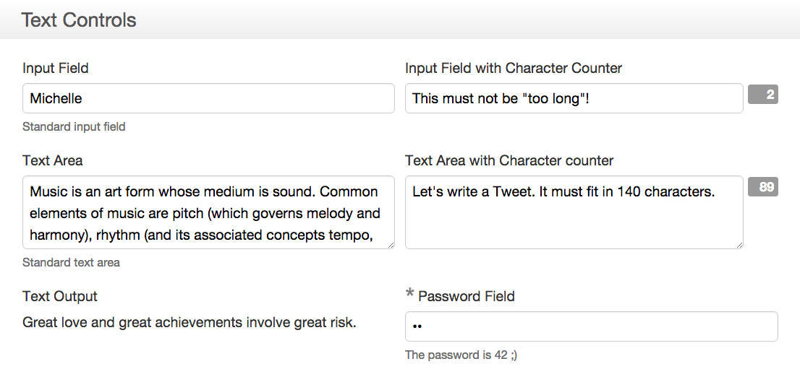

## Fields in one column

Starting with version 4.10, Orbeon Forms supports [responsive design](https://en.wikipedia.org/wiki/Responsive_web_design) for forms you create with Form Builder. One significant implication is that when your forms are shown on a narrow screen, for instance on a mobile phone, most fields are reflowed to be on the same "column".

## Example

If you have a form with a section containing a grid with two columns, on a desktop or tablet your form might show as:

When the same form is loaded from a mobile phone, fields will automatically be shown in one column to better fit that screen:

## Limitations

Version 4.10 introduces responsive design to the "detail page", i.e. the page used to fill out a form, as it is the page accessed by most end users, who are also more likely to be using a mobile device. In future versions, responsive design will be brought also to the summary page and [[home page|Form Runner ~ Home Page]].
