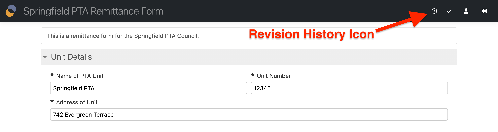
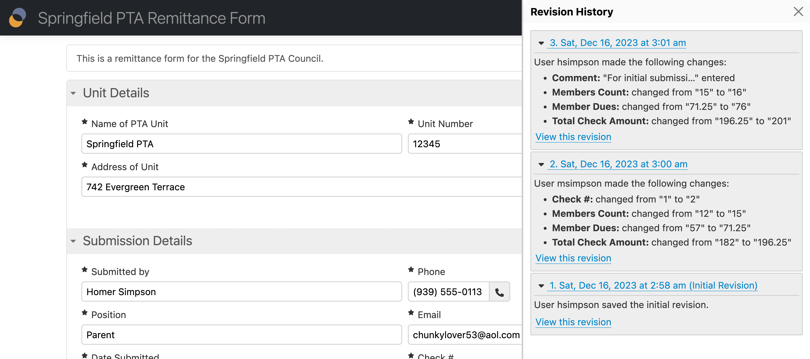
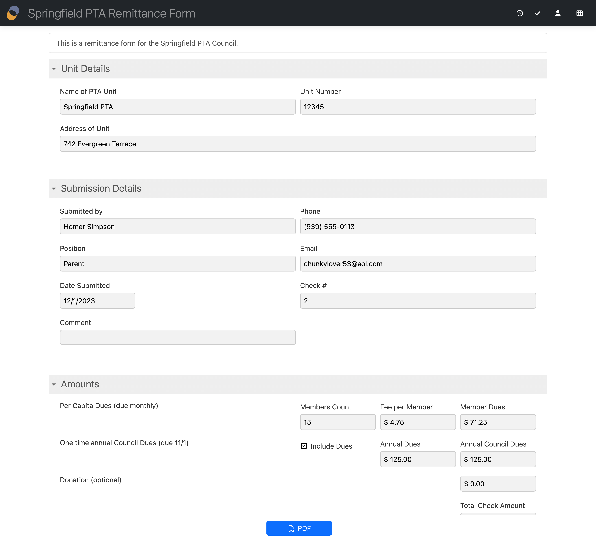

# Revision history

## Availability

[\[SINCE Orbeon Forms 2023.1\]](../../release-notes/orbeon-forms-2023.1.md)

## Introduction

Each time Form Runner saves data to the database, it saves a new _revision_ of the data. Each revision of the data has an associated timestamp.

Until Orbeon Forms 2023.1, the revision history was only accessible through the database, for [auditing purposes](../persistence/auditing.md), or for restoring an older version manually. Starting with Orbeon Forms 2023.1, Form Runner provides a user interface to access the revision history of a given form data.

Note that this feature is distinct from [form definition versioning](versioning.md), which regards the versioning of published form definitions.

## Enabling the feature

The feature is disabled by default. You can enable it globally by setting the following property to `true`:

```xml
<property
    as="xs:boolean"
    name="oxf.fr.navbar.revision-history.enable.*.*"
    value="true"/>
```

This adds a "Revision History" icon in the [navigation bar](navbar.md).



Activating the icon opens the Revision History pane:



## The Revision History pane

The Revision History pane shows the list of revisions for the current form data, with the following information:

* date and time of the change
* username of the user that made the change, or "Anonymous user"
* a description of the changes, including
  * value entered
  * value cleared
  * value changed
  * iteration added
  * iteration removed
  * other change
  * no change

For a given revision, you can click on the "View this revision" link to view the form data as it was at the time of that revision.



## See also

* Blog post: [Data Revision History](https://www.orbeon.com/2024/08/revision-history)
* [Form Runner navigation bar](navbar.md)
* [Auditing](../persistence/auditing.md)
* [Purging historical data](purging-historical-data.md)
* [Purging old data using SQL](../persistence/purging-old-data.md)
* [Form definition versioning](versioning.md)
* [Revision History API](../api/persistence/revision-history.md)
