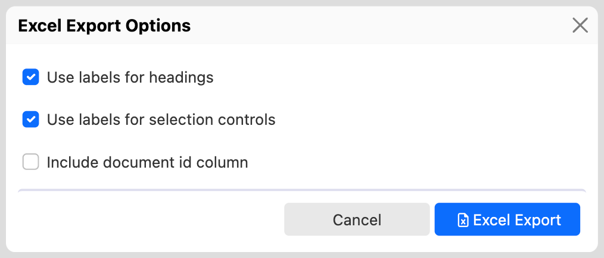

# Summary page Excel Export

## Availability

[\[SINCE Orbeon Forms 2023.1.3\]](/release-notes/orbeon-forms-2023.1.3.md)

This is an Orbeon Forms PE feature.

## Context

Orbeon Forms includes a few ways to export form definitions and form data. This page documents a very specific capability: exporting a subset of *form data* as seen in the Summary Page in Excel format.

[//]: # (, appropriate for [importing]&#40;/form-runner/feature/excel-xml-import.md&#41; the data into Orbeon Forms at a later time)

For different types of export, see also:

- [Form definitions and form data batch export](exporting-form-definitions-and-form-data.md)
- [Excel and XML Export](excel-xml-export.md)

## How to use the feature

### Locations

You can export form data from the Form Runner [Summary page](summary-page.md).

### Enabling the feature

In order to enable the feature, you need to add the `excel-export-with-search` token to the `oxf.fr.summary.buttons` property:

```xml
<property as="xs:string"  name="oxf.fr.summary.buttons.*.*">
    home review pdf delete duplicate excel-export-with-search new
</property>
```


### Options

Upon activating the button, a dialog opens which allows you to specify options for the export:

- __Use labels for headings:__
    - Default: selected
    - If selected, the column headings in the Excel document use control labels of the form controls, as well as human-readable labels for metadata
    - If deselected, the column headings in the Excel document use control names of the form controls, as well as metadata names 
- __Use labels for selection controls:__
   - Default: selected
   - If selected, the values of selection controls are exported as human-readable choices labels
   - If deselected, the values of selection controls are exported as choices values
- __Include document id column:__
    - Default: deselected
    - If selected, the document id is included in the Excel document as the first column
    - If deselected, the document id is not included in the Excel document



### Exported data

Activating the button exports the data currently displayed in the Summary Page, including:

- all the pages accessible using paging
- search results if a search is active
- sorting order if specified

The export only includes data from form controls that the user can already see in the Summary page. These are the form controls marked as "Show on Summary page" in Form Builder's [Control Settings dialog](/form-builder/control-settings.md).

The Excel document includes:

- a heading row including the column names
- one row per form data row
- form metadata is included as shown in the Summary page, if configured
    - Created: creation date/time
    - Modified: last modification date/time
    - Created By: username of the user who created the data
    - Modified By: username of the user who last modified the data
    - Workflow stage: name of the workflow stage associated with the data


## See also

- Blog post: [Excel export and import](https://blog.orbeon.com/2021/09/excel-export-and-import.html)
- [Excel and XML Import](excel-xml-import.md)
- [Form definitions and form data batch export](exporting-form-definitions-and-form-data.md)
- [Excel and XML Export](excel-xml-export.md)
- [Service calls](/form-runner/link-embed/linking.md)