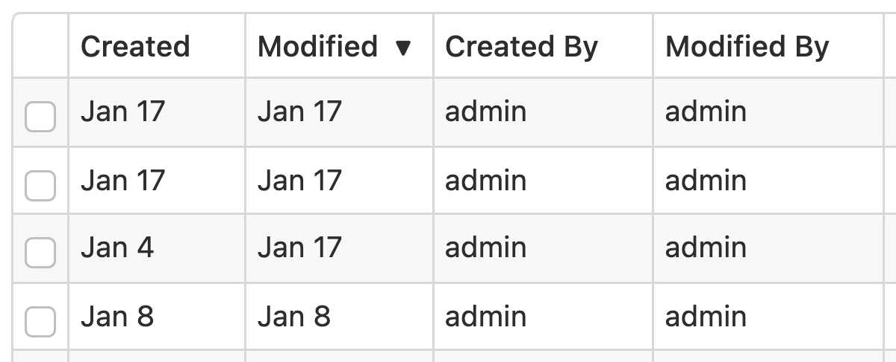

# Summary Page

## Introduction

The Form Runner Summary page shows, for a given published form, the list of accessible data in a table with paging. It allows:

- Listing and searching data
- Creating new data
- Editing or visualizing existing data
- Deleting data
- Duplicating data
- Navigating to the Home page and Import page
- Opening a PDF or TIFF version of the form


## Columns

- __Created:__
    - This is the data's creation date.
    - You can optionally remove this column via [configuration](/configuration/properties/form-runner-summary-page.md).
- __Modified:__
    - This is the data's last modification date.
    - You can optionally remove this column via [configuration](/configuration/properties/form-runner-summary-page.md). 
- __Custom columns:__
    - You specify those when editing the form definition, using the [Control Settings dialog](/form-builder/control-settings.md).

### Sorting

[SINCE Orbeon Forms 2024.1]

It is possible to sort the data by clicking on the column headers. The sort order is indicated by an arrow next to the column name. Clicking multiple times on the same header will toggle between ascending and descending order.



Limitations:

- Currently, all values except the "Created" and "Modified" columns are sorted as strings. This can lead to unexpected results, in particular for numbers and HTML values. Numbers will be sorted alphabetically (e.g. "1", "10", "11", "2", "37", "4", etc.) and HTML values will be sorted by their HTML representation (i.e. including HTML markup).
- Dropdown controls will be sorted by their value, not their label.

#### Enabling support

Implementations of the persistence API may support the sorting feature, but they are not required to. For this reason, if your implementation does support the sorting feature, you must set the following property to `true` for your provider:

```xml
<property 
    as="xs:boolean" 
    name="oxf.fr.persistence.[provider].sort"
    value="true"/>
```

## Search 

By default, the Summary page shows a single search box which does a full-text search in the form data.

You can open the search options using the "Show Search Options" button. The search options area contains individual search fields which allow performing a structured search, or search by field.

### Search by created, modified, created by, modified by, and workflow stage

[SINCE Orbeon Forms 2024.1]

When the corresponding [`oxf.fr.summary.show-*` properties](/configuration/properties/form-runner-summary-page.md) are enabled, the search options area contains individual search fields which allow performing a search by created, modified, created by, modified by, and workflow stage.

The created by, modified by, and workflow stage search fields contain distinct values from accessible data.


### Dynamic dropdowns

[\[SINCE Orbeon Forms 2023.1\]](/release-notes/orbeon-forms-2023.1.md)

For dynamic dropdowns, the original service used to populate the dropdown is not called again, but distinct values from accessible data are listed. This is also done in the bulk edit area if dynamic dropdowns are present.


You specify which fields appear in the search options area when editing the form definition, using the [Control Settings dialog](/form-builder/control-settings.md).

### Search options opened on load

[\[SINCE Orbeon Forms 2024.1.1\]](/release-notes/orbeon-forms-2024.1.1.md)

This property controls whether the search options area is opened by default when the Summary page loads. It allows you to provide a better user experience for forms where users frequently need to perform structured searches by having the search options immediately available.

- When set to `"true"`: The search options area is shown by default when the page loads
- When set to `"false"` (default): The search options area is collapsed by default when the page loads

```xml
<property 
    as="xs:string"  
    name="oxf.fr.summary.search-options-opened-on-load.*.*"              
    value="true"/>
```

## Versioning

[SINCE Orbeon Forms 2018.2]

When more than one [form version](/form-runner/feature/versioning.md) is available, the user has the choice of the version to access. Different versions can behave like very different forms. Also see the [properties to configuring the behavior of the summary page with regards to versioning](/configuration/properties/form-runner-summary-page.md#versioning).


## Bulk edit

[\[SINCE Orbeon Forms 2023.1\]](/release-notes/orbeon-forms-2023.1.md)

Just like for search options, you can open the bulk edit area using the "Show Bulk Edit" button. The bulk edit area contains individual fields which allow performing a bulk edit of multiple forms at once. 


You specify which fields appear in the bulk edit area when editing the form definition, using the [Control Settings dialog](/form-builder/control-settings.md).

## Summary page buttons and processes

See [Summary page buttons and processes](/form-runner/advanced/buttons-and-processes/summary-page-buttons-and-processes.md).

## See also 

- [Published Forms page](/form-runner/feature/published-forms-page.md)
- [Forms Admin page](/form-runner/feature/forms-admin-page.md)
- [Summary page configuration properties](/configuration/properties/form-runner-summary-page.md)
- [Summary page buttons and processes](/form-runner/advanced/buttons-and-processes/summary-page-buttons-and-processes.md)
- [Versioning](/form-runner/feature/versioning.md)
- [Form Builder Summary Page](/form-builder/summary-page.md)
- [Control Settings dialog](/form-builder/control-settings.md)
- Blog post: [Summary page versioning support](https://blog.orbeon.com/2019/05/summary-page-versioning-support.html)