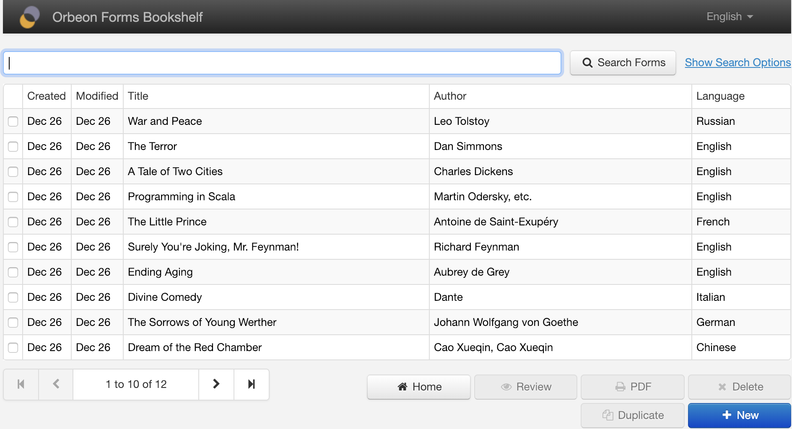
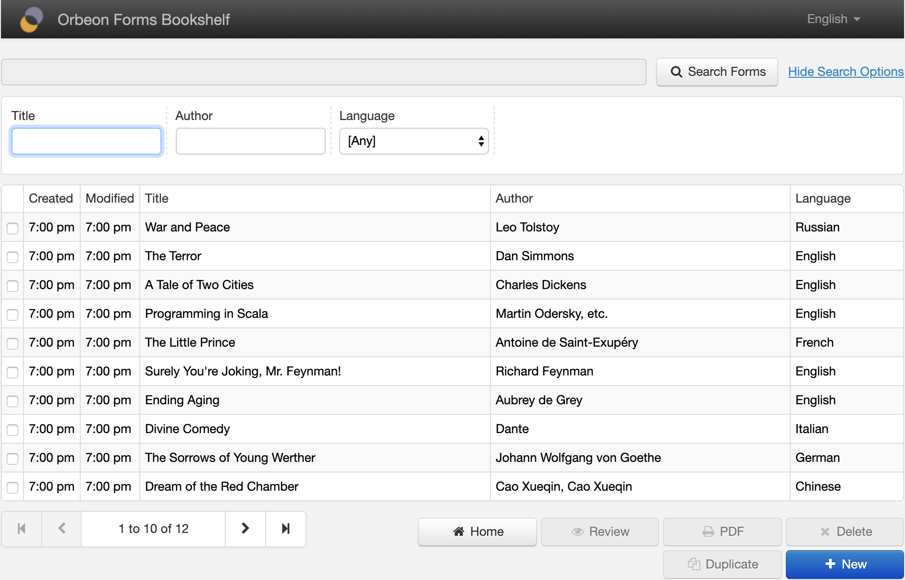
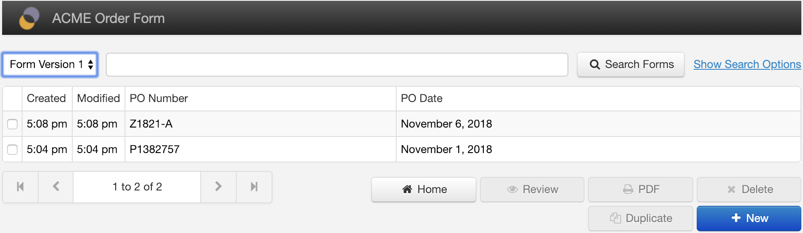
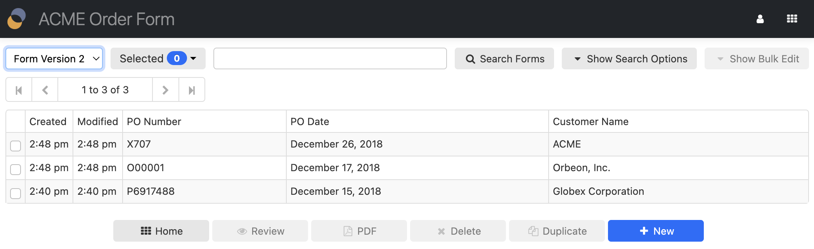

# Summary Page

## Introduction

The Form Runner Summary page shows, for a given published form, the list of accessible data in a table with paging. It allows:

- Listing and searching data
- Creating new data
- Editing or visualizing existing data
- Deleting data
- Duplicating data
- Navigating to the Home page and Import page
- Opening a PDF or TIFF version of the form

## Columns

- __Created:__
    - This is the data's creation date.
    - You can optionally remove this column via [configuration](/configuration/properties/form-runner-summary-page.md).
- __Last Modified:__
    - This is the data's last modification date.
    - You can optionally remove this column via [configuration](/configuration/properties/form-runner-summary-page.md). 
- __Custom columns:__
    - You specify those when editing the form definition, using the [Control Settings dialog](/form-builder/control-settings.md).

## Search 

By default, the Summary page shows a single search box which does a full-text search in the form data.

You can open the search options using the "Show Search Options" button. The search options area contains individual search fields which allow performing a structured search, or search by field.

You specify which fields appear in the search options area when editing the form definition, using the [Control Settings dialog](/form-builder/control-settings.md).

## Versioning

[SINCE Orbeon Forms 2018.2]

When more than one [form version](/form-runner/feature/versioning.md) is available, the user has the choice of the version to access. Different versions can behave like very different forms. Also see the [properties to configuring the behavior of the summary page with regards to versioning](/configuration/properties/form-runner-summary-page.md#versioning).

## Bulk edit

[SINCE Orbeon Forms 2023.1]

Just like for search options, you can open the bulk edit area using the "Show Bulk Edit" button. The bulk edit area contains individual fields which allow performing a bulk edit of multiple forms at once. 

You specify which fields appear in the bulk edit area when editing the form definition, using the [Control Settings dialog](/form-builder/control-settings.md).

## See also 

- [Home Page](home-page.md)
- [Summary page configuration properties](/configuration/properties/form-runner-summary-page.md)
- [Versioning](/form-runner/feature/versioning.md)
- [Form Builder Summary Page](/form-builder/summary-page.md)
- [Control Settings dialog](/form-builder/control-settings.md)
- Blog post: [Summary page versioning support](https://blog.orbeon.com/2019/05/summary-page-versioning-support.html)