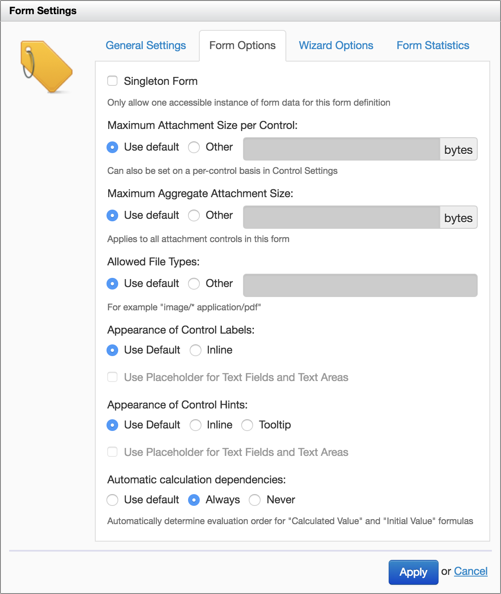

# Versioning

## Availability

This feature is available since Orbeon Forms 4.5. It is available with all supported relational databases but not the eXist database.

## What is form definition versioning?

### Without form definition versioning

Without form definition versioning, Orbeon Forms only keeps track of a single [published](/form-builder/publishing.md) form definition for a given application name/form name (see [terminology](/form-runner/overview/terminology.md#application-name-and-form-name)). This means that if you republish a form, the previously-published form definition gets overwritten (although there is an [auditing trail](/form-runner/api/persistence/versioning.md#auditing-trail)).

This also means that when opening existing data for editing or viewing, Orbeon Forms always uses the latest published version of the form definition. This can lead to unexpected results, as fields might have been added, removed, or renamed in the new form definition. In fact, the form definition could be completely different from the form definition used to create and save the data currently stored in the database!

### With form definition versioning

Form definition versioning introduces the idea that published form definitions for a given application name/form name also have a version number. When creating a *new* version upon publishing, the version number is "1", and when publishing again with a new version the number increases: "2", "3", etc. So you can talk about "version 2 of the Acme Order form".


When saving form data, the data in the database is associated not only with the application name and form name, but also with the *version* of the form definition that was used to create or edit that data. So when you open that data for editing or viewing at a later time, Form Runner can use the matching version of the form definition.

When publishing, if versioning is supported by the persistence layer, you have a choice to *create a new form version* or to *override an existing one*. This is detailed in [Publishing](/form-builder/publishing.md).

## Compatibility of changes

There are different types of changes you can make to a form definition which impact whether *existing data* in the database will be compatible with those changes.

*NOTE: If there is not yet any data created by that given form definition version in the database, then compatibility is not a problem.*

Examples of compatible changes:

- updating labels, hints, help messages, and explanatory texts
- adding items to selection controls
- changing the initial value of a control, either directly with the control or via an *Initial Value* formula
- moving a control within the same grid or section
- changing grid column widths  
- adding a language
- updating permissions
- updating email settings

Examples of incompatible changes:

- renaming a control
- adding a control, grid, or section
- removing a control, grid, or section
- renaming a control, grid, or section
- moving a control between grids or sections
- changing the nesting of grids or section within subsections

## Simple data migration

### Availability

This feature is available since Orbeon Forms 2018.2.

This is an Orbeon Forms PE feature.

### Rationale

Simple data migration is an option which sits between "overwrite an existing form definition in an incompatible way" and "create a whole new form definition version". When enabled, simple data migration allows you to overwrite a form definition, but keep certain changes compatible, namely, the updated form definition can:

- add and remove controls
- add and remove grids and sections

When you load existing data with the updated form definition, the following happens:

- If the data is *missing* placeholders for data associated with new controls, grids or sections, those are automatically added.
- If the data has *extra* placeholders for data associated with removed controls, grids or sections, those are automatically removed. 

### Configuration

This option is disabled by default. You can enable it in the Form Settings's Form Options tab:

- __Use property:__ Use the value set by the `oxf.fr.detail.data-migration` property.
- __Enabled:__ Perform simple data migration when loading and receiving data.
- __Disabled:__ Do not perform simple data migration when loading and receiving data.
- __Raise an error:__ If the data is incompatible upon load, raise an error. The user will not be able to access the data.

The `oxf.fr.detail.data-migration` is set as follows by default:

```xml
<property
    as="xs:string"
    name="oxf.fr.detail.data-migration.*.*"
    value="disabled"/>
```  



## Limitations

When using form definition versioning, form definitions and form data *must* both be stored in the same persistence provider, which must support versioning. See issue [\#3926](https://github.com/orbeon/orbeon-forms/issues/3926).

For example:

```xml
<property
    as="xs:string"
    name="oxf.fr.persistence.provider.acme.*.*"
    value="mysql"/>
```

or:

```xml
<property
    as="xs:string"
    name="oxf.fr.persistence.provider.acme.*.form"
    value="mysql"/>
    
<property
    as="xs:string"
    name="oxf.fr.persistence.provider.acme.*.data"
    value="mysql"/>
```

However, the following does *not* work:

```xml
<property
    as="xs:string"
    name="oxf.fr.persistence.provider.acme.*.form"
    value="mysql"/>
    
<property
    as="xs:string"
    name="oxf.fr.persistence.provider.acme.*.data"
    value="oracle"/>
```

## See also

- [Application name and form name](/form-runner/overview/terminology.md#application-name-and-form-name)
- [Publishing](/form-builder/publishing.md)
    - [Overwriting of existing version](/form-builder/publishing.md#versioning)
    - [Versioning comments](/form-builder/publishing.md#versioning-comments)
- [Summary Page](/form-builder/summary-page.md#versioning)
- Blog posts:
    - [Form versioning](https://blog.orbeon.com/2014/02/form-versioning.html)
    - [Choosing the best versioning option when publishing a form](https://blog.orbeon.com/2015/01/choosing-best-versioning-option-when.html)
    - [Versioning comments](https://blog.orbeon.com/2016/09/versioning-comments.html)
    - [Simple data migration](https://blog.orbeon.com/2018/09/simple-data-migration.html)
- [Persistence API and versioning](/form-runner/api/persistence/versioning.md)
- [Form Settings](/form-builder/form-settings.md)
