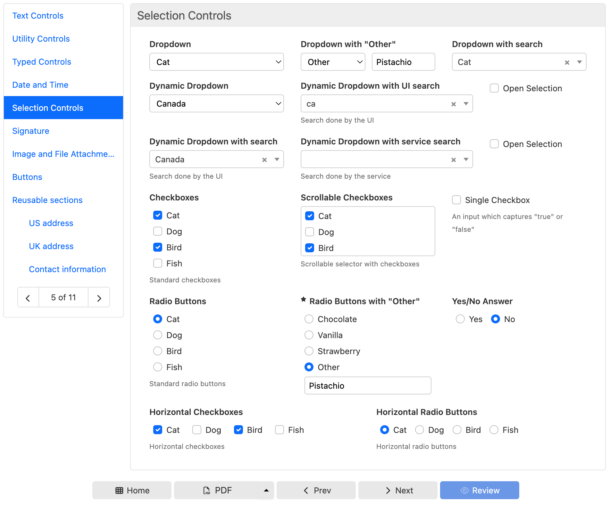
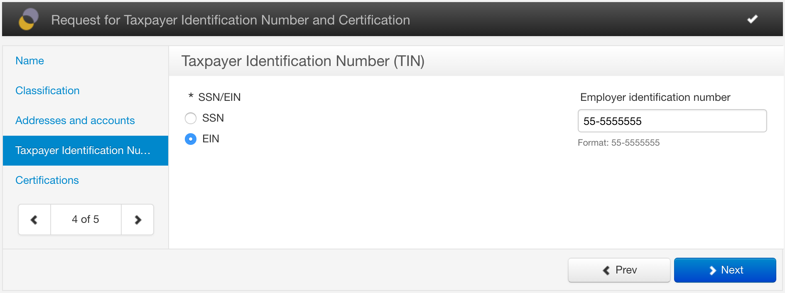
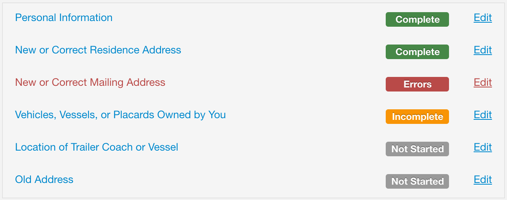
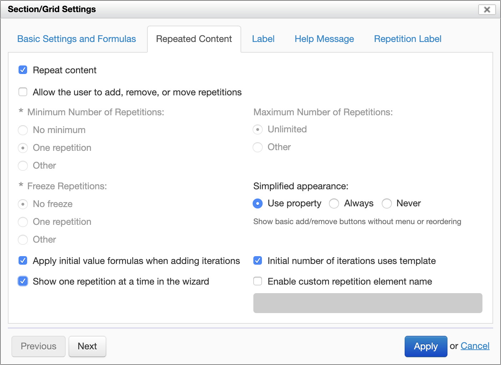
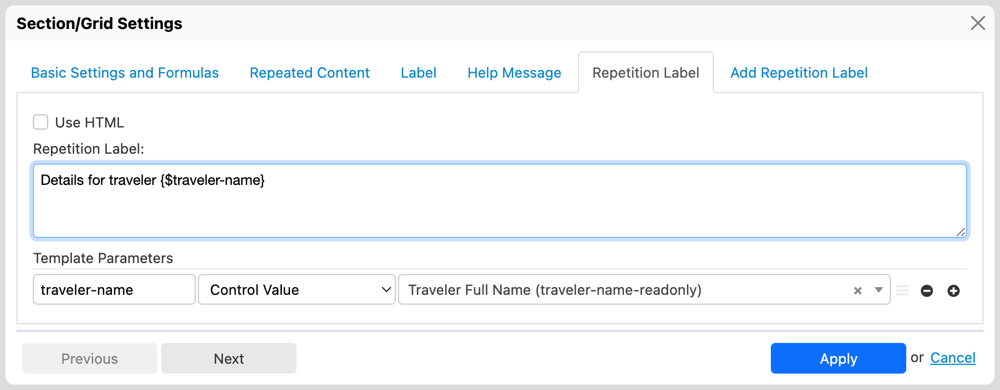

# Wizard view

## Introduction

By default with Form Runner all the form sections appear in the same page, on top of each other. If your form is large that means that you have to scroll to fill out the entire form.

With the wizard view, top-level sections instead appear in a table of contents area to the left, and only a single top-level section is shown at any given time in a separate wizard "page":



You can navigate between pages by clicking on a title in the table of contents, or you can use the navigation arrows. You can also use "Prev" and "Next" buttons when configured.

Errors on your form appear at the bottom as usual, and the title of pages that contain errors are highlighted in red. If you click on an error you are taken directly to the page and control containing the error.

## Enabling the wizard view 

### Using a property

The wizard view is optional - you can use the regular view instead, and you can enable this view per form, per app, or globally with a property:

```xml
<property
  as="xs:string"
  name="oxf.fr.detail.view.appearance.*.*"
  value="wizard"/>
```

### From Form Builder

[SINCE Orbeon Forms 2016.2]

You can enable or disable the wizard view for a specific form definition directly from Form Builder's Form Settings dialog, under Form Options:

- __Use Default:__ use  the configuration specified with the `oxf.fr.detail.view.appearance` property
- __Always:__ enable the wizard view no matter what the `oxf.fr.detail.view.appearance` property specifies
- __Never:__ disable the wizard view no matter what the `oxf.fr.detail.view.appearance` property specifies


## Modes

### Introduction

The wizard supports two mode:

- the *free* mode (which is the default mode)
- the *validated* mode [SINCE Orbeon Forms 4.9]

### Free mode

When using the free mode, you can freely:

- go back to the preceding page
- go forward to the next page
- change page from the table of contents
- leaving a page marks all fields on the given page as visited, ensuring that errors on that page, if any, show in the error summary

### Validated mode

#### Lax validated mode

[SINCE Orbeon Forms 4.9]

When using the validated mode:

- you can freely go back to the preceding page
- but you can only go forward to the next page if
  - there are no errors on all preceding pages as well as the current page
  - if you have already visited the next page
- the table of contents only allows you to navigate
  - to pages you have already visited
  - or to the next page if there are no errors on all preceding pages as well as the current page [SINCE Orbeon Forms 2016.1]
- you should generally use the "Prev" or "Next" buttons for navigation
- any attempt to navigate to the next page marks all the fields of the preceding pages as well as the current page as visited, ensuring that errors on those pages, if any, show in the error summary

[FROM Orbeon Forms Forms 4.9 to 2016.2]

The following property enables the lax validated mode:

```xml
<property
  as="xs:boolean"
  name="oxf.xforms.xbl.fr.wizard.validate.*.*"
  value="true"/>
```

[SINCE Orbeon Forms 2016.3]

The following property enables the lax validated mode:

```xml
<property
  as="xs:string"
  name="oxf.xforms.xbl.fr.wizard.validate.*.*"
  value="lax"/>
```

Setting the value to `true` is still supported for backward compatibility.

You can see in the following picture that the sections in the table of contents which have not yet been visited are grayed out:


#### Strict validated mode

[SINCE Orbeon Forms 2016.3]

The following property enables the strict validated mode:

```xml
<property
  as="xs:string"
  name="oxf.xforms.xbl.fr.wizard.validate.*.*"
  value="strict"/>
```

This mode behaves the same as the lax validated mode, except that it doesn't matter if a forward section has been visited or not: if there are errors in the current or preceding wizard pages, it is not possible to navigate with the "Next" button or via the table of contents.  

## Buttons

### Inner buttons

The following property allows specifying which buttons are presented *inside* the wizard, as opposed to the bottom of the page. This example places the wizard's "Prev" and "Next" buttons just under the current wizard section:

```xml
<property
    as="xs:string"
    name="oxf.fr.detail.buttons.inner.*.*"
    value="wizard-prev wizard-next"/>
```



### Buttons visibility

[SINCE Orbeon Forms 2016.1]

When the following conditions are met:

1. You are using inner buttons.
2. You are using the validated mode.

The following buttons are automatically hidden until the wizard shows the last top-level form section:

- `save-final`
- `submit`
- `send`
- `review`
- `pdf`
- `tiff`
- `email`

## Section status

### Status indication

[SINCE Orbeon Forms 2016.2]

The wizard indicates, in the table of contents, the status of each section:

- __Not Started:__ the user hasn't visited the section yet.
- __Incomplete:__ the user has visited the section but some required fields are not filled.
- __Errors:__ the user has visited the section and some fields have been filled but contain errors.
- __Complete:__ the user has visited the section and all the required fields for the section have been filled. 



### CSS classes

CSS classes are available on table of content entries to reflect the status of each section:

- `disabled`
- `active`
- `started`
- `changed`
- `incomplete`
- `invalid`

[SINCE Orbeon Forms 2018.1]

The following classes indicate the first and last sections:

- `first-page`: the first visible page
- `last-top-level-page`: the first visible top-level page 
- `last-page`: the last visible page
    - this can be different from `last-top-level-page` when using subsection navigation

### Wizard status persistence

[SINCE Orbeon Forms 2017.2]

The wizard status is persisted when the data is saved to the database. This means that if the user saves incomplete 
data and comes back to it, information about visited or changed wizard pages is restored.

The wizard shows the last possible page upon loading data.  

## Separate table of contents

[SINCE Orbeon Forms 2016.2]

When set to `true`, the following property enables showing the table of contents separately, as if on a different page:

```xml
<property
    as="xs:boolean"
    name="oxf.xforms.xbl.fr.wizard.separate-toc.*.*"
    value="true"/>
```

When `false` (the default):

- the table of contents appears to the left (wide desktop layout) or the top (narrow mobile layout)
- the section content appears to the right (wide desktop layout) or under the table of conents (narrow mobile layout)

When `true`:

- the table of contents takes the entire width when landing on the page
- when selecting a section, the view toggles to the selected section (top-level or subsection depending on whether subsection navigation is enabled)

<!-- TODO: screenshot -->

## Subsections

### Subsections navigation

[SINCE Orbeon Forms 2016.2]

```xml
<property
    as="xs:boolean"
    name="oxf.xforms.xbl.fr.wizard.subsections-nav.*.*"
    value="true"/>
```

When `false` (the default):

- the wizard allows you to navigate only between top-level sections

When `true`:

- the wizard navigates through the first level of subsections when present
- it shows one first level of subsections at a time, or one top-level section at a time for those top-level sections which don't have any subsections
- second-level and deeper levels of subsections appear on the same wizard page
- the "Next" and "Prev" buttons go to the next or previous first-level subsection if any, and then to the next or previous top-level section's first subsection if any
- the validated mode, if enabled, still applies only to top-level sections, which means that
    - it is possible to freely navigate through subsections within a given top-level section
    - however when attempting to navigate to the next top-level section, validation constraints apply

*NOTE: Grids directly nested within top-level sections which have any subsections are ignored in this mode. The recommendation is to avoid this situation when using subsections navigation and not place grids directly at the same level of first-level subsections. This restriction is lifted in Orbeon Forms 2016.3.*

*NOTE: Top-level repeated sections are not supported. The recommendation is to avoid this situation when using subsections navigation and not use top-level repeated sections. This is improved in Orbeon Forms 2016.3 where top-level repeated sections disable subsection navigation for themselves.*

<!-- TODO: screenshot -->

[SINCE Orbeon Forms 2016.3]

Grids directly nested within top-level sections which have any subsections are also part of the navigation. Each grid is navigated independently from the other grids.

The `subsections-nav` attribute on top-level `fr:section` elements can be used to explicitly disable subsection navigation. See [Wizard Component](../component/wizard.md#the-subsections-nav-attribute).

### Visibility in the table of contents

[SINCE Orbeon Forms 2016.2]

```xml
<property
    as="xs:string"
    name="oxf.xforms.xbl.fr.wizard.subsections-toc.*.*"
    value="active"/>
```

In all cases, the table of contents shows all visible top-level sections.

When `active` (the default and only behavior until 2016.1):

- the table of contents shows visible subsections only for the currently-visible top-level section

When `all`:

- the table of contents shows all visible subsections

When `none`:

- the table of contents doesn't show any subsection

<!-- TODO: screenshot -->

## Paging large repeated sections

By default, top-level repeated sections appear as a single entry in the table of contents. The section's repeated content appears within the section, each repetition on top of the other, as is the case when the wizard is not used.

[SINCE Orbeon Forms 2019.1]

It is now possible to make each iteration of a top-level repeated section that is the target of [synchronized repeated content](/form-builder/synchronize-repeated-content.md) appear as a separate entry in the table of contents. The benefit of this is that, if the repeated section content is large, then less content appears on screen at the same time. This is better for usability and for performance. 

To enable this, got to the relevant [section repeat settings](/form-builder/repeat-settings.md), and:

- Uncheck "Allow the user to add, remove, or move repetitions"
- Check "Show one repetition at a time in the wizard"



In addition, each repetition can have an individual [repetition label](/form-builder/form-editor/section-settings.md#dynamic-iteration-label).



## See also

- [Synchronizing repeated content](/form-builder/synchronize-repeated-content.md)
- [Repeat settings](/form-builder/repeat-settings.md)
- [Dynamic iteration label](/form-builder/section-settings.md#dynamic-iteration-label)
- [Wizard XBL component](/form-runner/component/wizard.md)
- [Buttons and Processes](/form-runner/advanced/buttons-and-processes/README.md)
- Blog posts
    - [Form Runner Wizard View](https://blog.orbeon.com/2012/12/form-runner-wizard-view.html)
    - [New wizard validated mode](https://blog.orbeon.com/2015/03/new-wizard-validated-mode.html)
    - [Synchronized master-detail views](https://blog.orbeon.com/2019/01/synchronized-master-detail-views.html)
    - [Dynamic loading of closed sections](https://blog.orbeon.com/2020/04/dynamic-loading-of-closed-sections.html)
