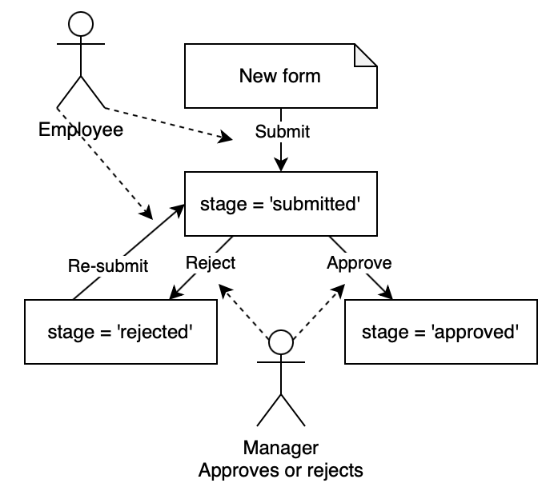

# Workflow stage

## Availability

[SINCE Orbeon Forms 2020.1]

## Introduction

Orbeon Forms has a number of features helping with workflows. One of them is the *workflow stage*.

## What is a workflow stage?

A *workflow stage* is a string value used to track the progress of a form through a workflow. For instance, you might have a form which goes through the following workflow:



This workflow has the following stages:

- `submitted`
- `approved`
- `rejected`

A workflow stage is associated with form data:

- __In memory:__ When the form is being edited the workflow stage can also have a value and be changed. 
- __At rest:__ When form data is saved in the database, the workflow stage is saved with it, and will be available alongside the form data when the form data is read.

## Setting or modifying the workflow stage

You can set or modify the workflow stage using the [`set-workflow-stage()` action](/form-runner/advanced/buttons-and-processes/actions-form-runner.md#set-workflow-stage). This action is part of a process, which is usually associated with a button. For example, in the workflow above, you might have:

- a "Submit" button to submit the form, which sets the workflow stage to `submitted`;
- a "Approve" button to approve the form, which sets the workflow stage to `approved`;
- a "Reject" button to reject the form, which sets the workflow stage to `rejected`.

For more, see [Buttons and processes](/form-runner/advanced/buttons-and-processes/README.md).

## Reading the workflow stage

The workflow stage can be read using the [`fr:workflow-stage-value()` function](/xforms/xpath/extension-form-runner.md#fr-workflow-stage-value). For example, you might use this function in formulas to conditionally show/hide, make readonly/readwrite fields, grids, sections, or buttons based on the workflow stage.

## Showing the workflow stage in the Summary page

You can optionally show the workflow page in a column in the form's Summary page by setting the following property value to `true`:

```xml
<property 
    as="xs:boolean" 
    name="oxf.fr.summary.show-workflow-stage.*.*"                           
    value="true"/>
```

In addition, the user can search by workflow stage.

## Showing the workflow stage in the Detail page

[\[SINCE Orbeon Forms 2024.1.1\]](/release-notes/orbeon-forms-2024.1.1.md)

You can optionally show the workflow page in the navigation bar of the form's Detail page by setting the following property value to `true`:

```xml
<property 
    as="xs:boolean"
    name="oxf.fr.navbar.workflow-stage.enable.*.*"
    value="true"/>
```


## See also

- Blog post: [New workflow capabilities in Orbeon Forms 2020.1](https://www.orbeon.com/2021/01/new-workflow-capabilities-in-orbeon.html)
- [The `set-workflow-stage()` action](/form-runner/advanced/buttons-and-processes/actions-form-runner.md#set-workflow-stage)
- [The `fr:workflow-stage-value()` function](/xforms/xpath/extension-form-runner.md#fr-workflow-stage-value)
- [Buttons and processes](/form-runner/advanced/buttons-and-processes/README.md)