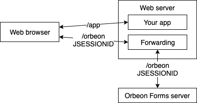

# Form Runner JavaScript Embedding API

## Availability

Since Orbeon Forms PE 2020.1. As of 2020.1, this feature is *experimental*: the API is very much subject to change, and we're interested in your feedback so we can continue to improve this feature.

## Rationale

Server-side application using Java can use the 

## Usage

### Forwarding

If you're using the JavaScript embedding API, chances are that your application isn't running on Java. This means that Orbeon Forms and your application might be running on different servers, and if on the same server, will be running on different ports.

All the requests made by browser, whether for the page of your app that uses the embedding API, or for Orbeon Forms resources, will made to the same server and port. So it is your responsibility to setup that server so requests to Orbeon Forms are forwarded to the Orbeon Forms server, as shown in the diagram below.



#### Requests to forward

You can identify the requests made to Orbeon Forms based on their path, which is typically `/orbeon`. (With Java web apps, that first part of the path is referred to as the "context", and you can deploy Orbeon Forms on context other than `/orbeon`, say `/forms`. However, in what follows, we'll just assume you've kept `/orbeon`.)

#### Forwarding the `JSESSIONID` cookie

When forwarding HTTP requests, you need to make sure the `JSESSIONID` cookie is properly forwarded. You can for instance check this with the Chrome Dev Tools using the Network tab. Make sure that:

1. The first time the browser makes a request to Orbeon Forms, that is with a path starting with `/orbeon`, the response sets `JSESSIONID` cookie.
2. In every subsequent request made to Orbeon Forms, that `JSESSIONID` cookie set earlier is sent by the browser, and the server doesn't in turn set another `JSESSIONID` in the response. (I.e. the value of the `JSESSIONID` cookie sent by the browser to the server shouldn't change for the duration of the session.)

### JavaScript to include

In the page where you want to embed a form, include the following JavaScript by adding this element inside the page's `<head>`:

```html
<script 
    type="text/javascript" 
    src="/orbeon/xforms-server/baseline.js?updates=fr"></script>
````

### `embedForm()` API

You embed a form in the page by calling the following API:

```javascript
ORBEON.fr.API.embedForm(
  container,  
  context,    
  app,        
  form,       
  action,     
  documentId, 
  queryString
)
```

| Parameter   | Optional  | Type         | Example             | Description                                                   |
| ----------- | --------- | ------------ | -----------         | ------------------------------------------------------------- |
| container   | No        | HTML element |                     | DOM element you want the form to be placed in                 |
| context     | No        | String       | `"/orbeon"`         | Context where Orbeon Forms is deployed, typically             |
| app         | No        | String       | `"human-resources"` | App name                                                      |
| form        | No        | String       | `"job-application"` | Form name                                                     |
| action      | No        | String       | `"new"`             | Either `"new"`, `"edit"`, or `"view"`                         |
| documentId  | See below | String       |                     | For actions other than `new`, the document to be loaded       |
| queryString | Yes       | String       | `"job=clerk"`       | Additional parameters to pass to the form as query parameters |    

The `documentId` parameter is mandatory for actions other than `new`, and must be `undefined` when the action is `new`. For `new`, if you don't need to pass a `queryString`, you can just omit the last 2 parameters in your call to `ORBEON.fr.API.embedForm()`, and if you need to pass a `queryString` then you must explicitly pass `undefined` as the value of `documentId`.
